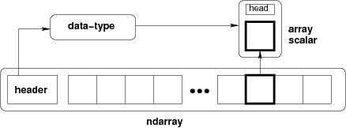

# İçindekiler

- [`ndarray` Object](#1)

<h1 id="1"><code>ndarray</code> Object</h1>

NumPy'da tanımlanan en önemli obje, `ndarray` adı verilen N boyutlu bir array türüdür. `ndarray`, aynı type data'ların (bunlara element veya item denir ama ben element olarak bahsedeceğim) toplandığı bir koleksiyonudur (grid of value, collection). Bu elementlere erişmek için zero-based index'leme kullanılır (yani ilk elementin index'i `0` olarak ifade edilir). Bir `ndarray`'deki her bir element bellekte aynı boyutta yer kaplar ve `data-type` objesinin bir objesidir (`data-type` = `dtype`).

Bir ndarray'i slicing yoluyla (daha sonra anlatılacak) parçalarsan bir array scalar elde edersin.



Görseldeki ndarray diyagramı, dtype ve array scalar arasındaki ilişkiyi gösteriyor. Örnek:
```py
import numpy as np

a = np.array([1,2,3,4,5])
b = a[0:2]
c = a[4]
print(type(b), b.dtype, b) # Output: <class 'numpy.ndarray'> int32 [1 2]
print(type(c), c.dtype, c) # Output: <class 'numpy.int32'> int32 5
```
Yani yukarıda anlattığım bütün olay, `c`'nin `'numpy.int32'` type bir obje olması için yaptığımız şeyin açıklaması.

**Not:** The ndarray object consists of contiguous one-dimensional segment of computer memory, combined with an indexing scheme that maps each item to a location in the memory block. The memory block holds the elements in a row-major order (C style) or a column-major order (FORTRAN or MatLab style).

<h2 id="1.1">Array'lerde Boyut (Dimension) ve Indexing</h2>

Array'leri indexlemek normal python'daki sequence'ları indexlemek gibidir. Örnek:
```py
import numpy as np

a = np.array([[1,2,3],[4,5,6],[7,8,9]])
print(a,end="\n-------\n")
print(a[0],end="\n-------\n")
print(a[0][0])
```
**Output:**
```
[[1 2 3]
 [4 5 6]
 [7 8 9]]
-------
[1 2 3]
-------
1
```

Bir array'in **rank**'ı, o dizinin dimension sayısını ifade eden bir integer'dır. İki ya da daha fazla dimension'ı bulunan NumPy array'ler initialize (başlatmak) edebilmek için (kısaca oluşturabilmek için) nested listeler kullanılır. Örnek:
```py
import numpy as np
print(np.array([[1,2,3],[4,5,6],[7,8,9]]))
```
**Output:**
```
[[1 2 3]
 [4 5 6]
 [7 8 9]]
```
NumPy'da dimension'lar **axis** olarak isimlendirilir (birden fazla dimension'dan bahsediyorsak **axes**). 2D array'lerle uğraşırken column ve row kavramlarıyla karşılaşmışsınızdır. Column ve row kavramları sadece 2D array'lerde geçerli olduğu için genel olarak axis (eksen) terimi kullanılır. Çok dimention'lu array'lerde axis'ler dıştan içe anlamına gelecek şekilde soldan sağa doğru sıralanır. Örnek:
```
[[[1 2 3]
  [4 5 6]
  [7 8 9]]

 [[1 2 3]
  [4 5 6]
  [7 8 9]]]

a[first axis, second axis, third axis, ...]
```
```py
import numpy as np

a = np.zeros((2,3,4))
print(a,end="\n-------\n")
a[:,0,0] = 1
print(a,end="\n-------\n")
a = np.zeros((2,3,4))
a[0,:,0] = 2
print(a,end="\n-------\n")
a = np.zeros((2,3,4))
a[0,0,:] = 3
print(a)
```
**Output:**
```
[[[0. 0. 0. 0.]
  [0. 0. 0. 0.]
  [0. 0. 0. 0.]]

 [[0. 0. 0. 0.]
  [0. 0. 0. 0.]
  [0. 0. 0. 0.]]]
-------
[[[1. 0. 0. 0.]
  [0. 0. 0. 0.]
  [0. 0. 0. 0.]]

 [[1. 0. 0. 0.]
  [0. 0. 0. 0.]
  [0. 0. 0. 0.]]]
-------
[[[2. 0. 0. 0.]
  [2. 0. 0. 0.]
  [2. 0. 0. 0.]]

 [[0. 0. 0. 0.]
  [0. 0. 0. 0.]
  [0. 0. 0. 0.]]]
-------
[[[3. 3. 3. 3.]
  [0. 0. 0. 0.]
  [0. 0. 0. 0.]]

 [[0. 0. 0. 0.]
  [0. 0. 0. 0.]
  [0. 0. 0. 0.]]]
```
**Not:** Farklı array'ler aynı verileri içeriyor olabilir. Bu durumda array'lerin birinde yaptığınız değişiklikler diğer array'i de etkiler.

[Array attributes](https://numpy.org/doc/stable/reference/arrays.ndarray.html#arrays-ndarray) ve [array object](https://numpy.org/doc/stable/reference/arrays.html#arrays) hakkında daha fazla bilgi tıklayınız.

<h2 id="1.2">NumPy'ın Desteklediği Veri Türleri (<code>dtype</code>)</h2>

Bir `dtype`,
- Data'nın type'ına (integer, float ya da Python object),
- Data'nın size'ına,
- Byte order (little-endian or big-endian),
- Structured type olması durumunda, field'lerin adları (name), her field'ın data type'ı ve her filed tarafından alınan memory block parçasına ()part of memory block),
- Data dype bir subarray ise, shape ve data type'ına

bağlı olarak bir array'e karşılık gelen sabit bellek bloğunun (fixed block of memory) yorumlanmasını (interpretation) açıklar.

**Not:** Byte order'a data type'a prefix olarak `<` ya da `>` eklenerek karar verilir. `<` encoding'in little-endian olduğu anlamına gelir (en önemsizi (least significant) en küçük adreste saklanır). `>` encoding'in big-endian olduğu anlamına gelir (en önemli (most significant) byte en küçük adreste saklanır).

|     Type     | Description                                                                                                         |
| :----------: | :------------------------------------------------------------------------------------------------------------------ |
|   `bool_`    | Byte olarak depolanan boolean (`True` ya da `False`)                                                                |
|    `int_`    | Default integer type (C'deki `long` ile neredeyse aynı (same as), normalde ya `int32` ya da `int64`)                |
|    `intc`    | C'deki `int` ile birebir aynı (identical)(normalde ya `int32` ya da `int64`)                                        |
|    `intp`    | Indexing için kullanılan integer (C'deki `ssize_t` ile neredeyse aynı (same as), normalde ya `int32` ya da `int64`) |
|    `int8`    | Byte (-128 to 127)                                                                                                  |
|   `int16`    | Integer (-32768 to 32767)                                                                                           |
|   `int32`    | Integer (-2147483648 to 2147483647)                                                                                 |
|   `int64`    | Integer (-9223372036854775808 to 9223372036854775807)                                                               |
|   `uint8`    | Unsigned integer (0 to 255)                                                                                         |
|   `uint16`   | Unsigned integer (0 to 65535)                                                                                       |
|   `uint32`   | Unsigned integer (0 to 4294967295)                                                                                  |
|   `uint64`   | Unsigned integer (0 to 18446744073709551615)                                                                        |
|   `float_`   | `float64` için kısaltma (shorthand)                                                                                 |
|  `float16`   | Half precision float: sign bit, 5 bits exponent, 10 bits mantissa                                                   |
|  `float32`   | Single precision float: sign bit, 8 bits exponent, 23 bits mantissa                                                 |
|  `float64`   | Double precision float: sign bit, 11 bits exponent, 52 bits mantissa                                                |
|  `complex_`  | `complex128` için kısaltma (shorthand)                                                                              |
| `complex64`  | İki 32-bit ile temsil edilen complex sayı (real and imaginary components)                                           |
| `complex128` | İki 64-bit ile temsil edilen complex sayı (real and imaginary components)                                           |

Bir `dtype` objesi oluşturmak için `dtype(object, align, copy)` methodu kullanılır.
- **`object`**: Argüman olarak bir data type objesine dönüştürülecek objeyi kabul eder.
- **`align:bool` (optional)**: Bilgi için [tıklayın](https://numpy.org/doc/stable/reference/generated/numpy.dtype.html?highlight=numpy%20dtype#numpy.dtype).
- **`copy:bool` (optional)**: Bilgi için [tıklayın](https://numpy.org/doc/stable/reference/generated/numpy.dtype.html?highlight=numpy%20dtype#numpy.dtype).

`dtype` ile ilgili daha fazla bilgi ve kullanımıyla ilgili örnekler için [tıklayınız](https://numpy.org/doc/stable/reference/generated/numpy.dtype.html?highlight=numpy%20dtype#numpy.dtype).

<h2 id="1.3">Array Attribute'ları</h2>

<h3 id="1.3.1"><code>shape(a)</code> Attribute'u</h3>

`a` parametresine argüman olarak girilen array'in dimension ve her dimension'ındaki element sayısı bilgisini içeren bir tuple döndürür. Örnek:
```py
import numpy as np

a = np.ones((4))
b = np.ones((4, 3))
c = np.ones((4, 3, 2))

print(a, np.shape(a), end="\n-------\n")
print(b, np.shape(b), end="\n-------\n")
print(c, np.shape(c))
```
**Output:**
```
[1. 1. 1. 1.] (4,)
-------
[[1. 1. 1.]
 [1. 1. 1.]
 [1. 1. 1.]
 [1. 1. 1.]] (4, 3)
-------
[[[1. 1.]
  [1. 1.]
  [1. 1.]]

 [[1. 1.]
  [1. 1.]
  [1. 1.]]

 [[1. 1.]
  [1. 1.]
  [1. 1.]]

 [[1. 1.]
  [1. 1.]
  [1. 1.]]] (4, 3, 2)
```
`shape` attribute'u ilgili array'i yeniden şekillendirmek (reshape) için de kullanılabilir. Örnek:
```py
import numpy as np

a = np.ones((4, 3, 2))

print(a, np.shape(a), end="\n-------\n")
a.shape = (4, 6)
print(a, np.shape(a), a.shape)
```
**Output:**
```
[[[1. 1.]
  [1. 1.]
  [1. 1.]]

 [[1. 1.]
  [1. 1.]
  [1. 1.]]

 [[1. 1.]
  [1. 1.]
  [1. 1.]]

 [[1. 1.]
  [1. 1.]
  [1. 1.]]] (4, 3, 2)
-------
[[1. 1. 1. 1. 1. 1.]
 [1. 1. 1. 1. 1. 1.]
 [1. 1. 1. 1. 1. 1.]
 [1. 1. 1. 1. 1. 1.]] (4, 6) (4, 6)
```
Gördüğünüz gibi `np.shape(a)` ile `a.shape` arasında bir fark yoktur. İkisi de aynı bilgiyi verir.

**Not:** Bu işlemin yapılabilmesi için ilgili array'in eski ve yeni shape'i aynı sayıda elemente sahip olmalıdır aksi halde `ValueError: cannot reshape array of size 24 into shape (4,5)` örneğindeki gibi bir hata döndürür.

<h3 id="1.3.2"><code>ndim(a)</code> Attribute'u</h3>

`a` parametresine argüman olarak girilen array'in dimension sayısını döndürür. Örnek:
```py
import numpy as np

a = np.ones((4, 3, 2))

print(np.ndim(a)) # Output: 3
a.shape = (4, 6)
print(np.ndim(a),a.ndim) # Output: 2 2
```
gördüğünüz gibi np.ndim(a) ile a.ndim arasında bir fark yoktur. İkisi de aynı bilgiyi verir.

<h3 id="1.3.3"><code>itemsize</code> Attribute'u</h3>

Uygulandığı array'in her elementinin bellekte kapladığı alanı byte cinsinden döndürür. Örnek:
```py
import numpy as np

a1 = np.ones((5,), dtype=np.int8)
a2 = np.ones((5,), dtype=np.int32)
a3 = np.ones((5,), dtype=np.float16)

print(a1.itemsize) # Output: 1
print(a2.itemsize) # Output: 4
print(a3.itemsize) # Output: 2
```

<h3 id="1.3.4"><code>flags</code> Attribute'u</h3>

Bir array'in bellekte nasıl saklandığını gösteren bir özellik öbjesi (`<class 'numpy.core.multiarray.flagsobj'>`) döndürür. Örnek:
```py
import numpy as np

a = np.array([1,2,3,4,5,6,7,8,9,10])
print(a.flags)
```
**Output:**
```
  C_CONTIGUOUS : True
  F_CONTIGUOUS : True
  OWNDATA : True
  WRITEABLE : True
  ALIGNED : True
  WRITEBACKIFCOPY : False
```
Buradaki özelliklerin anlamları şu şekildedir:
- `C_CONTIGUOUS` (C): True ise array'in bellekte C dilindeki gibi sıralandığı anlamına gelir (C-style contiguous segment).
- `F_CONTIGUOUS` (F): True ise array'in bellekte Fortran dilindeki gibi sıralandığı anlamına gelir (Fortran-style contiguous segment).
- `OWNDATA` (O): True ise array'in bellekteki verilerini kendi sakladığı (yani dizi, kullandığı belleğin sahibi) ya da başka bir objeden ödünç aldığı anlamına gelir.
- `WRITEABLE` (W): True ise array'in bellekteki verilerini değiştirebilir (yani array'in immutable olmadığı) anlamına gelir. Bunu False olarak ayarlamak verileri kilitler ve salt okunur (read-only) yapar.
- `ALIGNED` (A): True ise array'in verilerini ve tüm elementleri, donanım için uygun şekilde hizalanmış anlamına gelir.
- `UPDATEIFCOPY` (U): True ise array'in bellekteki verilerini değiştirdiğinizde, değişikliklerin başka bir array'e yazılacağı (yani temel dizi bu dizinin içeriğiyle güncelleneceği) anlamına gelir. Bu özellik, array'in bellekteki verilerini kopyaladığından dolayı performansı düşürür.

<h2 id="1.4">Array Oluşturmak</h2>

<h3 id="1.4.1"><code>array(object, dtype=None, *, copy=True, order='K', subok=False, ndmin=0, like=None)</code> Methodu</h3>

Bir array oluşturmak için en temel yöntem `array` methodunu kullanmaktır. Örnek:
```py
import numpy as np
print(type(np.array([1,2,3]))) # Output: <class 'numpy.ndarray'>
```
- **`object:array_like`**: Bu parametreye argüman olarak sequence, nested sequence, scalar bir değer (integer, float vs.), array döndüren `__array__` methoduna sahip bir şey... kısaca array interface ortaya çıkarabilecek (exposing) herhangi bir obje verilebilir. Bu parametre zorunludur. Daha fazla bilgi için [tıklayın](https://numpy.org/doc/1.23/reference/generated/numpy.array.html?highlight=array#numpy.array).
- **`dtype:data-type` (optional)**: Bu parametreye argüman olarak C-like veri türleri girilebilir. Böylece array'in öğeleri belirttiğiniz veri türünde olacaktır. Daha fazla bilgi için [tıklayın](https://numpy.org/doc/1.23/reference/generated/numpy.array.html?highlight=array#numpy.array).
- **`copy:bool` (optional)**: Bu parametreye argüman olarak `True` veya `False` girilebilir. `True` ise array'in bellekteki verilerini kopyalar, `False` ise kopyalamaz. Default değeri `True`'dur. Daha fazla bilgi için [tıklayın](https://numpy.org/doc/1.23/reference/generated/numpy.array.html?highlight=array#numpy.array).
- **`order:{'C', 'F', 'A', 'K'}` (optional)**: Bu parametreye argüman olarak `C`, `F`, `A` veya `K` girilebilir. `C` ise array'in bellekte C dilindeki gibi (row-major) sıralandığı anlamına gelir (C-style contiguous segment), `F` ise array'in bellekte Fortran dilindeki gibi (column-major) sıralandığı anlamına gelir (Fortran-style contiguous segment), `A` ise array'in bellekteki verilerini kopyalamadan sıralamaya çalışır, `K` ise array'in bellekteki verilerini kopyalamadan sıralamaya çalışır. Default değeri `K`'dur. Daha fazla bilgi için [tıklayın](https://numpy.org/doc/1.23/reference/generated/numpy.array.html?highlight=array#numpy.array).
- **`subok:bool` (optional)**: Bu parametreye argüman olarak `True` veya `False` girilebilir. `True` ise array'in alt sınıflarını (subclass) döndürür, `False` ise döndürmez. Default değeri `False`'dur. Daha fazla bilgi için [tıklayın](https://numpy.org/doc/1.23/reference/generated/numpy.array.html?highlight=array#numpy.array).
- **`ndmin:int` (optional)**: Bu parametreye argüman olarak integer girilebilir. Array'in en az kaç boyutlu (dimension) olacağını belirtir. Default değeri `0`'dır. Daha fazla bilgi için [tıklayın](https://numpy.org/doc/1.23/reference/generated/numpy.array.html?highlight=array#numpy.array).
- **`like:array_like` (optional)**: Bu parametreye argüman olarak array verilebilir. NumPy array objesi olmayan array'ler oluşturmanız gerektiğinde bu parametreye argüman olarak girilen array'in özelliklerini (properties) kullanarak array oluşturur. Daha fazla bilgi için [tıklayın](https://numpy.org/doc/1.23/reference/generated/numpy.array.html?highlight=array#numpy.array).

<h3 id="1.4.2"><code>empty(shape, dtype=float, order='C', *, like=None)</code> Methodu</h3>

İstenilen boyutlarda ve veri türünde başlatılmamış (uninitialized) bir array oluşturmak için kullanılır. Örnek:
```py
import numpy as np
print(np.empty((3,2), dtype = int))
```
**Output:**
```
[[1948283503  656434536]
 [1629497131  656434286]
 [1663051567 1634885992]]
```
- **`shape:int or sequence of ints`**: Array'in boyutlarını belirtir. Daha fazla bilgi için [tıklayın](https://numpy.org/doc/1.23/reference/generated/numpy.empty.html?highlight=empty#numpy.empty).
- **`dtype:data-type` (optional)**: Array'in veri türünü belirtir. Default değeri `float`'tur. Daha fazla bilgi için [tıklayın](https://numpy.org/doc/1.23/reference/generated/numpy.empty.html?highlight=empty#numpy.empty).
- **`order:{'C', 'F'}` (optional)**: Array'in bellekteki sıralamasını belirtir. `C` ise C dilindeki gibi (row-major), `F` ise Fortran dilindeki gibi (column-major). Default değeri `C`'dir. Daha fazla bilgi için [tıklayın](https://numpy.org/doc/1.23/reference/generated/numpy.empty.html?highlight=empty#numpy.empty).
- **`like:array_like` (optional)**: Bu parametreye argüman olarak array verilebilir. NumPy array objesi olmayan array'ler oluşturmanız gerektiğinde bu parametreye argüman olarak girilen array'in özelliklerini (properties) kullanarak array oluşturur. Daha fazla bilgi için [tıklayın](https://numpy.org/doc/1.23/reference/generated/numpy.empty.html?highlight=empty#numpy.empty).

<h3 id="1.4.3"><code>zeros(shape, dtype=float, order='C', *, like=None)</code> Methodu</h3>

İstenilen boyutlarda ve veri türünde sıfırlardan oluşan bir array oluşturmak için kullanılır. Örnek:
```py
import numpy as np
print(np.zeros((3,2), dtype = int))
```
**Output:**
```
[[0 0]
 [0 0]
 [0 0]]
```
- **`shape:int or sequence of ints`**: Array'in boyutlarını belirtir. Daha fazla bilgi için [tıklayın](https://numpy.org/doc/1.23/reference/generated/numpy.zeros.html?highlight=zeros#numpy.zeros).
- **`dtype:data-type` (optional):** Array'in veri türünü belirtir. Default değeri `float`'tur. Daha fazla bilgi için [tıklayın](https://numpy.org/doc/1.23/reference/generated/numpy.zeros.html?highlight=zeros#numpy.zeros).
- **`order:{'C', 'F'}` (optional)**: Array'in bellekteki sıralamasını belirtir. `C` ise C dilindeki gibi (row-major), `F` ise Fortran dilindeki gibi (column-major). Default değeri `C`'dir. Daha fazla bilgi için [tıklayın](https://numpy.org/doc/1.23/reference/generated/numpy.zeros.html?highlight=zeros#numpy.zeros).
- **`like:array_like` (optional)**: Bu parametreye argüman olarak array verilebilir. NumPy array objesi olmayan array'ler oluşturmanız gerektiğinde bu parametreye argüman olarak girilen array'in özelliklerini (properties) kullanarak array oluşturur. Daha fazla bilgi için [tıklayın](https://numpy.org/doc/1.23/reference/generated/numpy.zeros.html?highlight=zeros#numpy.zeros).

<h3 id="1.4.4"><code>ones(shape, dtype=None, order='C', *, like=None)</code> Methodu</h3>

İstenilen boyutlarda ve veri türünde birlerden oluşan bir array oluşturmak için kullanılır. Örnek:
```py
import numpy as np
print(np.ones((3,2), dtype = int))
```
**Output:**
```
[[1 1]
 [1 1]
 [1 1]]
```
- **`shape:int or sequence of ints`**: Array'in boyutlarını belirtir. Daha fazla bilgi için [tıklayın](https://numpy.org/doc/1.23/reference/generated/numpy.ones.html?highlight=ones#numpy.ones).
- **`dtype:data-type` (optional)**: Array'in veri türünü belirtir. Default değeri `float`'tur. Daha fazla bilgi için [tıklayın](https://numpy.org/doc/1.23/reference/generated/numpy.ones.html?highlight=ones#numpy.ones).
- **`order:{'C', 'F'}` (optional)**: Array'in bellekteki sıralamasını belirtir. `C` ise C dilindeki gibi (row-major), `F` ise Fortran dilindeki gibi (column-major). Default değeri `C`'dir. Daha fazla bilgi için [tıklayın](https://numpy.org/doc/1.23/reference/generated/numpy.ones.html?highlight=ones#numpy.ones).
- **`like:array_like` (optional)**: Bu parametreye argüman olarak array verilebilir. NumPy array objesi olmayan array'ler oluşturmanız gerektiğinde bu parametreye argüman olarak girilen array'in özelliklerini (properties) kullanarak array oluşturur. Daha fazla bilgi için [tıklayın](https://numpy.org/doc/1.23/reference/generated/numpy.ones.html?highlight=ones#numpy.ones).

<h3 id="1.4.5"><code>asarray(a, dtype=None, order=None, *, like=None)</code> Methodu</h3>

Verilen argümanı array objesine dönüştürür. `array` methodundan farkı, daha az parametre almasıdır. Örnek:
```py
import numpy as np
print(np.asarray([1,2,3])) # Ourput: [1 2 3]
```
- **`a:array_like`**: Array objesine dönüştürülecek argüman. Daha fazla bilgi için [tıklayın](https://numpy.org/doc/1.23/reference/generated/numpy.asarray.html?highlight=asarray#numpy.asarray).
- **`dtype:data-type` (optional)**: Array'in veri türünü belirtir. Default değeri `float`'tur. Daha fazla bilgi için [tıklayın](https://numpy.org/doc/1.23/reference/generated/numpy.asarray.html?highlight=asarray#numpy.asarray).
- **`order:{'C', 'F'}` (optional)**: Array'in bellekteki sıralamasını belirtir. `C` ise C dilindeki gibi (row-major), `F` ise Fortran dilindeki gibi (column-major). Default değeri `C`'dir. Daha fazla bilgi için [tıklayın](https://numpy.org/doc/1.23/reference/generated/numpy.asarray.html?highlight=asarray#numpy.asarray).
- **`like:array_like` (optional)**: Bu parametreye argüman olarak array verilebilir. NumPy array objesi olmayan array'ler oluşturmanız gerektiğinde bu parametreye argüman olarak girilen array'in özelliklerini (properties) kullanarak array oluşturur. Daha fazla bilgi için [tıklayın](https://numpy.org/doc/1.23/reference/generated/numpy.asarray.html?highlight=asarray#numpy.asarray).

**Not:** `asarray` methodu, `array` methodundan farklı olarak, argüman olarak verilen array'i kopyalamaz. Yani argüman olarak verilen array'i değiştirdiğinizde, `asarray` methodu ile oluşturulan array de değişecektir. Örnek:
```py
import numpy as np

a = np.array([1,2,3,4,5])
array_exp = np.array(a)
asarray_exp = np.asarray(a)
print(a,array_exp,asarray_exp,sep='\n')
a[0] = 10
print(a,array_exp,asarray_exp,sep='\n')
```
**Output:**
```
[1 2 3 4 5]
[1 2 3 4 5]
[1 2 3 4 5]
[10  2  3  4  5]
[1 2 3 4 5]
[10  2  3  4  5]
```

**Not:** `array` ve `asarray` methodları aynı uzunluktaki nested listeleri array'e dönüştürebilir ama farklı uzunluktaki nested listeleri array'e dönüştürürken farklı davranırlar. Örnek:
```py
import numpy as np

a = np.array([[1,2,3],[4,5]])
b = np.asarray([[1,2,3],[4,5]])
print(a) # Output: [list([1, 2, 3]) list([4, 5])]
print(b) # Output: [list([1, 2, 3]) list([4, 5])]
```

<h3 id="1.4.6"><code>frombuffer(buffer, dtype=float, count=- 1, offset=0, *, like=None)</code> Methodu</h3>

Verilen buffer'ı array objesine dönüştürür. Örnek:
```py
import numpy as np

s = b'Hello World'
a = np.frombuffer(s, dtype = 'S1')
print(a) # Output: [b'H' b'e' b'l' b'l' b'o' b' ' b'W' b'o' b'r' b'l' b'd']
```
- **`buffer:object`**: Array objesine dönüştürülecek buffer. Daha fazla bilgi için [tıklayın](https://numpy.org/doc/1.23/reference/generated/numpy.frombuffer.html?highlight=frombuffer#numpy.frombuffer).
- **`dtype:data-type` (optional)**: Array'in veri türünü belirtir. Default değeri `float`'tur. Daha fazla bilgi için [tıklayın](https://numpy.org/doc/1.23/reference/generated/numpy.frombuffer.html?highlight=frombuffer#numpy.frombuffer).
- **`count:int` (optional)**: Dönüştürülecek buffer'daki byte sayısını belirtir. Default değeri `-1`'dir. Daha fazla bilgi için [tıklayın](https://numpy.org/doc/1.23/reference/generated/numpy.frombuffer.html?highlight=frombuffer#numpy.frombuffer).
- **`offset:int` (optional)**: Dönüştürülecek buffer'daki ilk byte'ın indexini belirtir. Default değeri `0`'dır. Daha fazla bilgi için [tıklayın](https://numpy.org/doc/1.23/reference/generated/numpy.frombuffer.html?highlight=frombuffer#numpy.frombuffer).
- **`like:array_like` (optional)**: Bu parametreye argüman olarak array verilebilir. NumPy array objesi olmayan array'ler oluşturmanız gerektiğinde bu parametreye argüman olarak girilen array'in özelliklerini (properties) kullanarak array oluşturur. Daha fazla bilgi için [tıklayın](https://numpy.org/doc/1.23/reference/generated/numpy.frombuffer.html?highlight=frombuffer#numpy.frombuffer).

<h3 id="1.4.7"><code>fromiter(iter, dtype, count=- 1, *, like=None)</code> Methodu</h3>

Verilen iterable objeyi array objesine dönüştürür. Örnek:
```py
import numpy as np

a = iter(range(5))
b = np.fromiter(a, dtype = float)
print(b) # Output: [0. 1. 2. 3. 4.]
```
- **`iterable:iterable`**: Array objesine dönüştürülecek iterable obje. Daha fazla bilgi için [tıklayın](https://numpy.org/doc/1.23/reference/generated/numpy.fromiter.html?highlight=fromiter#numpy.fromiter).
- **`dtype:data-type`**: Array'in veri türünü belirtir. Daha fazla bilgi için [tıklayın](https://numpy.org/doc/1.23/reference/generated/numpy.fromiter.html?highlight=fromiter#numpy.fromiter).
- **`count:int` (optional)**: Dönüştürülecek iterable objedeki eleman sayısını belirtir. Default değeri `-1`'dir. Daha fazla bilgi için [tıklayın](https://numpy.org/doc/1.23/reference/generated/numpy.fromiter.html?highlight=fromiter#numpy.fromiter).
- **`like:array_like` (optional)**: Bu parametreye argüman olarak array verilebilir. NumPy array objesi olmayan array'ler oluşturmanız gerektiğinde bu parametreye argüman olarak girilen array'in özelliklerini (properties) kullanarak array oluşturur. Daha fazla bilgi için [tıklayın](https://numpy.org/doc/1.23/reference/generated/numpy.fromiter.html?highlight=fromiter#numpy.fromiter).

<h3 id="1.4.8"><code>arange(start, stop, step, dtype=None, *, like=None)</code> Methodu</h3>

`start` ve `stop` (`stop` hariç) arasındaki sayıları `step` kadar arttırarak elde edilen sayı dizisini array objesine dönüştürür. Örnek:
```py
import numpy as np

a = np.arange(10)
b = np.arange(1,9,2)
print(a) # Output: [0 1 2 3 4 5 6 7 8 9]
print(b) # Output: [1 3 5 7]
```
- **`start:int` (optional)**: Array'in ilk elemanını belirtir. Default değeri `0`'dır. `range` fonksiyonundaki `start` parametresindeki kurallar geçerlidir. Daha fazla bilgi için [tıklayın](https://numpy.org/doc/1.23/reference/generated/numpy.arange.html?highlight=arange#numpy.arange).
- **`stop:int`**: Array'in son elemanını belirtir. `stop` dahil değildir. `range` fonksiyonundaki `stop` parametresindeki kurallar geçerlidir. Daha fazla bilgi için [tıklayın](https://numpy.org/doc/1.23/reference/generated/numpy.arange.html?highlight=arange#numpy.arange).
- **`step:int` (optional)**: Array'in elemanlarının arasındaki farkı belirtir. Default değeri `1`'dir. `range` fonksiyonundaki `step` parametresindeki kurallar geçerlidir. Daha fazla bilgi için [tıklayın](https://numpy.org/doc/1.23/reference/generated/numpy.arange.html?highlight=arange#numpy.arange).
- **`dtype:data-type` (optional)**: Array'in veri türünü belirtir. Default değeri `float`'tur. Daha fazla bilgi için [tıklayın](https://numpy.org/doc/1.23/reference/generated/numpy.arange.html?highlight=arange#numpy.arange).
- **`like:array_like` (optional)**: Bu parametreye argüman olarak array verilebilir. NumPy array objesi olmayan array'ler oluşturmanız gerektiğinde bu parametreye argüman olarak girilen array'in özelliklerini (properties) kullanarak array oluşturur. Daha fazla bilgi için [tıklayın](https://numpy.org/doc/1.23/reference/generated/numpy.arange.html?highlight=arange#numpy.arange).

<h3 id="1.4.9"><code>linspace(start, stop, num=50, endpoint=True, retstep=False, dtype=None, axis=0)</code> Methodu</h3>

`start` ve `stop` arasındaki `num` kadar birbirine eşit uzaklıkta olan sayıları içeren bir array objesi döndürür. Örnek:
```py
import numpy as np

a = np.linspace(10,20,5)
print(a) # Output: [10.  12.5 15.  17.5 20. ]
```
- **`start:int`**: Array'in ilk elemanını belirtir. Daha fazla bilgi için [tıklayın](https://numpy.org/doc/1.23/reference/generated/numpy.linspace.html?highlight=linspace#numpy.linspace).
- **`stop:int`**: Array'in son elemanını belirtir. Dahil edilip edilmeyeceğini `endpoint` parametresi belirler. Daha fazla bilgi için [tıklayın](https://numpy.org/doc/1.23/reference/generated/numpy.linspace.html?highlight=linspace#numpy.linspace).
- **`num:int`**: Array'in eleman sayısını belirtir. Daha fazla bilgi için [tıklayın](https://numpy.org/doc/1.23/reference/generated/numpy.linspace.html?highlight=linspace#numpy.linspace).
- **`endpoint:bool` (optional)**: `stop` değerinin dahil edilip edilmeyeceğini belirtir. Default değeri `True`'tur. Daha fazla bilgi için [tıklayın](https://numpy.org/doc/1.23/reference/generated/numpy.linspace.html?highlight=linspace#numpy.linspace).
- **`retstep:bool` (optional)**: Array'in elemanlarının arasındaki farkı döndürüp döndürmeyeceğini belirtir. Default değeri `False`'tur. Daha fazla bilgi için [tıklayın](https://numpy.org/doc/1.23/reference/generated/numpy.linspace.html?highlight=linspace#numpy.linspace). Örnek:
  ```py
  import numpy as np

  a = np.linspace(10,20,5,retstep=True)
  print(a) # Output: (array([10. , 12.5, 15. , 17.5, 20. ]), 2.5)
  ```
  Buradaki `2.5` array'in elemanlarının arasındaki farktır.
- **`dtype:data-type` (optional)**: Array'in veri türünü belirtir. Default değeri `float`'tur. Daha fazla bilgi için [tıklayın](https://numpy.org/doc/1.23/reference/generated/numpy.linspace.html?highlight=linspace#numpy.linspace).
- **`axis:int` (optional)**: Array'in boyutunu belirtir. Default değeri `0`'dır. Daha fazla bilgi için [tıklayın](https://numpy.org/doc/1.23/reference/generated/numpy.linspace.html?highlight=linspace#numpy.linspace).

<h3 id="1.4.10"><code>logspace(start, stop, num=50, endpoint=True, base=10.0, dtype=None, axis=0)</code> Methodu</h3>

`start` ve `stop` arasındaki `num` kadar birbirine eşit uzaklıkta olan sayıların `base` parametresinde belirtilen taban üzerindeki logaritmasını içeren bir array objesi döndürür. Yani `base ** start` ile `base ** stop` arasındaki `num` kadar birbirine eşit uzaklıkta olan sayıları içeren bir array objesi döndürür. Örnek:
```py
import numpy as np

a = np.logspace(1,10,10,base=2)
print(a) # Output: [   2.    4.    8.   16.   32.   64.  128.  256.  512. 1024.]
```
- **`start:int`**: Array'in ilk elemanının logaritmasını alınacak sayıyı belirtir. Daha fazla bilgi için [tıklayın](https://numpy.org/doc/1.23/reference/generated/numpy.logspace.html?highlight=logspace#numpy.logspace).
- **`stop:int`**: Array'in son elemanının logaritmasını alınacak sayıyı belirtir. Dahil edilip edilmeyeceğini `endpoint` parametresi belirler. Daha fazla bilgi için [tıklayın](https://numpy.org/doc/1.23/reference/generated/numpy.logspace.html?highlight=logspace#numpy.logspace).
- **`num:int`**: Array'in eleman sayısını belirtir. Daha fazla bilgi için [tıklayın](https://numpy.org/doc/1.23/reference/generated/numpy.logspace.html?highlight=logspace#numpy.logspace).
- **`endpoint:bool` (optional)**: `stop` değerinin dahil edilip edilmeyeceğini belirtir. Default değeri `True`'tur. Daha fazla bilgi için [tıklayın](https://numpy.org/doc/1.23/reference/generated/numpy.logspace.html?highlight=logspace#numpy.logspace).
- **`base:float` (optional)**: Array'in elemanlarının logaritmasını alınacak sayıyı belirtir. Default değeri `10.0`'dur. Daha fazla bilgi için [tıklayın](https://numpy.org/doc/1.23/reference/generated/numpy.logspace.html?highlight=logspace#numpy.logspace).
- **`dtype:data-type` (optional)**: Array'in veri türünü belirtir. Default değeri `float`'tur. Daha fazla bilgi için [tıklayın](https://numpy.org/doc/1.23/reference/generated/numpy.logspace.html?highlight=logspace#numpy.logspace).
- **`axis:int` (optional)**: Array'in boyutunu belirtir. Default değeri `0`'dır. Daha fazla bilgi için [tıklayın](https://numpy.org/doc/1.23/reference/generated/numpy.logspace.html?highlight=logspace#numpy.logspace).

<h2 id="1.5">Indexing ve Slicing</h2>

Array'in elemanlarına aynı Python'ın build-in container objelerindeki gibi index numarası ile erişebilirsiniz. Birden fazla indexleme yöntemi mevcuttur:
- **Integer Indexing**: Array'in elemanlarına tek tek index numarası ile erişebilirsiniz. Örnek:
  ```py
  import numpy as np

  a = np.array([1,2,3,4,5])
  print(a[0]) # Output: 1
  print(a[2]) # Output: 3
  ```
  Çok boyutlu array'lerde axis'ler dıştan içe anlamına gelecek şekilde soldan sağa doğru sıraladığından integer indexlemeyi buna göre yapmalısınız. Örnek:
  ```py
  import numpy as np

  a = np.array([[[1,2,3],[4,5,6],[7,8,9]],
              [[10,11,12],[13,14,15],[16,17,18]],
              [[19,20,21],[22,23,24],[25,26,27]]])
  print(a, end='\n--------\n')
  print(a[0], end='\n--------\n')
  print(a[0,], end='\n--------\n')
  print(a[0][0], end='\n--------\n')
  print(a[0,0], end='\n--------\n')
  print(a[0][0][0], end='\n--------\n')
  print(a[0,0,0])
  ```
  Output:
  ```py
  [[[ 1  2  3]
    [ 4  5  6]
    [ 7  8  9]]

  [[10 11 12]
    [13 14 15]
    [16 17 18]]

  [[19 20 21]
    [22 23 24]
    [25 26 27]]]
  --------
  [[1 2 3]
  [4 5 6]
  [7 8 9]]
  --------
  [[1 2 3]
  [4 5 6]
  [7 8 9]]
  --------
  [1 2 3]
  --------
  [1 2 3]
  --------
  1
  --------
  1
  ```

- **Boolean Indexing**: Array'in elemanlarına tek tek boolean değerler ile erişebilirsiniz. Örnek:
  ```py
  import numpy as np

  a = np.array([1,2,3,4,5])
  print(a[[True,False,True,False,True]]) # Output: [1 3 5]

  a = np.array([[1,2,3],[4,5,6]])
  print(a[[[True,False,True],[False,True,True]]]) # Output: [1 3 5 6]
  ```

- **Filter Indexing**: Array'in elemanlarına filtreleme yaparak erişebilirsiniz. Örnek:
  ```py
  import numpy as np

  a = np.array([1,2,3,4,5])
  print(a[a > 3]) # Output: [4 5]
  print(a[(a > 3) & (a < 5)]) # Output: [4]
  ```

- **Fancy Indexing**: Array'in elemanlarına tek tek index numarası ile erişebilirsiniz. Örnek:
  ```py
  import numpy as np

  a = np.array([1,2,3,4,5])
  print(a[[0,2,4]]) # Output: [1 3 5]
  ```

- **Field Indexing**: Array'in elemanlarına tek tek field ismi ile erişebilirsiniz. Örnek:
  ```py
  import numpy as np

  a = np.array([(1,2,3),(4,5,6)],dtype=[('a','i4'),('b','i4'),('c','i4')])
  print(a['a']) # Output: [1 4]
  print(a['b']) # Output: [2 5]
  print(a['c']) # Output: [3 6]
  ```

- **Ellipsis Indexing**: Array'in birden fazla boyutlu olduğu durumlarda, array'in tüm boyutlarını tek seferde erişmek için kullanılır. Örnek:
  ```py
  import numpy as np

  a = np.ones((2,2,2,2))
  print(a[:,:,:,0], end='\n----------------\n')
  print(a[...,0])
  ```
  Output:
  ```py
  [[[1. 1.]
    [1. 1.]]

   [[1. 1.]
    [1. 1.]]]
  ----------------
  [[[1. 1.]
    [1. 1.]]

   [[1. 1.]
    [1. 1.]]]
  ```
Daha fazla bilgi için [tıklayın](https://numpy.org/doc/1.23/reference/arrays.indexing.html#basic-slicing-and-indexing).

<h2 id="1.6">Broadcasting</h2>

Array'ler arasında işlem yapma kabiliyetine **broadcasting** denir. Broadcasting'in mümkün olabilmesi için vector ve bir scalar veya uyumlu boyutlardaki arrayler arasında işlem yapılmalıdır. Farklı boyutlardaki arrayler arasında doğrudan işlem yapamazsınız. Farklı boyutlardaki arrayler arasında işlem yapılabilmesi için boyutları uyumlu hale getirilmelidir. Bunun için arraylerin boyutlarından en küçük olanı, diğer arrayin boyutlarına uygun şekilde tekrarlanmalıdır. Örnek:
```py
import numpy as np

a = np.array([1,2,3,4,5])
print(a + 1) # Output: [2 3 4 5 6] (vector + scalar)

a = np.array([[1,2,3],[4,5,6]])
b = np.array([1,2,3])
print(a + b) # Output: [[2 4 6] [5 7 9]] (array + vector)

a = np.array([[[1,2,3],[4,5,6]],[[7,8,9],[10,11,12]]])
b = np.array([[1,2,3],[4,5,6]])
print(a+b) # Output: [[[ 2  4  6] [ 8 10 12]] [[ 8 10 12] [14 16 18]]] (array + array)
```
gördüğünüz gibi `a` arrayinin boyutu `(2,3)` iken `b` arrayinin boyutu `(3,)` olduğu için `b` arrayinin boyutu `(2,3)`'e çevrilmiştir yani daha küçük bir array olan `b`, uyumlu shape'e sahip olmaları için daha büyük array olan `a` boyutuna yayınlanlanmıştır (broadcast to). Ardından `a` ile `b` arrayleri arasında element-to-element işlemi yapmak mümkün olmuştur. Bu yayınlama (broadcast to) işlemini `broadcast_to` fonksiyonu ile de yapabilirsiniz. Örnek:
```py
import numpy as np

a = np.array([1,2,3])
print(np.broadcast_to(a,(2,3))) # Output: [[1 2 3] [1 2 3]]
```
Daha fazla bilgi için [tıklayın](https://numpy.org/doc/1.23/user/basics.broadcasting.html).

<h2 id="1.7">Iterating Over Array</h2>

Array'ler üzerinde döngü oluşturmak için `nditer` fonksiyonunu kullanabilirsiniz. Örnek:
```py
import numpy as np

a = np.arange(0,60,5).reshape(3,4)
print("Original array is:\n", a)
b = a.T
print("Transpose of array is:\n", b)
print("Orjinal array'in sıralanması:")
for i in np.nditer(a):
    print(i,end=", ") # Output: 0, 5, 10, 15, 20, 25, 30, 35, 40, 45, 50, 55,
    
print("\nOrjinal array'in Transpose'sinin sıralanması:")
for i in np.nditer(b):
    print(i,end=", ") # Output: 0, 5, 10, 15, 20, 25, 30, 35, 40, 45, 50, 55,
```
**Output:**
```
Original array is:
 [[ 0  5 10 15]
 [20 25 30 35]
 [40 45 50 55]]
Transpose of array is:
 [[ 0 20 40]
 [ 5 25 45]
 [10 30 50]
 [15 35 55]]
Orjinal array'in yazdırılması:
0, 5, 10, 15, 20, 25, 30, 35, 40, 45, 50, 55,
Orjinal array'in Transpose'sinin yazdırılması:
0, 5, 10, 15, 20, 25, 30, 35, 40, 45, 50, 55,
```
Gördüğünüz gibi yineleme sırası, array'in elemanlarının array'deki konumlarına göre değil array'in bellekteki konumlarına göre yapılır. Bu duruma Iteration Order (Yineleme Sırası) denir. Yineleme sırasını değiştirmek için `order` parametresini kullanabilirsiniz. Örnek:
```py
import numpy as np

a = np.arange(0,60,5).reshape(3,4)
print("Original array is:\n", a)
print("Transpose of array is:\n", a.T)
print("Sorted in C-style order:")
for i in np.nditer(a, order='C'):
    print(i,end=", ")
print("\nSorted in F-style order:")
for i in np.nditer(a, order='F'):
    print(i,end=", ")
```
**Output:**
```
Original array is:
 [[ 0  5 10 15]       
 [20 25 30 35]        
 [40 45 50 55]]       
Transpose of array is:
 [[ 0 20 40]
 [ 5 25 45]
 [10 30 50]
 [15 35 55]]
Sorted in C-style order:
0, 5, 10, 15, 20, 25, 30, 35, 40, 45, 50, 55,
Sorted in F-style order:
0, 20, 40, 5, 25, 45, 10, 30, 50, 15, 35, 55,
```
Aynı elementler F-style order kullanılarak sıralanırsa, iterator, bir array üzerinde iterating işleminin daha verimli yolunu seçer.

`nditer` objesinin bir diğer optional parametresi `op_flags`'dır. Bu parametre, array üzerindeki her bir element için bir flag belirler. Bu flag'ler, array üzerindeki elementlerin üzerinde yapılacak işlemleri belirler. Default değeri `'readonly'`'dır. Bu flag, array üzerindeki elementlerin üzerinde sadece okuma yapılmasını sağlar. `'readwrite'` flag'ini kullanarak array üzerindeki elementlerin üzerinde okuma ve yazma yapılmasını sağlayabilirsiniz. `'writeonly'` flag'ini kullanarak array üzerindeki elementlerin üzerinde sadece yazma yapılmasını sağlayabilirsiniz. Örnek:
```py
import numpy as np

a = np.arange(0,60,5).reshape(3,4)
print("Original array is:\n", a)
print("Transpose of array is:\n", a.T)
print("Sorted in C-style order:")
for i in np.nditer(a, order='C', op_flags=['readwrite']):
    i[...] = 2*i
print("Modified array is:\n", a)
```
**Output:**
```
Original array is:
 [[ 0  5 10 15]
 [20 25 30 35]
 [40 45 50 55]]
Modified array is:
 [[  0  10  20  30]
 [ 40  50  60  70]
 [ 80  90 100 110]]
```
`nditer` objesinin bir diğer optional parametresi `flags`'dır. Bu parametre, array üzerindeki her bir element için bir flag belirler. Bu flag'ler, array üzerindeki elementlerin üzerinde yapılacak işlemleri belirler.
- `'c_index'`: Causes a C-order index to be tracked.
- `'f_index'`: Causes a Fortran-order index to be tracked.
- `'multi-index'`: Causes a multi-index, or a tuple of indices with one per iteration dimension, to be tracked.
- `'external_loop'`: Causes the values given to be one-dimensional arrays with multiple values instead of zero-dimensional arrays. Örnek:
```py
import numpy as np

a = np.arange(0,60,5).reshape(3,4)

print("Original array is:\n", a)

print("\nSorting in C order with c_index flag:")
for i in np.nditer(a, flags=['c_index'], order='C'):
    print(i,end=", ")
print("\nSorting in F order with c_index flag:")
for i in np.nditer(a, flags=['c_index'], order='F'):
    print(i,end=", ")

print("\n\nSorting in C order with f_index flag:")
for i in np.nditer(a, flags=['f_index'], order='C'):
    print(i,end=", ")
print("\nSorting in F order with f_index flag:")
for i in np.nditer(a, flags=['f_index'], order='F'):
    print(i,end=", ")
    
print("\n\nSorting in C order with multi_index flag:")
for i in np.nditer(a, flags=['multi_index'], order='C'):
    print(i,end=", ")
print("\nSorting in F order with multi_index flag:")
for i in np.nditer(a, flags=['multi_index'], order='F'):
    print(i,end=", ")

print("\n\nSorting in C order with external_loop flag:")
for i in np.nditer(a, flags=['external_loop'], order='C'):
    print(i,end=", ")
print("\nSorting in F order with external_loop flag:")
for i in np.nditer(a, flags=['external_loop'], order='F'):
    print(i,end=", ")
```
**Output:**
```
Original array is:
 [[ 0  5 10 15]
 [20 25 30 35]
 [40 45 50 55]]

Sorting in C order with c_index flag:
0, 5, 10, 15, 20, 25, 30, 35, 40, 45, 50, 55,
Sorting in F order with c_index flag:
0, 20, 40, 5, 25, 45, 10, 30, 50, 15, 35, 55,

Sorting in C order with f_index flag:
0, 5, 10, 15, 20, 25, 30, 35, 40, 45, 50, 55,
Sorting in F order with f_index flag:
0, 20, 40, 5, 25, 45, 10, 30, 50, 15, 35, 55,

Sorting in C order with multi_index flag:
0, 5, 10, 15, 20, 25, 30, 35, 40, 45, 50, 55,
Sorting in F order with multi_index flag:
0, 20, 40, 5, 25, 45, 10, 30, 50, 15, 35, 55,

Sorting in C order with external_loop flag:
[ 0  5 10 15 20 25 30 35 40 45 50 55],
Sorting in F order with external_loop flag:
[ 0 20 40], [ 5 25 45], [10 30 50], [15 35 55],
```

Broadcastable iki array üzerinde aynı anda iterating yapmak için `nditer` objesini kullanabilirsiniz. Örnek:
```py
import numpy as np

a = np.arange(0,60,5).reshape(3,4)
b = np.array([1, 2, 3, 4], dtype=int)
for i,j in np.nditer([a,b]):
    print(f"{i}:{j}", end=", ") # Output: 0:1, 5:2, 10:3, 15:4, 20:1, 25:2, 30:3, 35:4, 40:1, 45:2, 50:3, 55:4, 
```
Daha fazla bilgi için [tıklayın](https://numpy.org/doc/1.23/reference/generated/numpy.nditer.html).

<h2 id="1.8">Array Manipulation</h2>

NumPy arraylerini manipüle etmek için birçok yöntem vardır. Bu yöntemlerin bazıları şunlardır:

<h3 id="1.8.1">Changing Shape</h3>

- `reshape(a, newshape, order='C')`: `a` parametresine argüman olarak girilen array'i `newshape` parametresine girilen tuple'da belirtilene göre yeniden boyutlandırdığı bir array öbjesi döndürür (yani `a` parametresine argüman olarak girilen array'i etkilemez). Örnek:
  ```py
  import numpy as np

  a = np.ones((4, 3, 2))

  print(a, np.shape(a), end="\n-------\n")
  b = a.reshape((4, 6))
  print(a, np.shape(a), end="\n-------\n")
  print(b, np.shape(b))
  ```
  **Output:**
  ```
  [[[1. 1.]
    [1. 1.]
    [1. 1.]]

  [[1. 1.]
    [1. 1.]
    [1. 1.]]

  [[1. 1.]
    [1. 1.]
    [1. 1.]]

  [[1. 1.]
    [1. 1.]
    [1. 1.]]] (4, 3, 2)
  -------
  [[[1. 1.]
    [1. 1.]
    [1. 1.]]

  [[1. 1.]
    [1. 1.]
    [1. 1.]]

  [[1. 1.]
    [1. 1.]
    [1. 1.]]

  [[1. 1.]
    [1. 1.]
    [1. 1.]]] (4, 3, 2)
  -------
  [[1. 1. 1. 1. 1. 1.]
  [1. 1. 1. 1. 1. 1.]
  [1. 1. 1. 1. 1. 1.]
  [1. 1. 1. 1. 1. 1.]] (4, 6)
  ```
- `ndarray.flat`: Uygulandığı `ndarray` objesinin içindeki elemetleri tek bir boyutta döndürür. Örnek:
  ```py
  import numpy as np

  a = np.arange(8).reshape(2,4)
  print(a, end="\n-------\n")
  for i in a.flat:
      print(i, end=", ")
  ```
  **Output:**
  ```
  [[0 1 2 3]
  [4 5 6 7]]
  -------
  0, 1, 2, 3, 4, 5, 6, 7,
  ```
- `ndarray.flantten(order='C')`: Uygulandığı `ndarray` objesini tek boyutlu bir array'e dönüştürür. Örnek:
  ```py
  import numpy as np

  a = np.arange(8).reshape(2,4)
  print(a, end="\n-------\n")
  print(a.flatten(), end="\n-------\n")
  print(a.flatten(order='F'))
  ```
  **Output:**
  ```
  [[0 1 2 3]
  [4 5 6 7]]
  -------
  [0 1 2 3 4 5 6 7]
  -------
  [0 4 1 5 2 6 3 7]
  ```
- `ravel(a, order='C')`: `a` parametresine argüman olarak girilen array'i tek boyutlu bir array'e dönüştürür. Örnek:
  ```py
  import numpy as np

  a = np.arange(8).reshape(2,4)
  print(a, end="\n-------\n")
  print(np.ravel(a))
  print(a.ravel(), end="\n-------\n")
  print(np.ravel(a, order='F'))
  print(a.ravel(order='F'))
  ```
  **Output:**
  ```
  [[0 1 2 3]
  [4 5 6 7]]
  -------
  [0 1 2 3 4 5 6 7]
  [0 1 2 3 4 5 6 7]
  -------
  [0 4 1 5 2 6 3 7]
  [0 4 1 5 2 6 3 7]
  ```

<h3 id="1.8.2">Transposing Arrays</h3>

- `transpose(a, axes=None)`: `a` parametresine argüman olarak girilen array'in transpozesini döndürür. Örnek:
  ```py
  import numpy as np

  a = np.arange(12).reshape(3,4)
  print(a, end="\n-------\n")
  print(np.transpose(a))
  print(a.transpose())
  ```
  **Output:**
  ```
  [[ 0  1  2  3]
  [ 4  5  6  7]
  [ 8  9 10 11]]
  -------
  [[ 0  4  8]
  [ 1  5  9]
  [ 2  6 10]
  [ 3  7 11]]
  [[ 0  4  8]
  [ 1  5  9]
  [ 2  6 10]
  [ 3  7 11]]
  ```
  Aynı şeyi `a.T` ile de yapabiliriz. Örnek:
  ```py
  import numpy as np

  a = np.arange(12).reshape(3,4)
  print(a, end="\n-------\n")
  print(a.T)
  ```
  **Output:**
  ```
  [[ 0  1  2  3]
  [ 4  5  6  7]
  [ 8  9 10 11]]
  -------
  [[ 0  4  8]
  [ 1  5  9]
  [ 2  6 10]
  [ 3  7 11]]
  ```
- `rollaxis(a, axis, start=0)`: `a` parametresine argüman olarak girilen array'in `axis` parametresine girilen ekseni `start` parametresine girilen konuma taşır. Örnek:
  ```py
  import numpy as np

  a = np.arange(8).reshape(2,2,2)
  print(a, end="\n-------\n")
  print(np.rollaxis(a, 2))
  print(np.rollaxis(a, 2, 1))
  ```
  **Output:**
  ```
  [[[0 1]
    [2 3]]

  [[4 5]
    [6 7]]]
  -------
  [[[0 2]
    [4 6]]

  [[1 3]
    [5 7]]]
  -------
  [[[0 2]
    [1 3]]

  [[4 6]
    [5 7]]]
  ```
- `swapaxes(a, axis1, axis2)`: `a` parametresine argüman olarak girilen array'in `axis1` ve `axis2` parametrelerine girilen eksenleri yer değiştirir. Örnek:
  ```py
  import numpy as np

  a = np.arange(8).reshape(2,2,2)
  print(a, end="\n-------\n")
  print(np.swapaxes(a, 2, 0), end="\n-------\n")
  print(np.swapaxes(a, 1, 0))
  ```
  **Output:**
  ```
  [[[0 1]
    [2 3]]

  [[4 5]
    [6 7]]]
  -------
  [[[0 4]
    [2 6]]

  [[1 5]
    [3 7]]]
  -------
  [[[0 1]
    [4 5]]

  [[2 3]
    [6 7]]]
  ```

<h3 id="1.8.3">Changing Dimensions</h3> # Burada kaldım

- `broadcast`: Parametre olarak array_like objeler kabul eder. Verilen argümanları birbirine karşı yayınlar (broadcast) ve sonucu kapsayan bir broadcast objesi döndürür. Örnek:
  ```py
  import numpy as np

  a = np.arange(4).reshape(1,4)
  b = np.arange(8).reshape(2,4)
  c = np.broadcast(a, b)
  print(a, end="\n-------\n")
  print(b, end="\n-------\n")
  print(c, c.index, c.shape, c.size, c.ndim, c.iters, sep="\n")
  ```
  **Output:**
  ```
  [[0 1 2 3]]
  -------
  [[0 1 2 3]
  [4 5 6 7]]
  -------
  <numpy.broadcast object at 0x00000220CADF8710>
  0
  (2, 4)
  8
  2
  (<numpy.flatiter object at 0x00000220CAC968C0>, <numpy.flatiter object at 0x00000220CAC97310>)
  ```
- `broadcast_to(array, shape, subok=False)`: `array` parametresine argüman olarak girilen array'i `shape` parametresine girilen şekle yayınlar (broadcast). Örnek:
  ```py
  import numpy as np

  a = np.arange(4).reshape(1,4)
  print(a, end="\n-------\n")
  print(np.broadcast_to(a, (4,4)))
  ```
  **Output:**
  ```
  [[0 1 2 3]]
  -------
  [[0 1 2 3]
   [0 1 2 3]
   [0 1 2 3]
   [0 1 2 3]]
  ```
- `expand_dims(a, axis)`: `a` parametresine argüman olarak girilen array'in `axis` parametresine girilen eksenini genişletir. Örnek:
  ```py
  import numpy as np

  a = np.arange(4).reshape(1,4)
  print(a, a.shape, end="\n-------\n")
  print(np.expand_dims(a, axis=0), np.expand_dims(a, axis=0).shape, end="\n-------\n")
  print(np.expand_dims(a, axis=1), np.expand_dims(a, axis=1).shape, end="\n-------\n")
  print(np.expand_dims(a, axis=2), np.expand_dims(a, axis=2).shape)
  ```
  **Output:**
  ```
  [[0 1 2 3]] (1, 4)
  -------
  [[[0 1 2 3]]] (1, 1, 4)
  -------
  [[[0 1 2 3]]] (1, 1, 4)
  -------
  [[[0]
    [1]
    [2]
    [3]]] (1, 4, 1)
  ```
- `squeeze(a, axis=None)`: `a` parametresine argüman olarak girilen array'den `axis` parametresine girilen eksenleri kaldırır. Örnek:
  ```py
  import numpy as np

  a = np.arange(4).reshape(1,1,1,4)
  print(a, a.shape, end="\n-------\n")
  print(np.squeeze(a, axis=0), np.squeeze(a, axis=0).shape, end="\n-------\n")
  print(np.squeeze(a, axis=1), np.squeeze(a, axis=1).shape, end="\n-------\n")
  print(np.squeeze(a, axis=2), np.squeeze(a, axis=2).shape, end="\n-------\n")
  print(np.squeeze(a, axis=3), np.squeeze(a, axis=3).shape)
  ```
  **Output:**
  ```
  [[[[0 1 2 3]]]] (1, 1, 1, 4)
  -------
  [[[0 1 2 3]]] (1, 1, 4)
  -------
  [[[0 1 2 3]]] (1, 1, 4)
  -------
  [[[0]
    [1]
    [2]
    [3]]] (1, 4, 1)
  -------
  [[0 1 2 3]] (4,)
  ```

<h3 id="1.8.4">Joining Arrays</h3>

- `concatenate((a1, a2, ...), axis=0, out=None)`: `a1`, `a2`, ... parametrelerine argüman olarak girilen array'leri `axis` parametresine girilen **mevcut** eksen üzerinde birleştirir. Örnek:
  ```py
  import numpy as np

  a = np.arange(4).reshape(1,4)
  b = np.arange(4,8).reshape(1,4)
  print(a, end="\n-------\n")
  print(b, end="\n-------\n")
  print(np.concatenate((a,b), axis=0), end="\n-------\n")
  print(np.concatenate((a,b), axis=1))
  ```
  **Output:**
  ```
  [[0 1 2 3]]
  -------
  [[4 5 6 7]]
  -------
  [[0 1 2 3]
   [4 5 6 7]]
  -------
  [[0 1 2 3 4 5 6 7]]
  ```
- `stack(arrays, axis=0, out=None)`: `arrays` parametresine argüman olarak girilen array'leri `axis` parametresine girilen **yeni** eksen üzerinde birleştirir. Örnek:
  ```py
  import numpy as np

  a = np.arange(4).reshape(1,4)
  b = np.arange(4,8).reshape(1,4)
  print(a, end="\n-------\n")
  print(b, end="\n-------\n")
  print(np.stack((a,b), axis=0), end="\n-------\n")
  print(np.stack((a,b), axis=1), end="\n-------\n")
  print(np.stack((a,b), axis=2))
  ```
  **Output:**
  ```
  [[0 1 2 3]]
  -------
  [[4 5 6 7]]
  -------
  [[[0 1 2 3]]
   [[4 5 6 7]]]
  -------
  [[[0 1 2 3]
    [4 5 6 7]]]
  -------
  [[[0 4]
    [1 5]
    [2 6]
    [3 7]]]
  ```
- `hstack(tup)`: `tup` parametresine argüman olarak girilen tuple'ı yatay olarak birleştirir. Örnek:
  ```py
  import numpy as np

  a = np.arange(4).reshape(1,4)
  b = np.arange(4,8).reshape(1,4)
  print(a, end="\n-------\n")
  print(b, end="\n-------\n")
  print(np.hstack((a,b)))
  ```
  **Output:**
  ```
  [[0 1 2 3]]
  -------
  [[4 5 6 7]]
  -------
  [[0 1 2 3 4 5 6 7]]
  ```
- `vstack(tup)`: `tup` parametresine argüman olarak girilen tuple'ı dikey olarak birleştirir. Örnek:
  ```py
  import numpy as np

  a = np.arange(4).reshape(1,4)
  b = np.arange(4,8).reshape(1,4)
  print(a, end="\n-------\n")
  print(b, end="\n-------\n")
  print(np.vstack((a,b)))
  ```
  **Output:**
  ```
  [[0 1 2 3]]
  -------
  [[4 5 6 7]]
  -------
  [[0 1 2 3]
  [4 5 6 7]]
  ```
- `dstack(tup)`: `tup` parametresine argüman olarak girilen tuple'ı derinlik olarak birleştirir. Örnek:
  ```py
  import numpy as np

  a = np.arange(4).reshape(1,1,4)
  b = np.arange(4,8).reshape(1,1,4)
  print(a, end="\n-------\n")
  print(b, end="\n-------\n")
  print(np.dstack((a,b)))
  ```
  **Output:**
  ```
  [[[0 1 2 3]]]
  -------
  [[[4 5 6 7]]]
  -------
  [[[0 1 2 3 4 5 6 7]]]
  ```

<h3 id="1.8.5">Splitting Arrays</h3>

- `split(ary, indices_or_sections, axis=0)`: `ary` parametresine argüman olarak girilen array'i `indices_or_sections` parametresine girilen değerlere göre bölerek tuple olarak döndürür. Örnek:
  ```py
  import numpy as np

  a = np.arange(8).reshape(2,4)
  print(a, end="\n-------\n")
  print(np.split(a, 2, axis=0), end="\n-------\n")
  print(np.split(a, 2, axis=1), end="\n-------\n")
  print(np.split(a, [1,3], axis=1))
  ```
  **Output:**
  ```
  [[0 1 2 3]
   [4 5 6 7]]
  -------
  [array([[0, 1, 2, 3]]), array([[4, 5, 6, 7]])]
  -------
  [array([[0, 1],
          [4, 5]]), array([[2, 3],
          [6, 7]])]
  -------
  [array([[0, 1]]), array([[2, 3],
          [4, 5]]), array([[6, 7]])]
  ```
  - `hsplit(ary, indices_or_sections)`: `ary` parametresine argüman olarak girilen array'i `indices_or_sections` parametresine girilen değerlere göre yatay olarak bölerek tuple olarak döndürür. Örnek:
  ```py
  import numpy as np

  a = np.arange(8).reshape(2,4)
  print(a, end="\n-------\n")
  print(np.hsplit(a, 2), end="\n-------\n")
  print(np.hsplit(a, [1,3]))
  ```
  **Output:**
  ```
  [[0 1 2 3]
   [4 5 6 7]]
  -------
  [array([[0, 1],
          [4, 5]]), array([[2, 3],
          [6, 7]])]
  -------
  [array([[0],
          [4]]), array([[1, 2],
          [5, 6]]), array([[3],
          [7]])]
  ```
  - `vsplit(ary, indices_or_sections)`: `ary` parametresine argüman olarak girilen array'i `indices_or_sections` parametresine girilen değerlere göre dikey olarak bölerek tuple olarak döndürür. Örnek:
  ```py
  import numpy as np

  a = np.arange(8).reshape(2,4)
  print(a, end="\n-------\n")
  print(np.vsplit(a, 2), end="\n-------\n")
  print(np.vsplit(a, [1,3]))
  ```
  **Output:**
  ```
  [[0 1 2 3]
   [4 5 6 7]]
  -------
  [array([[0, 1, 2, 3]]), array([[4, 5, 6, 7]])]
  -------
  [array([[0, 1, 2, 3]]), array([[4, 5, 6, 7]]), array([], shape=(0, 4), dtype=int32)]
  ```
  - `dsplit(ary, indices_or_sections)`: `ary` parametresine argüman olarak girilen array'i `indices_or_sections` parametresine girilen değerlere göre derinlik olarak bölerek tuple olarak döndürür. Örnek:
  ```py
  import numpy as np

  a = np.arange(8).reshape(2,2,2)
  print(a, end="\n-------\n")
  print(np.dsplit(a, 2), end="\n-------\n")
  print(np.dsplit(a, [1,3]))
  ```
  **Output:**
  ```
  [[[0 1]
    [2 3]]

   [[4 5]
    [6 7]]]
  -------
  [array([[[0],
          [2]],

         [[4],
          [6]]]), array([[[1],
          [3]],

         [[5],
          [7]]])]
  -------
  [array([[[0]],

         [[4]]]), array([[[1]],

         [[5]]]), array([[[2]],

         [[6]]]), array([[[3]],

         [[7]]])]
  ```
  - `array_split(ary, indices_or_sections, axis=0)`: `ary` parametresine argüman olarak girilen array'i `indices_or_sections` parametresine girilen değerlere göre bölerek tuple olarak döndürür. `split()` fonksiyonu ile aynı işlevi görür, fakat `split()` fonksiyonunda bölme işlemi sabit bir şekilde yapılırken, `array_split()` fonksiyonunda bölme işlemi farklılık gösterebilir. Örnek:
  ```py
  import numpy as np

  a = np.arange(8).reshape(2,4)
  print(a, end="\n-------\n")
  print(np.array_split(a, 3, axis=1), end="\n-------\n")
  print(np.array_split(a, 3, axis=0))
  ```
  **Output:**
  ```
  [[0 1 2 3]
   [4 5 6 7]]
  -------
  [array([[0, 1],
          [4, 5]]), array([[2, 3],
          [6, 7]]), array([], shape=(2, 0), dtype=int32)]
  -------
  [array([[0, 1, 2, 3]]), array([[4, 5, 6, 7]]), array([], shape=(0, 4), dtype=int32)]
  ```

<h3 id="1.8.6">Adding/Removing Elements</h3>

  - `resize(a, new_shape)`: `a` parametresine argüman olarak girilen array'in boyutunu `new_shape` parametresine girilen boyuta çevirir. Örnek:
  ```py
  import numpy as np

  a = np.array([[1,2,3],[4,5,6]])
  print(a, end="\n-------\n")
  print(np.resize(a, (3,2)), end="\n-------\n")
  print(np.resize(a, (3,3)))
  ```
  **Output:**
  ```
  [[1 2 3]
   [4 5 6]]
  -------
  [[1 2]
   [3 4]
   [5 6]]
  -------
  [[1 2 3]
   [4 5 6]
   [1 2 3]]
  ```
  - `append(arr, values, axis=None)`: `arr` parametresine argüman olarak girilen array'in sonuna `values` parametresine girilen değeri ekler. `axis` parametresi girilirse, `values` parametresine girilen değerler `axis` parametresine girilen değere göre eklenir. Örnek:
  ```py
  import numpy as np

  a = np.array([[1,2,3],[4,5,6]])
  print(a, end="\n-------\n")
  print(np.append(a, [7,8,9]), end="\n-------\n")
  print(np.append(a, [[7,8,9]], axis=0), end="\n-------\n")
  print(np.append(a, [[5,5,5],[7,8,9]], axis=1))
  ```
  **Output:**
  ```
  [[1 2 3]
   [4 5 6]]
  -------
  [1 2 3 4 5 6 7 8 9]
  -------
  [[1 2 3]
   [4 5 6]
   [7 8 9]]
  -------
  [[1 2 3 5 5 5]
   [4 5 6 7 8 9]]
  ```
  - `insert(arr , obj, values, axis=None)`: `arr` parametresine argüman olarak girilen array'in `obj` parametresine girilen değerlerin yerine (yani bulunduğu index'e) `values` parametresine girilen değerleri ekler. `axis` parametresi girilirse, `values` parametresine girilen değerler `axis` parametresine girilen değere göre eklenir. Örnek:
  ```py
  import numpy as np

  a = np.array([[1,2],[3,4],[5,6]])
  print(a, end="\n-------\n")
  print(np.insert(a, 3, [11,12]), end="\n-------\n")
  print(np.insert(a, 1, [11], axis=0), end="\n-------\n")
  print(np.insert(a, 1, 11, axis=1))
  ```
  **Output:**
  ```
  [[1 2]
   [3 4]
   [5 6]]
  -------
  [ 1  2  3 11 12  4  5  6]
  -------
  [[ 1  2]
   [11 11]
   [ 3  4]
   [ 5  6]]
  -------
  [[ 1 11  2]
   [ 3 11  4]
   [ 5 11  6]]
  ```
  - `delete(arr, obj, axis=None)`: `arr` parametresine argüman olarak girilen array'in `obj` parametresine girilen değerlerin yerindeki (yani bulunduğu index'deki) değerleri siler. `axis` parametresi girilirse, `obj` parametresine girilen değerler `axis` parametresine girilen değere göre silinir. Örnek:
  ```py
  import numpy as np

  a = np.arange(12).reshape(3,4)
  print(a, end="\n-------\n")
  print(np.delete(a, 5), end="\n-------\n")
  print(np.delete(a, 1, axis=0), end="\n-------\n")
  print(np.delete(a, [1,3], axis=1))
  ```
  **Output:**
  ```
  [[ 0  1  2  3]
   [ 4  5  6  7]
   [ 8  9 10 11]]
  -------
  [ 0  1  2  3  4  6  7  8  9 10 11]
  -------
  [[0 1 2 3]
   [8 9 10 11]]
  -------
  [[ 0  2]
   [ 4  6]
   [ 8 10]]
  ```
  - `unique(ar, return_index=False, return_inverse=False, return_counts=False, axis=None)`: `ar` parametresine argüman olarak girilen array'deki tekrar eden değerleri siler. `return_index` parametresi `True` olarak girilirse, `ar` parametresine girilen array'deki tekrar eden değerlerin index'lerini de döndürür. `return_inverse` parametresi `True` olarak girilirse, `ar` parametresine girilen array'deki tekrar eden değerlerin index'lerini de döndürür. `return_counts` parametresi `True` olarak girilirse, `ar` parametresine girilen array'deki tekrar eden değerlerin kaç defa tekrar ettiğini de döndürür. `axis` parametresi girilirse, `ar` parametresine girilen array'deki tekrar eden değerler `axis` parametresine girilen değere göre silinir. Örnek:
  ```py
  import numpy as np
  a = np.array([5,2,6,2,7,5,6,8,2,9])

  print ('First array:', a, sep='\n', end="\n\n")

  u = np.unique(a)
  print ('Unique values of first array:', u, sep='\n', end="\n\n")

  u,indices = np.unique(a, return_index = True)
  print ('Unique array and Indices array:', indices, sep='\n', end="\n\n")

  print ('We can see each number corresponds to index in original array:', a, sep='\n', end="\n\n")

  u,indices = np.unique(a,return_inverse = True)
  print ('Indices of unique array:', u, sep='\n', end="\n\n")

  print ('Indices are:', indices, sep='\n', end="\n\n")

  print ('Reconstruct the original array using indices:', u[indices], sep='\n', end="\n\n")

  u,indices = np.unique(a,return_counts = True)
  print ('Return the count of repetitions of unique elements:', u, indices, sep='\n')
  ```
  **Output:**
  ```
  First array:
  [5 2 6 2 7 5 6 8 2 9]

  Unique values of first array:
  [2 5 6 7 8 9]

  Unique array and Indices array:
  [1 0 2 4 7 9]

  We can see each number corresponds to index in original array:
  [5 2 6 2 7 5 6 8 2 9]

  Indices of unique array:
  [2 5 6 7 8 9]

  Indices are:
  [1 0 2 0 3 1 2 4 0 5]

  Reconstruct the original array using indices:
  [5 2 6 2 7 5 6 8 2 9]

  Return the count of repetitions of unique elements:
  [2 5 6 7 8 9]
  [3 2 2 1 1 1]
  ```

<h2 id="1.8">Binary Operators</h2>

