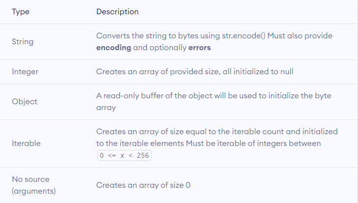

# İçindekiler

- [Bytearray](#1)
    - [Bytearray'lerde İşlemler](#1.1)
    - [Bytearray Üreteçleri (Bytearray Comprehensions)](#1.2)
    - [Bytearray Methodları](#1.3)
        - [`fromhex(s)` Methodu](#1.3.1)
        - [`hex(sep, bytes_per_sep)` Methodu](#1.3.2)
        - [`decode(encoding="utf-8", errors="strict")` Methodu](#1.3.3)
        - [`replace(old, new, count)` Methodu](#1.3.4)
        - [`split(sep = None, maxsplit)` Methodu](#1.3.5)
        - [`rsplit(sep = None, maxsplit = -1)` Methodu](#1.3.6)
        - [`splitlines()` Methodu](#1.3.7)
        - [`lower()` Methodu](#1.3.8)
        - [`islower()` Methodu](#1.3.9)
        - [`upper()` Methodu](#1.3.10)
        - [`isupper()` Methodu](#1.3.11)
        - [`endswith(suffix, start, end)` Methodu](#1.3.12)
        - [`startswith(prefix, start, end)` Methodu](#1.3.13)
        - [`capitalize()` Methodu](#1.3.14)
        - [`swapcase()` Methodu](#1.3.15)
        - [`strip(chars)` Methodu](#1.3.16)
        - [`rstrip(chars)` Methodu](#1.3.17)
        - [`lstrip(chars)` Methodu](#1.3.18)
        - [`join(iterable)` Methodu](#1.3.19)
        - [`center(width, fillbyte)` Methodu](#1.3.20)
        - [`rjust(width, fillbyte)` Methodu](#1.3.21)
        - [`ljust(width, fillbyte)` Methodu](#1.3.22)
        - [`count(x, start, end)` Methodu](#1.3.23)
        - [`index(sub, start, end)` Methodu](#1.3.24)
        - [`rindex(sub, start, end)` Methodu](#1.3.25)
        - [`find(sub, start, end)` Methodu](#1.3.26)
        - [`rfind(sub, start, end)` Methodu](#1.3.27)
        - [`zfill(width)` Methodu](#1.3.28)
        - [`partition(sep)` Methodu](#1.3.29)
        - [`rpartition(sep)` Methodu](#1.3.30)
        - [`expandtabs(tabsize)` Methodu](#1.3.31)
        - [`maketrans(from, to)` Methodu](#1.3.32)
        - [`translate(table)` Methodu](#1.3.33)
        - [`title()` Methodu](#1.3.34)
        - [`istitle()` Methodu](#1.3.35)
        - [`isalpha()` Methodu](#1.3.36)
        - [`isalnum()` Methodu](#1.3.37)
        - [`isdigit()` Methodu](#1.3.38)
        - [`isspace()` Methodu](#1.3.39)
        - [`isascii()` Methodu](#1.3.40)
        - [`removeprefix(prefix)` Methodu](#1.3.41)
        - [`removesuffix(suffix)` Methodu](#1.3.42)
        - [`append(item)` Methodu](#1.3.43)
        - [`clear()` Methodu](#1.3.44)
        - [`copy()` Methodu](#1.3.45)
        - [`extend(iterable_of_ints)` Methodu](#1.3.46)
        - [`insert(index, item)` Methodu](#1.3.47)
        - [`pop(index)` Methodu](#1.3.48)
        - [`remove(value)` Methodu](#1.3.49)
        - [`reverse()` Methodu](#1.3.50)

<h1 id="1">Bytearray</h1>

Bytes data type, temel olarak ASCII karakterlerini kabul eder. Yani ASCII tablosu dışında kalan karakterler doğrudan bytes olarak temsil edilemez. Bytes data type, string data type gibi değiştirilemez (immutable) bir data type'dır. bytearray bu durumu kaldıran bir fonksiyondur çünkü bytearray objeleri değiştirilebilir (mutable) objelerdir. `bytearray()` fonksiyonu kendisine girilen argümanı önce `bytes`'a, sonra `bytearray`'e dönüştürüp üzerinde değişiklik yapmamıza izin veren bir bytearray nesnesi döndürür. `bytearray(source, encoding, errors)` fonksiyonunun 3 parametresi vardır:
- `source` parametresine argüman olarak bytes'lardan oluşan bir dizi (sequence) girilebilir ya da hiçbir şey girilmeyebilir. Bu dizi (sequence) bir string, integer ya da iterable bir obje olabilir.

    

    - `source` parametresine argüman olarak string girilirse, mutlaka `encoding` parametresine bu string'in hangi kod çözücü ile çözülmesi gerektiğini belirlemelisiniz. Aksi halde `TypeError: string argument without an encoding` hatası yükseltilir. Yanlış kod çözücü kullanırsanız yine hata yükseltilir. Örnek:
        ```py
        print(bytearray("aş")) # TypeError: string argument without an encoding
		print(bytearray("aş", "utf-8")) # Output: bytearray(b'a\xc5\x9f')
		print(bytearray("aş", "ascii")) # UnicodeEncodeError: 'ascii' codec can't encode character '\u015f' in position 1: ordinal not in range(128)
        ```
        Yanlış kod çözücü tanımlama sonucu Python'un nasıl davranacağını `errors` parametresine gireceğiniz agümanla belirleyebilirsiniz. Örnek:
        ```py
        print(bytearray("aş", "ascii", "replace")) # Output: bytearray(b'a?')
        ```
    - `source` parametresine argüman olarak integer girilirse, tamamı null (`b'\x00'`) olarak başlatılmış integer kadar bir dizi oluşturulur. Örnek:
        ```py
        print(bytearray(5)) # Output: bytearray(b'\x00\x00\x00\x00\x00')
        ```
    - `source` parametresine argüman olarak iterable bir obje girilirse, iterable objenin eleman sayısı kadar bir array oluşturulur. Örnek:
        ```py
		print(bytearray([1,2,3])) # Output: bytearray(b'\x01\x02\x03')
		print(bytearray({1,2,3})) # Output: bytearray(b'\x01\x02\x03')
		print(bytearray((1,2,3))) # Output: bytearray(b'\x01\x02\x03')
        ```
        Bu iterable objenin elemanları `0 <= x < 256` değer aralığındaki integer sayılar olabilir. Bu değer aralığında olmazsa `ValueError: bytes must be in range(0, 256)` hatası yükseltilir.
        ```py
        print(bytearray([254,255,256])) # ValueError: byte must be in range(0, 256)
        ```
        Integer haricinde bir type girilirse `TypeError` hatası yükseltilir. Örnek:
        ```py
		print(bytearray(["a"])) # TypeError: 'str' object cannot be interpreted as an integer
		print(bytearray([[254,255],256])) # TypeError: 'list' object cannot be interpreted as an integer
        ```
- `encoding` parametresine argüman olarak girilen değerle, `source` parametresine argüman olarak girilen string'in hangi kod çözücü ile çözüleceğini belirleyebilirsiniz. Örnek:
    ```py
	print(bytearray("Selam", "ascii")) # Output: bytearray(b'Selam')
	print(bytearray("Selam", "utf-8")) # Output: bytearray(b'Selam')
    ```
- `errors` parametresine argüman olarak girilen değerle, `encoding` parametresine argüman olarak girilen kod çözücünün `source` parametresine argüman olarak girilen string'i çözememsi durumunda Python'un nasıl davranacağını belirleyebilirsiniz. Örnek:
    ```py
	print(bytearray("aş", "ascii", "replace")) # Output: bytearray(b'a?')
    ```
    Bu argümanlara ulaşmak için [tıklayınız](https://github.com/e-k-eyupoglu/python_tutorial/blob/main/python_tutorial/data_types/text_types/strings.md#1.3 "https://github.com/e-k-eyupoglu/python_tutorial/blob/main/python_tutorial/data_types/text_types/strings.md#1.3").

Daha fazla bilgi için:
- [Bytearray Function](https://docs.python.org/3/library/functions.html#func-bytearray "https://docs.python.org/3/library/functions.html#func-bytearray")
- [Bytearray Type](https://docs.python.org/3/library/stdtypes.html#bytearray "https://docs.python.org/3/library/stdtypes.html#bytearray")
- [Programiz Bytearray Function](https://www.programiz.com/python-programming/methods/built-in/bytearray "https://www.programiz.com/python-programming/methods/built-in/bytearray")

<h2 id="1.1">Bytearray'lerde İşlemler</h2>

Bir `bytearray`'i dilimlerken `bytearray_exp[Başlama index'i : bitiş index'i : atlama değeri]` syntax'ı kullanılır. Örnekler:
```py
a = bytearray(b"0123456789")

# 4. index'ten başlar, (9. index'i dahil etmeden) 9. index'e kadar bytearray'i yazdırır.
print(a[4:9]) # Output: bytearray(b'45678')

# Başlangıç index'i belirtilmediği için en baştan (0. index'ten) başlar, (9. index'i dahil etmeden) 9. index'e kadar bytearray'i yazdırır.
print(a[:9]) # Output: bytearray(b'012345678')

# Bitiş index'i belirtilmediği için 4. indexten başlar, en son index'e kadar bytearray'i yazdırır.
print(a[4:]) # Output: bytearray(b'456789')

# Başlangıç ve bitiş intex'i belirtilmediği için tüm bytearray'i yazdırır.
print(a[:]) # Output: bytearray(b'0123456789')

# Başlangıç index'i belirtilmediği için en baştan (0. index'ten) başlar, (-1. index'i dahil etmeden) -1. index'e kadar (sonran bir önceki index) bytearray'i yazdırır.
print(a[:-1])# Output: bytearray(b'012345678')

# Baştan sona index atlamadan bytearray'i yazdırır.
print(a[::1]) # bytearray(b'0123456789')

# Baştan sona 1 index atlaya atlaya bytearray'i yazdırır.
print(a[::2]) # Output: bytearray(b'02468')

# 4. index'ten başlar, (9. index'i dahil etmeden) 9. index'e kadar 2 index atlaya atlaya bytearray'i yazdırır.
print(a[0:9:3]) # Output: bytearray(b'036')

# Sondan başa index atlamadan bytearray'i yazdırır. (bytearray'i ters çevirme)
print(a[::-1]) # Output: bytearray(b'9876543210')
```

`bytearray`'lerin item sayısına `len()` fonksiyonuyla ulaşılabilir. Örnek:
```py
b1 = bytearray(b"12345")
print(len(b1)) # Output: 5
```

`bytearray`'lerde aritmetik (sayısal) işlemler yapılabilir. Örnek:
```py
print(bytearray(b"123") + bytearray(b"456") ) # Output: bytearray(b'123456')
print(bytearray([1,2,3]) + bytearray([4,5,6]) ) # Output: bytearray(b'\x01\x02\x03\x04\x05\x06')
print(bytearray(b"123") * 2) # Output: bytearray(b'123123')
print(bytearray([1,2,3]) * 2) # Output: bytearray(b'\x01\x02\x03\x01\x02\x03')
```
Bir `bytearray`'e item eklemek için addition (toplama `+`) operator'ını kullanarak item ekleyebilirsiniz. Bu durum yeniden tanımlama (redefinition) işlemi olsa bile `bytearray`, değiştirilebilir (mutable) bir type olduğu için ID'si değişmez, yani farklı bir obje olmaz. Örnek:
```py
b1 = bytearray([1,2])
id_1 = id(b1)
b1 += bytearray([3])
id_2 = id(b1)
print((id_1 == id_2)) # Output: True
```

Diğer iterable objeleri `bytearray()` fonksiyonu ile `bytearray` type'a dönüştürebilirsiniz. Örnek:
```py
print(bytearray(range(0,4))) # Output: bytearray(b'\x00\x01\x02\x03')
print(bytearray((0,1,2,3))) # Output: bytearray(b'\x00\x01\x02\x03')
print(bytearray({0,1,2,3})) # Output: bytearray(b'\x00\x01\x02\x03')
print(bytearray(b"0123")) # Output: bytearray(b'0123')
```

item sayısını bilmediğiniz `bytearray`'lerin son item'ına ulaşmak için iki yöntem:
```py
b1 = bytearray([0,1,2,3,4])
print(b1[len(b1)-1]) # Output: 4
print(b1[-1]) # Output: 4
```

Bir `bytearray`'in herhangi bir index'indeki item'ını başka bir şeyler değiştirmek:
```py
b1 = bytearray([1,2,3,4])
print(b1) # Output: bytearray(b'\x01\x02\x03\x04')
b1[1] = 0x05
print(b1) # Output: bytearray(b'\x01\x05\x03\x04')
```

Bir `bytearray`'in bütün item'larını değiştirmek:
```py
b1 = bytearray([1,2,3,4])
print(b1) # Output: bytearray(b'\x01\x02\x03\x04')
b1[:] = 0x05,0x06,0x07,0x08
print(b1) # Output: bytearray(b'\x05\x06\x07\x08')
```

`bytearray`'de belli bir index'deki item'ı tamamen silmek:
```py
b1 = bytearray([1,2,3,4])
print(b1) # Output: bytearray(b'\x01\x02\x03\x04')
del b1[0]
print(b1) # Output: bytearray(b'\x02\x03\x04')
```

`bytearray`'de bütün item'ları' silmek:
```py
b1 = bytearray([1,2,3,4])
del b1[:]
print(b1) # Output: bytearray(b'')
```

`bytearray` objesini tamamen silmek:
```py
b1 = bytearray([1,2,3,4])
del b1
print(b1) # NameError: name 'b1' is not defined
```

Bir `bytearray`'i kopyalamak ve sonuçları:
```py
b1 = bytearray([1,2,3,4])
b2 = b1
print(b1) # Output: bytearray(b'\x01\x02\x03\x04')
print(b2) # Output: bytearray(b'\x01\x02\x03\x04')
print(id(b1) == id(b2)) # Output: True

b1[0] = 0x05
print(b1) # Output: bytearray(b'\x05\x02\x03\x04')
print(b2) # Output: bytearray(b'\x05\x02\x03\x04')
```
`bytearray`, değiştirilebilir (mutable) bir data type olduğu için assignment operator (`=`) kullanılarak bir `bytearray` objesini yukarıdaki gibi farklı bir variable'a atarsanız, son durumda oluşan objeler aynı `bytearray` objesine atıfta bulunacağı (refers to) için birinde yapılan değişiklikler diğerini de etkiler. Bu durum değiştirilemez (immutable) data type'lar için geçerli değildir çünkü değiştirilemez (immutable) data type'ları değiştirmek için yeniden tanımlama (redefinition) işlemi yapmak zorundayız. Yeniden tanımlama (redefinition) işlemi sonucunda da mevcut obje farklı bir objeye dönüştüğü için birbirine atıfta bulunma durumu ortadan kalkacak ve bu objeler birbirini etkilemeyecek.

Bir `bytearray`'i yukarıda anlattığım sorunu yaşamadan kopyalamak istiyorsanız aşağıdaki yöntemi kullanabilirsiniz:
```py
b1 = bytearray([1,2,3,4])
b2 = b1[:]
print(id(b1) == id(b2)) # Output: False
print(b1) # Output: bytearray(b'\x01\x02\x03\x04')
print(b2) # Output: bytearray(b'\x01\x02\x03\x04')
```
Gördüğünüz gibi bu yöntemle içerikleri aynı ama iki farklı obje olan `bytearray` objeleri elde ettik.

<h2 id="1.2">Bytearray Üreteçleri (Bytearray Comprehensions)</h2>

**Comprehension**, tek satırda oluşturduğumuz **Generator** (daha sonra anlatılacak) yapısına verilen isimdir. `(expression for item in iterable)` syntax'ına sahiptir (parantezler dahil). Bu generator yapısı (**Generator Comprehension**) bir generator objesi oluşturmakta kullanılır. Daha sonra bu generator objesini `bytearray` type'a dönüştürerek Bytearray Comprehension oluşturabiliriz. Örnek:
```py
bytearray_exp = bytearray(i for i in range(0,256))
print(bytearray_exp) # Output: bytearray(b'\x00\x01\x02\x03\x04\x05\x06\x07\x08\t\n\x0b\x0c\r\x0e\x0f\x10\x11\x12\x13\x14\x15\x16\x17\x18\x19\x1a\x1b\x1c\x1d\x1e\x1f !"#$%&\'()*+,-./0123456789:;<=>?@ABCDEFGHIJKLMNOPQRSTUVWXYZ[\\]^_`abcdefghijklmnopqrstuvwxyz{|}~\x7f\x80\x81\x82\x83\x84\x85\x86\x87\x88\x89\x8a\x8b\x8c\x8d\x8e\x8f\x90\x91\x92\x93\x94\x95\x96\x97\x98\x99\x9a\x9b\x9c\x9d\x9e\x9f\xa0\xa1\xa2\xa3\xa4\xa5\xa6\xa7\xa8\xa9\xaa\xab\xac\xad\xae\xaf\xb0\xb1\xb2\xb3\xb4\xb5\xb6\xb7\xb8\xb9\xba\xbb\xbc\xbd\xbe\xbf\xc0\xc1\xc2\xc3\xc4\xc5\xc6\xc7\xc8\xc9\xca\xcb\xcc\xcd\xce\xcf\xd0\xd1\xd2\xd3\xd4\xd5\xd6\xd7\xd8\xd9\xda\xdb\xdc\xdd\xde\xdf\xe0\xe1\xe2\xe3\xe4\xe5\xe6\xe7\xe8\xe9\xea\xeb\xec\xed\xee\xef\xf0\xf1\xf2\xf3\xf4\xf5\xf6\xf7\xf8\xf9\xfa\xfb\xfc\xfd\xfe\xff')
```
Bu konu daha sonra comprehension başlığı altında daha detaylı anlatılacak.

<h2 id="1.3">Bytearray Methodları</h2>

`bytearray()`, [Mutable Sequence Types](https://docs.python.org/3/library/stdtypes.html#typesseq-mutable "https://docs.python.org/3/library/stdtypes.html#typesseq-mutable")'da açıklanan değişirilebilir dizi (mutable sequence) methodlarının çoğuna ve `bytes` type'ın sahip olduğu methodların tamamına sahiptir. Bu methodlara [Bytes and Bytearray Operations](https://docs.python.org/3/library/stdtypes.html#bytes-methods "https://docs.python.org/3/library/stdtypes.html#bytes-methods")'dan ulaşabilirsiniz.

**Not:** Aşağıdaki methodlardan bazıları uygulandığı `bytearray` objesini değiştirirken, bazıları işlevini gerçekleştikten sonra o `bytearray` objesinin kopyasını döndürür. Bu yüzden kimi zaman ilgili methodu uyguladığınız `bytearray` objesi değişikliğe uğramaz. Bu gibi durumları aşağıdaki methodları anlatırken belirtmeyi unutmuş olabilirim. Bu yüzden methodu kullanmadan önce o method uygulandığı `bytearray` objesini mi değiştiriyor yoksa kopyasını mı döndürüyor, kontrol etmeyi ihmal etmeyin.

<h3 id="1.3.1"><code>fromhex(s)</code> Methodu</h3>

Bu method bir class method olduğu için direkt `bytearray` class'ına veya bu class'dan türetilen objelere uygulanabilir. `s` parametresine argüman olarak girilen, hexadecimal digit'ler belirten bir string'i `bytearray` type'a dönüştürür. Bu dönüşümün ancak her bytes için en az 2 hexadecimal digit tanımlandığında yapılabilir. Aksi halde `ValueError: non-hexadecimal number found in fromhex() arg at position n` hatası yükseltilir. Bu dönüşüm hexadecimal digit'lerin kapsamında (`0, 1, 2, 3, 4, 5, 6, 7, 8, 9, a, b, c, d, e, f`) gerçekleşebilir. Aksi halde yine `ValueError` hatası yükseltilir. Boşluk (space) karakterlerini görmezden gelir. Python 3.7'den sonra ASCII whitespaces karakterini de (`20`) görmezden gelir. Örnek:
```py
print(bytearray.fromhex("f9 c8")) # Output: bytearray(b'\xf9\xc8')
print(bytearray.fromhex("f920c8")) # Output: bytearray(b'\xf9 \xc8')
print(bytearray.fromhex("c")) # ValueError: non-hexadecimal number found in fromhex() arg at position 1
print(bytearray.fromhex("ÇŞ")) # ValueError: non-hexadecimal number found in fromhex() arg at position 0
```

Daha fazla bilgi için [tıklayınız](https://docs.python.org/3/library/stdtypes.html#bytearray.fromhex "https://docs.python.org/3/library/stdtypes.html#bytearray.fromhex").

<h3 id="1.3.2"><code>hex(sep, bytes_per_sep)</code> Methodu</h3>

Uygulandığı `bytearray` objesinin içerdiği string objesi olarak döndürür. Bir nevi `fromhex()` methodunun yaptığı işin tersini yapar diyebiliriz. `fromhex()` methodunun space karakterlerini görmezden gelmesi gibi `hex()` methodu da hexadecimal anlamına gelen `\x` kaçış dizisini (escape character) görmezden gelir. `sep` parametresine girilen string'i, her ikili hexadecimal digit'in arasına uygular ve bu sayede kullanıcı tarafından output'un okunması kolaylaşır. Örnek:
```py
print((bytearray.fromhex("f9 c8")).hex("-")) # Output: f9-c8
print((bytearray.fromhex("f920c8")).hex("-")) # Output: f9-20-c8
```

Daha fazla bilgi için [tıklayınız](https://docs.python.org/3/library/stdtypes.html#bytearray.hex "https://docs.python.org/3/library/stdtypes.html#bytearray.hex").

<h3 id="1.3.3"><code>decode(encoding="utf-8", errors="strict")</code> Methodu</h3>

Uygulandığı `bytearray` objesini, default değeri `utf-8` olan `encoding` parametresine girilen argümanın belirttiği kod çözücüye göre çözer ve döndürür. Örnek:
```py
print("İ".encode("utf-8")) # Output: b'\xc4\xb0'
print(bytearray("İ".encode("utf-8"))) # Output: bytearray(b'\xc4\xb0')
print(bytearray("İ".encode("utf-8")).decode("utf-8")) # Output: İ
```
`encoding` parametresine girilen argümanın belirttiği kod çözücünün kodu çözemediği zamanlarda Python'un nasıl davranacağını `errors` parametresine girilen argüman ile belirleyebilirsiniz. Bu parametreye `strict` (default değer), `ignore` ve `replace` argümanlarını girebilirsiniz. Bu argümanların ne gibi sonuçlara sebep olduklarına ulaşmak için [tıklayınız](https://github.com/e-k-eyupoglu/python_tutorial/blob/main/python_tutorial/data_types/text_types/strings.md#1.3 "https://github.com/e-k-eyupoglu/python_tutorial/blob/main/python_tutorial/data_types/text_types/strings.md#1.3"). Örnek:
```py
print(bytearray(b'abcd\xe7').decode("ascii", "ignore")) # Output: abcd
print(bytearray(b'abcd\xe7').decode("ascii", "replace")) # Output: abcd�
```

Daha fazla bilgi için [tıklayınız](https://docs.python.org/3/library/stdtypes.html#bytearray.decode "https://docs.python.org/3/library/stdtypes.html#bytearray.decode").

<h3 id="1.3.4"><code>replace(old, new, count)</code> Methodu</h3>

`old` parametresinde argüman olarak girilen `bytes`'ı `new` parametresine argüman olarak girilen `bytes` ile değiştirir ve döndürür. `count` parametresine argüman girilmezse, o `bytes`'daki uyuşan bütün değerleri değiştirir. `count` parametresine argüman olarak integer bir değer girilirse, Python soldan sağa doğru `count` kadar ilgili değeri değiştirir. Örnek:
```py
a = bytearray(b"\xf0\xf1\xf2\xf1\xf3")
a1 = a.replace(b"\xf1",b"\xf5")
a2 = a.replace(b"\xf1",b"\xf5", 1)

print(a1) #Output: bytearray(b'\xf0\xf5\xf2\xf5\xf3')
print(a2) #Output: bytearray(b'\xf0\xf5\xf2\xf1\xf3')

a = bytearray(b"\xf0\xf1\xf2\xf1\xf3")
a1 = a.replace(bytearray(b"\xf1"),bytearray(b"\xf5"))
a2 = a.replace(bytearray(b"\xf1"),bytearray(b"\xf5"), 1)

print(a1) #Output: bytearray(b'\xf0\xf5\xf2\xf5\xf3')
print(a2) #Output: bytearray(b'\xf0\xf5\xf2\xf1\xf3')
```
`replace` methodunu kullanarak `bytearray`'de yaptığımız değişikliklerin kalıcı olmasını istiyorsanız, ilgili variable'ı yukarıdaki gibi yeniden tanımlamanız (redefinition) gerekmektedir.

Daha fazla bilgi için [tıklayınız](https://docs.python.org/3/library/stdtypes.html#bytearray.replace "https://docs.python.org/3/library/stdtypes.html#bytearray.replace").

<h3 id="1.3.5"><code>split(sep = None, maxsplit)</code> Methodu</h3>

Bytearray'leri parçalarına ayırıp bir liste içinde döndürür. `sep` parametresine argüman olarak girilen `bytes`'ı referans alarak soldan sağa doğru parçalama işlemini gerçekleştirir. `sep` parametresine argüman girilmezse boşluk karakterini (`b" "`) veya ASCII boşluk (whitespaces) karakterini referans alarak parçalama işlemi yapar. Bu boşluk karakteri ve ASCII boşluk (whitespaces) karakteri birbiri ardına geliyorsa, bunlar tek bir space karakteri olarak kabul edilir. Örnek:
```py
bytearray_exp = bytearray(b"            abc             abc   abc          abc       ")
print(bytearray_exp.split()) # Output: [bytearray(b'abc'), bytearray(b'abc'), bytearray(b'abc'), bytearray(b'abc')]
```
`maxsplit` parametresine argüman girilmezse, default değeri olan `-1` geçerli olur ve `sep` parametresine argüman olarak girilen `bytes`'ı referans alarak uygulandığı bütün `bytes`'ı parçalar. Bu durum argüman olarak girilen diğer negatif sayılar için de geçerlidir. `maxsplit` parametresine argüman olarak `0` girilirse, parçalama işlemi yapmaz. `maxsplit` parametresine argüman olarak integer bir değer girilirse, o değerde belirtilen kadar parçalama işlemi yapar. Örnek:
```py
bytearray_exp = bytearray(b"abc abc abc abc")

print(bytearray_exp.split()) # Output: [bytearray(b'abc'), bytearray(b'abc'), bytearray(b'abc'), bytearray(b'abc')]
print(bytearray_exp.split(maxsplit=0)) # Output: [bytearray(b'abc abc abc abc')]
print(bytearray_exp.split(maxsplit=2)) # Output: [bytearray(b'abc'), bytearray(b'abc'), bytearray(b'abc abc')]
print(bytearray_exp.split(b"b")) # Output: [bytearray(b'a'), bytearray(b'c a'), bytearray(b'c a'), bytearray(b'c a'), bytearray(b'c')]  
print(bytearray_exp.split(b"b", 2)) # Output: [bytearray(b'a'), bytearray(b'c a'), bytearray(b'c abc abc')]
print(bytearray_exp.split(bytearray(b"b"))) # Output: [bytearray(b'a'), bytearray(b'c a'), bytearray(b'c a'), bytearray(b'c a'), bytearray(b'c')]  
print(bytearray_exp.split(bytearray(b"b"), 2)) # Output: [bytearray(b'a'), bytearray(b'c a'), bytearray(b'c abc abc')]
```
`maxsplit` parametresinde belirtilen integer, `split` methodunun döndürdüğü listede bulunan virgül sayısına eşit, eleman sayısından bir eksiktir. Yani: `maxsplit = virgül sayısı = len(split methodunun döndürdüğü liste)-1`. `sep` parametresine girilen referans ilgili `bytes`'da yoksa, hiçbir işlem yapılmaz. Örnek:
```py
bytearray_exp = bytearray(b"abc abc abc abc")

print(bytearray_exp.split(b"d")) # Output: [bytearray(b'abc abc abc abc')]
print(bytearray_exp.split(bytearray(b"d"))) # Output: [bytearray(b'abc abc abc abc')]
```

Daha fazla bilgi için [tıklayınız](https://docs.python.org/3/library/stdtypes.html#bytearray.split "https://docs.python.org/3/library/stdtypes.html#bytearray.split").

<h3 id="1.3.6"><code>rsplit(sep = None, maxsplit = -1)</code> Methodu</h3>

`split()` methodunun yaptığı işi sağdan sola doğru yapar. Örnek:
```py
bytearray_exp = bytearray(b"abc abc abc abc")

print(bytearray_exp.rsplit()) # Output: [bytearray(b'abc'), bytearray(b'abc'), bytearray(b'abc'), bytearray(b'abc')]
print(bytearray_exp.rsplit(maxsplit=0)) # Output: [bytearray(b'abc abc abc abc')]
print(bytearray_exp.rsplit(maxsplit=2)) # Output: [bytearray(b'abc abc'), bytearray(b'abc'), bytearray(b'abc')]
print(bytearray_exp.rsplit(b"b")) # Output: [bytearray(b'a'), bytearray(b'c a'), bytearray(b'c a'), bytearray(b'c a'), bytearray(b'c')]
print(bytearray_exp.rsplit(b"b", 2)) # Output: [bytearray(b'abc abc a'), bytearray(b'c a'), bytearray(b'c')]
print(bytearray_exp.rsplit(bytearray(b"d"))) # Output: [bytearray(b'abc abc abc abc')]
print(bytearray_exp.rsplit(bytearray(b"b"))) # Output: [bytearray(b'a'), bytearray(b'c a'), bytearray(b'c a'), bytearray(b'c a'), bytearray(b'c')] 
print(bytearray_exp.rsplit(bytearray(b"b"), 2)) # Output: [bytearray(b'abc abc a'), bytearray(b'c a'), bytearray(b'c')]
print(bytearray_exp.rsplit(bytearray(b"d"))) # Output: [bytearray(b'abc abc abc abc')]
```

Daha fazla bilgi için [tıklayınız](https://docs.python.org/3/library/stdtypes.html#bytearray.rsplit "https://docs.python.org/3/library/stdtypes.html#bytearray.rsplit").

<h3 id="1.3.7"><code>splitlines()</code> Methodu</h3>

Bytearray'leri satır satır (line) olarak parçalar. `keepends` parametresi boolean type değerleri kabul eder. `keepends` parametresine girilen argüman `True` boolean değerine sahipse `splitlines` methodu `\n` kaçış dizilerini de dahil eder, `False` ise etmez. `keepends` parametresinin default değeri `False`'dır. Örnek:
```py
a = bytearray(b'abc\nabc\nabc\nabc\nabc')
print(a.splitlines(False)) # Output: [bytearray(b'abc'), bytearray(b'abc'), bytearray(b'abc'), bytearray(b'abc'), bytearray(b'abc')]
print(a.splitlines(True))  # Output: [bytearray(b'abc\n'), bytearray(b'abc\n'), bytearray(b'abc\n'), bytearray(b'abc\n'), bytearray(b'abc')]
```

Daha fazla bilgi için [tıklayınız](https://docs.python.org/3/library/stdtypes.html#bytearray.splitlines "https://docs.python.org/3/library/stdtypes.html#bytearray.splitlines").

<h3 id="1.3.8"><code>lower()</code> Methodu</h3>

Uygulandığı `bytes` objesinin içerdiği bütün ASCII karakterlerini küçük harfe dönüştürür. Örnek:
```py
bytearray_exp = bytearray(b"SeLaMlArRrR")
print(bytearray_exp.lower()) # Output: bytearray(b'selamlarrrr')
```

Daha fazla bilgi için [tıklayınız](https://docs.python.org/3/library/stdtypes.html#bytearray.lower "https://docs.python.org/3/library/stdtypes.html#bytearray.lower").

<h3 id="1.3.9"><code>islower()</code> Methodu</h3>

Uygulandığı `bytearray` objesinin içerdiği bütün ASCII karakterlerini küçük harf olup olmadığını sorgular. Hepsi küçük harf ise `True`, diğer durumlarda `False` döndürür. Örnek:
```py
bytearray1 = bytearray(b"selamlar")
bytearray2 = bytearray(b"Selamlar")
print(bytearray1.islower()) # Output: True
print(bytearray2.islower()) # Output: False
```

Daha fazla bilgi için [tıklayınız](https://docs.python.org/3/library/stdtypes.html#bytearray.islower "https://docs.python.org/3/library/stdtypes.html#bytearray.islower").

<h3 id="1.3.10"><code>upper()</code> Methodu</h3>

Uygulandığı `bytearray` objesinin içerdiği bütün ASCII karakterlerini büyük harfe dönüştürür. Örnek:
```py
bytearray_exp = bytearray(b"SeLaMlArRrR")
print(bytearray_exp.upper()) # Output: bytearray(b'SELAMLARRRR')
```

Daha fazla bilgi için [tıklayınız](https://docs.python.org/3/library/stdtypes.html#bytearray.upper "https://docs.python.org/3/library/stdtypes.html#bytearray.upper").

<h3 id="1.3.11"><code>isupper()</code> Methodu</h3>

Uygulandığı `bytearray` objesinin içerdiği bütün ASCII karakterlerini büyük harf olup olmadığını sorgular. Hepsi büyük harf ise `True`, diğer durumlarda `False` döndürür. Örnek:
```py
bytearray1 = bytearray(b"SELAMLAR")
bytearray2 = bytearray(b"SELAMLAr")
print(bytearray1.isupper()) # Output: True
print(bytearray2.isupper()) # Output: False
```

Daha fazla bilgi için [tıklayınız](https://docs.python.org/3/library/stdtypes.html#bytearray.isupper "https://docs.python.org/3/library/stdtypes.html#bytearray.isupper").

<h3 id="1.3.12"><code>endswith(suffix, start, end)</code> Methodu</h3>

Uygulandığı `bytearray`'in en son index'inden en baş index'ine doğru tarayarak, `suffix` parametresine argüman olarak girilen `bytes`'ı ya da tuple içinde belirtilen `bytes`'ları arar ve bulursa `True`, bulamazsa `False` boolean değerini döndürür. `start` ve `end` parametreleri tanımlanırsa, bu parametrelere tanımlanan index'ler arasında tarama işlemi yapar. `start` parametresinde belirtilen index dahil edilirken, `end` parametresinde belirtilen index dahil edilmez. Örnek:
```py
bytearray1 = bytearray(b"abc i abc abc abc x")
bytearray2 = bytearray(b"abc j abc abc abc y")
bytearray3 = bytearray(b"abc k abc abc abc z")
print(bytearray1.endswith(b"x")) # Output: True
print(bytearray1.endswith(b"i", 0, 5), end="\n\n") # Output: True

for i in [bytearray1, bytearray2, bytearray3]:
    print(i.endswith((b"x", b"y", b"z", b"p")))
```
**Output:**
```
True
True

True
True
True
```
Gördüğünüz gibi `suffix` parametresine argüman olarak girilen tuple içinde belirtilen `bytes`'lardan herhangi birisi `endswith` methodunun uygulandığı `bytes`'ın sonunda varsa `True` output'u verilir.

Daha fazla bilgi için [tıklayınız](https://docs.python.org/3/library/stdtypes.html#bytearray.endswith "https://docs.python.org/3/library/stdtypes.html#bytearray.endswith").

<h3 id="1.3.13"><code>startswith(prefix, start, end)</code> Methodu</h3>

`endswith` methodunun yaptığı işin aynısının, uygulandığı `bytearray`'in başını kontrol eden versiyonudur. Örnek:
```py
bytearray1 = bytearray(b"x abc abc i abc abc")
bytearray2 = bytearray(b"y abc abc j abc abc")
bytearray3 = bytearray(b"z abc abc k abc abc")
print(bytearray1.startswith(b"x")) # Output: True
print(bytearray1.startswith(b"i", 10), end="\n\n") # Output: True

for i in [bytearray1, bytearray2, bytearray3]:
    print(i.startswith((b"x", b"y", b"z", b"p")))
```
**Output:**
```
True
True

True
True
True
```

Daha fazla bilgi için [tıklayınız](https://docs.python.org/3/library/stdtypes.html#bytearray.startswith "https://docs.python.org/3/library/stdtypes.html#bytearray.startswith").

<h3 id="1.3.14"><code>capitalize()</code> Methodu</h3>

Bir `bytearray`'in 0. index'indeki ASCII karakteri büyük harf karakterine dönüştürür. 0. index'indeki harf karakterinin üstünde `upper()` methodu uygulanmış gibi düşünebilirsiniz. Non-ASCII (ASCII olmayan) karakterlere bir şey yapmaz. Örnek:
```py
bytearray1 = bytearray(b"istisnalar kaideyi bozmaz.")
print(bytearray1.capitalize()) # Output: bytearray(b'Istisnalar kaideyi bozmaz.')

bytearray2 = bytearray(b" istisnalar kaideyi bozmaz.")
print(bytearray2.capitalize()) # Output: bytearray(b' istisnalar kaideyi bozmaz.')

bytearray3 = bytearray(b'\xc3\xa7al\xc4\xb1\xc5\x9fkan \xc3\xa7ocuk')
print(bytearray3.capitalize()) # Output: bytearray(b'\xc3\xa7al\xc4\xb1\xc5\x9fkan \xc3\xa7ocuk')
```

Daha fazla bilgi için [tıklayınız](https://docs.python.org/3/library/stdtypes.html#bytearray.capitalize "https://docs.python.org/3/library/stdtypes.html#bytearray.capitalize").

<h3 id="1.3.15"><code>swapcase()</code> Methodu</h3>

`bytearray`'in içindeki büyük ASCII harflerini küçük ASCII harferine, küçük ASCII harferini de büyük ASCII harferine dönüştürür. Yani `b'abcdefghijklmnopqrstuvwxyz'` ve `b'ABCDEFGHIJKLMNOPQRSTUVWXYZ'` verilerini kullanarak dönüşüm işlemi yapar. Örnek:
```py
bytearray1 = bytearray(b"SelaMLar")
print(bytearray1.swapcase()) # Output: bytearray(b'sELAmlAR')

bytearray2 = bytearray(b"iRiTe")
print(bytearray2.swapcase()) # Output: bytearray(b'IrItE')
```

Daha fazla bilgi için [tıklayınız](https://docs.python.org/3/library/stdtypes.html#bytearray.swapcase "https://docs.python.org/3/library/stdtypes.html#bytearray.swapcase").

<h3 id="1.3.16"><code>strip(chars)</code> Methodu</h3>

Bir `bytearray`'deki her line'ın başındaki ve sonundaki `chars` parametresine argüman olarak girilen string'i kırpmaya yarar. Default değer olarak boşluk karakteri `" "` alır. Bu method'un nasıl davranacağını kestirmek zordur. Bu yüzden kullanıldığında nasıl bir output vereceğini test etmek önem arz ediyor.
```py
bytearray1 = bytearray(b"   salamlar salamlar salamlar    ")
print(bytearray1.strip(b" "), end="\n\n") # Output: bytearray(b'salamlar salamlar salamlar')

bytearray1 = bytearray(b".. salamlar ..")
print(bytearray1.strip(b".. "), end="\n\n") # Output: bytearray(b'salamlar')
print(bytearray1.strip(b" .."), end="\n\n") # Output: bytearray(b'salamlar')

bytearray1 = bytearray(b".. salamlar ..\n.. salamlar ..\n.. salamlar ..")
print(bytearray1.strip(b".. "), end="\n\n") # Output: bytearray(b'salamlar ..\n.. salamlar ..\n.. salamlar')
print(bytearray1.strip(b" .."), end="\n\n") # Output: bytearray(b'salamlar ..\n.. salamlar ..\n.. salamlar')
```

Daha fazla bilgi için [tıklayınız](https://docs.python.org/3/library/stdtypes.html#bytearray.strip "https://docs.python.org/3/library/stdtypes.html#bytearray.strip").

<h3 id="1.3.17"><code>rstrip(chars)</code> Methodu</h3>

`strip(chars)`'den tek farkı, sadece sağdaki kısmı kırpar. Örnek:
```py
bytearray1 = bytearray(b"   salamlar salamlar salamlar    ")
print(bytearray1.rstrip(b" "), end="\n\n") # Output: bytearray(b'   salamlar salamlar salamlar')

bytearray1 = bytearray(b".. salamlar ..")
print(bytearray1.rstrip(b".. "), end="\n\n") # Output: bytearray(b'.. salamlar')
print(bytearray1.rstrip(b" .."), end="\n\n") # Output: bytearray(b'.. salamlar')

bytearray1 = bytearray(b".. salamlar ..\n.. salamlar ..\n.. salamlar ..")
print(bytearray1.rstrip(b".. "), end="\n\n") # Output: bytearray(b'.. salamlar ..\n.. salamlar ..\n.. salamlar')
print(bytearray1.rstrip(b" .."), end="\n\n") # Output: bytearray(b'.. salamlar ..\n.. salamlar ..\n.. salamlar')
```

Daha fazla bilgi için [tıklayınız](https://docs.python.org/3/library/stdtypes.html#bytearray.rstrip "https://docs.python.org/3/library/stdtypes.html#bytearray.rstrip").

<h3 id="1.3.18"><code>lstrip(chars)</code> Methodu</h3>

`strip(chars)`'den tek farkı, sadece soldaki kısmı kırpar. Örnek:
```py
bytearray1 = bytearray(b"   salamlar salamlar salamlar    ")
print(bytearray1.lstrip(b" "), end="\n\n") # Output: bytearray(b'salamlar salamlar salamlar    ')

bytearray1 = bytearray(b".. salamlar ..")
print(bytearray1.lstrip(b".. "), end="\n\n") # Output: bytearray(b'salamlar ..')
print(bytearray1.lstrip(b" .."), end="\n\n") # Output: bytearray(b'salamlar ..')

bytearray1 = bytearray(b".. salamlar ..\n.. salamlar ..\n.. salamlar ..")
print(bytearray1.lstrip(b".. "), end="\n\n") # Output: bytearray(b'salamlar ..\n.. salamlar ..\n.. salamlar ..')
print(bytearray1.lstrip(b" .."), end="\n\n") # Output: bytearray(b'salamlar ..\n.. salamlar ..\n.. salamlar ..')
```

Daha fazla bilgi için [tıklayınız](https://docs.python.org/3/library/stdtypes.html#bytearray.lstrip "https://docs.python.org/3/library/stdtypes.html#bytearray.lstrip").

<h3 id="1.3.19"><code>join(iterable)</code> Methodu</h3>

Uygulandığı `bytearray`'i, `iterable` parametresine girilen iterable objelerin (`list`, `tuple`, `set` ...) elemanları arasına ekleyerek bir string oluşturur ve döndürür. Örnek:
```py
m1 = [b"1",b"2",b"3"]
m2 = (b"1",b"2",b"3")
m3 = {b"1",b"2",b"3"}
print(bytearray(b"--").join(m1)) # Output: bytearray(b'1--2--3')
print(bytearray(b"--").join(m2)) # Output: bytearray(b'1--2--3')
print(bytearray(b"--").join(m3)) # Output: bytearray(b'1--3--2') (rastgele olmasının sebebi set'in bir özelliği)
```

Daha fazla bilgi için [tıklayınız](https://docs.python.org/3/library/stdtypes.html#bytearray.join "https://docs.python.org/3/library/stdtypes.html#bytearray.join").

<h3 id="1.3.20"><code>center(width, fillbyte)</code> Methodu</h3>

Uygulandığı `bytearray`'i, `width` parametresine girilen argüman kadar ortalar. Ortalama işleminde oluşan boşlukları `fillbyte` parametresine argüman olarak girilen `bytes`'lar ile doldurur. `fillbyte` parametresinin default değeri boşluk karakteridir (`b" "`). Örnek:
```py
print(bytearray(b"1234").center(4,b"-")) # Output: bytearray(b'1234')
print(bytearray(b"1234").center(5,b"-")) # Output: bytearray(b'-1234')
print(bytearray(b"1234").center(6,b"-")) # Output: bytearray(b'-1234-')

print(bytearray(b"12345").center(5,b"-")) # Output: bytearray(b'12345')
print(bytearray(b"12345").center(6,b"-")) # Output: bytearray(b'12345-')
print(bytearray(b"12345").center(7,b"-")) # Output: bytearray(b'-12345-')
```
Ortalama işleminde `fillbyte` parametresine argüman olarak girilen `bytes`'ın düzgünce kullanılabilmesi için `width` parametresinde belirtilen sayının, `center` methodunun uygulandığı `bytes`'ın uzunluğundan en az 2 fazla olması gerekmektedir. Örnek:
```py
for i in range(1,11,2):
	print(bytearray(b"1").center(i,b"-"), f"({i})")

print()

for i in range(0,11,2):
	print(bytearray(b"12").center(i,b"-"), f"({i})")

print()

for i in range(1,11,2):
	print(bytearray(b"12345").center(i,b"-"), f"({i})")

print()

for i in range(0,11,2):
	print(bytearray(b"123456").center(i,b"-"), f"({i})")
```
**Output:**
```
bytearray(b'1') (1)
bytearray(b'-1-') (3)
bytearray(b'--1--') (5)
bytearray(b'---1---') (7)
bytearray(b'----1----') (9)

bytearray(b'12') (0)
bytearray(b'12') (2)
bytearray(b'-12-') (4)
bytearray(b'--12--') (6)
bytearray(b'---12---') (8)
bytearray(b'----12----') (10)

bytearray(b'12345') (1)
bytearray(b'12345') (3)
bytearray(b'12345') (5)
bytearray(b'-12345-') (7)
bytearray(b'--12345--') (9)

bytearray(b'123456') (0)
bytearray(b'123456') (2)
bytearray(b'123456') (4)
bytearray(b'123456') (6)
bytearray(b'-123456-') (8)
bytearray(b'--123456--') (10)
```

Daha fazla bilgi için [tıklayınız](https://docs.python.org/3/library/stdtypes.html#bytearray.center "https://docs.python.org/3/library/stdtypes.html#bytearray.center").

<h3 id="1.3.21"><code>rjust(width, fillbyte)</code> Methodu</h3>

`center()` methoduna benzer çalışır. Tek farkı uygulandığı `bytearray`'i ortalamaz, sağa yaslar. `fillchar` parametresinin default değeri boşluk karakteridir (`b" "`). Örnek:
```py
for i in range(1,11,2):
	print(bytearray(b"1").rjust(i,b"-"), f"({i})")

print()

for i in range(0,11,2):
	print(bytearray(b"123456").rjust(i,b"-"), f"({i})")
```
**Output:**
```
bytearray(b'1') (1)
bytearray(b'--1') (3)
bytearray(b'----1') (5)
bytearray(b'------1') (7)
bytearray(b'--------1') (9)

bytearray(b'123456') (0)
bytearray(b'123456') (2)
bytearray(b'123456') (4)
bytearray(b'123456') (6)
bytearray(b'--123456') (8)
bytearray(b'----123456') (10)
```

Daha fazla bilgi için [tıklayınız](https://docs.python.org/3/library/stdtypes.html#bytearray.rjust "https://docs.python.org/3/library/stdtypes.html#bytearray.rjust").

<h3 id="1.3.22"><code>ljust(width, fillbyte)</code> Methodu</h3>

`center()` methoduna benzer çalışır. Tek farkı uygulandığı `bytearray`'i ortalamaz, sola yaslar. `fillchar` parametresinin default değeri boşluk karakteridir (`b" "`). Örnek:
```py
for i in range(1,11,2):
	print(bytearray(b"1").ljust(i,b"-"), f"({i})")

print()

for i in range(0,11,2):
	print(bytearray(b"123456").ljust(i,b"-"), f"({i})")
```
**Output:**
```
bytearray(b'1') (1)
bytearray(b'1--') (3)
bytearray(b'1----') (5)
bytearray(b'1------') (7)
bytearray(b'1--------') (9)

bytearray(b'123456') (0)
bytearray(b'123456') (2)
bytearray(b'123456') (4)
bytearray(b'123456') (6)
bytearray(b'123456--') (8)
bytearray(b'123456----') (10)
```

Daha fazla bilgi için [tıklayınız](https://docs.python.org/3/library/stdtypes.html#bytearray.ljust "https://docs.python.org/3/library/stdtypes.html#bytearray.ljust").

<h3 id="1.3.23"><code>count(x, start, end)</code> Methodu</h3>

`x` parametresine argüman olarak girilen `bytes`'ın, uygulandığı `bytearray`'in içinde kaç defa geçtiğini söyler. `start` ve `end` parametrelerine başlama ve bitiş index'lerini girerek `bytearray` içerisinde belli bir bölümü kontrol edebilirsiniz. Örnek:
```py
bytearray1 = bytearray(b"Kahramanmaras")
print(bytearray1.count(b"a")) # Output: 5
```

Daha fazla bilgi için [tıklayınız](https://docs.python.org/3/library/stdtypes.html#bytearray.count "https://docs.python.org/3/library/stdtypes.html#bytearray.count").

<h3 id="1.3.24"><code>index(sub, start, end)</code> Methodu</h3>

`sub` parametresine argüman olarak girilen `bytes`'ı, uygulandığı `bytearray`'in içinde soldan sağa doğru arar ve ilk kaçıncı index'de olduğunu söyler. `sub` parametresine argüman olarak birden fazla ASCII karakterden oluşan `bytes` girilirse, soldan sağa doğru arar ve o ASCII karakterlerden oluşan `bytes`'ın ilk ASCII karakterinin geçtiği index'i söyler. `start` ve `end` parametrelerine başlama ve bitiş index'lerini girerek `bytes` içerisinde belli bir bölümü kontrol edebilirsiniz. Örnek:
```py
bytearray1 = bytearray(b"abc abc abcd abc abc abcd abc abc")
print(bytearray1.index(b"d")) # Output: 11
print(bytearray1.index(b"abcd")) # Output: 8 (a ASCII karakteri ilk 8. index'te bulunmuş)
```
İstenilen `bytes`'ı bulunamazsa `ValueError` hatası yükseltilir. Örnek:
```py
bytearray2 = bytearray(b"abc abc abcd abc abc abcd abc abc")
print(bytearray2.index(b"x")) # ValueError: substring not found
```

Daha fazla bilgi için [tıklayınız](https://docs.python.org/3/library/stdtypes.html#bytearray.index "https://docs.python.org/3/library/stdtypes.html#bytearray.index").

<h3 id="1.3.25"><code>rindex(sub, start, end)</code> Methodu</h3>

`index()` methodunun yaptığı işi sağdan sola yapar. Örnek:
```py
bytearray1 = bytearray(b"abc abc abcd abc abc abcd abc abc")
print(bytearray1.rindex(b"d")) # Output: 24
print(bytearray1.rindex(b"abcd")) # Output: 21 (a ASCII karakteri ilk 21. index'te bulunmuş)
print(bytearray1.rindex(b"x")) # ValueError: substring not found
```

Daha fazla bilgi için [tıklayınız](https://docs.python.org/3/library/stdtypes.html#bytearray.rindex "https://docs.python.org/3/library/stdtypes.html#bytearray.rindex").

<h3 id="1.3.26"><code>find(sub, start, end)</code> Methodu</h3>

`index()` methodunun yaptığı işi yapar. Tek farkı, istenilen `bytes`'ı bulunamazsa `ValueError` hatası yükseltmek yerine yerine `-1` değerini döndürür. Örnek:
```py
bytearray1 = bytearray(b"abc abc abcd abc abc abcd abc abc")
print(bytearray1.find(b"d")) # Output: 11
print(bytearray1.find(b"abcd")) # Output: 8 (a ASCII karakteri ilk 8. index'te bulunmuş)
print(bytearray1.find(b"x")) # Output: -1
```

Daha fazla bilgi için [tıklayınız](https://docs.python.org/3/library/stdtypes.html#bytearray.find "https://docs.python.org/3/library/stdtypes.html#bytearray.find").

<h3 id="1.3.27"><code>rfind(sub, start, end)</code> Methodu</h3>

`find()` methodunun sağdan sola versiyonudur. Örnek:
```py
bytearray1 = bytearray(b"abc abc abcd abc abc abcd abc abc")
print(bytearray1.rfind(b"d")) # Output: 24
print(bytearray1.rfind(b"abcd")) # Output: 21 (a ASCII karakteri ilk 21. index'te bulunmuş)
print(bytearray1.rfind(b"x")) # Output: -1
```

Daha fazla bilgi için [tıklayınız](https://docs.python.org/3/library/stdtypes.html#bytearray.rfind "https://docs.python.org/3/library/stdtypes.html#bytearray.rfind").

<h3 id="1.3.28"><code>zfill(width)</code> Methodu</h3>

Uygulandığı `bytearray`'in soluna `width` parametresine argüman olarak girilen integer kadar sıfır (`0`) ekler. Sıfırların gözükebilmesi için `width` parametresine argüman olarak girilen integer, `zfill` methodunun uygulandığı `bytes`'ın uzunluğundan en az 2 fazla olması gerekmektedir. Örnek:
```py
print(bytearray(b"1").zfill(1))   # Output: bytearray(b'1')
print(bytearray(b"1").zfill(2))   # Output: bytearray(b'01')
print(bytearray(b"123").zfill(7)) # Output: bytearray(b'0000123')
```
Uygulandığı string'in en solunda `+` ya da `-` karakterleri varsa, `zfill` methodu bunu algılar ve sıfırları `+`/`-` karakterlerinden sonra koyar. Örnek:
```py
print(bytearray(b"-290").zfill(8)) # Output: bytearray(b'-0000290')
print(bytearray(b"+290").zfill(8)) # Output: bytearray(b'+0000290')
print(bytearray(b"--random+text").zfill(20)) # Output: bytearray(b'-0000000-random+text')
```

Daha fazla bilgi için [tıklayınız](https://docs.python.org/3/library/stdtypes.html#bytearray.zfill "https://docs.python.org/3/library/stdtypes.html#bytearray.zfill").

<h3 id="1.3.29"><code>partition(sep)</code> Methodu</h3>

`sep` parametresine argüman olarak girilen `bytes`'ı referans alarak, uygulandığı `bytearray`'i soldan sağa doğru okur ve referansa uyan ilk yerden üçe böler. Sonucu list type olarak döndürür. Örnek:
```py
print(bytearray(b"Istanbul").partition(b"an")) # Output: (bytearray(b'Ist'), bytearray(b'an'), bytearray(b'bul'))
```
`sep` parametresine argüman olarak girilen `bytes`, uygulandığı `bytearray`'de yoksa aşağıdaki gibi bir output verir:
```py
print(bytearray(b"Istanbul").partition(b"fil")) # Output: (bytearray(b'Istanbul'), bytearray(b''), bytearray(b''))
```

Daha fazla bilgi için [tıklayınız](https://docs.python.org/3/library/stdtypes.html#bytearray.partition "https://docs.python.org/3/library/stdtypes.html#bytearray.partition").

<h3 id="1.3.30"><code>rpartition(sep)</code> Methodu</h3>

`partition()` methodunun yaptığı işi sağdan sola yapar. Örnek:
```py
print(bytearray(b"Istanbul").rpartition(b"an")) # Output: (bytearray(b'Ist'), bytearray(b'an'), bytearray(b'bul'))
print(bytearray(b"Istanbul").rpartition(b"fil")) # Output: (bytearray(b''), bytearray(b''), bytearray(b'Istanbul'))
```

Daha fazla bilgi için [tıklayınız](https://docs.python.org/3/library/stdtypes.html#bytearray.rpartition "https://docs.python.org/3/library/stdtypes.html#bytearray.rpartition").

<h3 id="1.3.31"><code>expandtabs(tabsize)</code> Methodu</h3>

Uygulandığı `bytearray`'in içeriğindeki TAB (`\t`) kaçış dizisinin kaç space (boşluk) genişliğinde olacağını `tabsize` parametresine girilen integer argümanla belirleyebiliriz.
```py
a = bytearray(b"elma\tbir\tmeyvedir.")
print(a.expandtabs(10)) # Output: bytearray(b'elma      bir       meyvedir.')
```

Daha fazla bilgi için [tıklayınız](https://docs.python.org/3/library/stdtypes.html#bytearray.expandtabs "https://docs.python.org/3/library/stdtypes.html#bytearray.expandtabs").

<h3 id="1.3.32"><code>maketrans(from, to)</code> Methodu</h3>

`maketrans` methodu bir static method olduğu için direkt `bytearray` class'ına veya `bytearray` objesine uygulanabilir. `from` parametrelerine tanımalanan `bytes`'ları `to` parametresine tanımlanan `bytes`'larla eşlediği (mapping) bir `bytes` objesi döndürür. Bu mapping `bytes` objesini `translate()` methodunun `table` parametresinde kullanabiliriz. Örnek:
```py
a = bytearray(b"abc")
b = bytearray(b"123")
c = bytearray.maketrans(a,b)
print(c) # Output: b'\x00\x01\x02\x03\x04\x05\x06\x07\x08\t\n\x0b\x0c\r\x0e\x0f\x10\x11\x12\x13\x14\x15\x16\x17\x18\x19\x1a\x1b\x1c\x1d\x1e\x1f !"#$%&\'()*+,-./0123456789:;<=>?@ABCDEFGHIJKLMNOPQRSTUVWXYZ[\\]^_`123defghijklmnopqrstuvwxyz{|}~\x7f\x80\x81\x82\x83\x84\x85\x86\x87\x88\x89\x8a\x8b\x8c\x8d\x8e\x8f\x90\x91\x92\x93\x94\x95\x96\x97\x98\x99\x9a\x9b\x9c\x9d\x9e\x9f\xa0\xa1\xa2\xa3\xa4\xa5\xa6\xa7\xa8\xa9\xaa\xab\xac\xad\xae\xaf\xb0\xb1\xb2\xb3\xb4\xb5\xb6\xb7\xb8\xb9\xba\xbb\xbc\xbd\xbe\xbf\xc0\xc1\xc2\xc3\xc4\xc5\xc6\xc7\xc8\xc9\xca\xcb\xcc\xcd\xce\xcf\xd0\xd1\xd2\xd3\xd4\xd5\xd6\xd7\xd8\xd9\xda\xdb\xdc\xdd\xde\xdf\xe0\xe1\xe2\xe3\xe4\xe5\xe6\xe7\xe8\xe9\xea\xeb\xec\xed\xee\xef\xf0\xf1\xf2\xf3\xf4\xf5\xf6\xf7\xf8\xf9\xfa\xfb\xfc\xfd\xfe\xff'
```

Daha fazla bilgi için [tıklayınız](https://docs.python.org/3/library/stdtypes.html#bytearray.maketrans "https://docs.python.org/3/library/stdtypes.html#bytearray.maketrans").

<h3 id="1.3.33"><code>translate(table)</code> Methodu</h3>

Uygulandığı `bytearray`'ı, `table` parametresinde belirtilen mapping `bytes` objesine göre düzenler ve döndürür. `table` parametresine argüman olarak girilen mapping `bytes` objesi, `maketrans()` methodu ile oluşturulan mapping `bytes` objelerin formatında olmalıdır. Örnek:
```py
büyük_harfler = bytearray(b'ABCDEFGHIJKLMNOPQRSTUVWXYZ')
küçük_harfler = bytearray(b'abcdefghijklmnopqrstuvwxyz')
bk= bytearray.maketrans(büyük_harfler,küçük_harfler)
kb= bytearray.maketrans(küçük_harfler,büyük_harfler)

print(bytearray(b"SeLamLar BeN PytHoN").translate(bk)) # Output: bytearray(b'selamlar ben python')
print(bytearray(b"SeLamLar BeN PytHoN").translate(kb)) # Output: bytearray(b'SELAMLAR BEN PYTHON')
```

`table` parametresinde argüman olarak girilen mapping `bytes` objesinde, `translate` methodunun uygulandığı `bytes`'ın içeriğinde bulunan bir ASCII karakter tanımlı değilse, `translate` methodu o ASCII karaktere müdahele etmez.
```py
büyük_harfler = bytearray(b"ABC")
küçük_harfler = bytearray(b"abc")
bk= bytearray.maketrans(büyük_harfler,küçük_harfler)
kb= bytearray.maketrans(küçük_harfler,büyük_harfler)

print(bytearray(b"aBCD").translate(bk)) # Output: bytearray(b'abcD')
print(bytearray(b"aBCd").translate(kb)) # Output: bytearray(b'ABCd')
```

Daha fazla bilgi için [tıklayınız](https://docs.python.org/3/library/stdtypes.html#bytearray.translate "https://docs.python.org/3/library/stdtypes.html#bytearray.translate").

<h3 id="1.3.34"><code>title()</code> Methodu</h3>

Uygulandığı `bytearray`'deki ASCII harflerinden oluşmuş her kelimenin (her kelime space karakteri ile birbirinden ayrılıyor) büyük harfle başlayıp küçük harflerle devam ettiği başlıklı (titlecased) versiyonunu döndürür. Örnek:
```py
print(bytearray(b" falan filan").title()) # Output: bytearray(b' Falan Filan')
print(bytearray(b"falan filan").title())  # Output: bytearray(b'Falan Filan')
```
Bu algoritma, kelime grupları için dilden bağımsız (language-independent) basit bir tanımlama kullanır. Bu algoritma çoğu zaman işe yarasa bile, kısaltmalarda ve kesme işaretlerinin kullanıldığı yerlerde istenmeyen sonuçlara neden olabilir. Örnek:
```py
print(bytearray(b"they're bill's friends from the USA.").title()) # Output: bytearray(b"They\'Re Bill\'S Friends From The Usa.")
```

Daha fazla bilgi için [tıklayınız](https://docs.python.org/3/library/stdtypes.html#bytearray.title "https://docs.python.org/3/library/stdtypes.html#bytearray.title").

<h3 id="1.3.35"><code>istitle()</code> Methodu</h3>

Uygulandığı `bytearray`, `title()` methodunun algoritmasına uygunsa `True`, diğer durumlarda `False` döndürür. Örnek:
```py
print((bytearray(b"they're bill's friends from the USA.").title()).istitle()) # Output: True
```

Daha fazla bilgi için [tıklayınız](https://docs.python.org/3/library/stdtypes.html#bytearray.istitle "https://docs.python.org/3/library/stdtypes.html#bytearray.istitle").

<h3 id="1.3.36"><code>isalpha()</code> Methodu</h3>

Bir `bytearray` yalnızca `b'abcdefghijklmnopqrstuvwxyzABCDEFGHIJKLMNOPQRSTUVWXYZ'` bunlardan oluşuyorsa, `isalpha` methodu `True`, aksi durumlarda `False` döndürür. Örnek:
```py
print(bytearray(b"abcd").isalpha()) # Output: True
print(bytearray(b"abcd1").isalpha()) # Output: False
print(bytearray(b"abcd?").isalpha()) # Output: False
```

Daha fazla bilgi için [tıklayınız](https://docs.python.org/3/library/stdtypes.html#bytearray.isalpha "https://docs.python.org/3/library/stdtypes.html#bytearray.isalpha").

<h3 id="1.3.37"><code>isalnum()</code> Methodu</h3>

Bir `bytearray` yalnızca `b'abcdefghijklmnopqrstuvwxyzABCDEFGHIJKLMNOPQRSTUVWXYZ'` veya `b'0123456789'` bunlardan oluşuyorsa, `isalnum` methodu `True`, aksi durumlarda `False` döndürür. Örnek:
```py
print(bytearray(b"abcd").isalnum()) # Output: True
print(bytearray(b"1234").isalnum()) # Output: True
print(bytearray(b"1234abcd").isalnum()) # Output: True
print(bytearray(b"1234!").isalnum()) # Output: False
```

Daha fazla bilgi için [tıklayınız](https://docs.python.org/3/library/stdtypes.html#bytearray.isalnum "https://docs.python.org/3/library/stdtypes.html#bytearray.isalnum").

<h3 id="1.3.38"><code>isdigit()</code> Methodu</h3>

Bir `bytearray` yalnızca `b'0123456789'` bunlardan oluşuyorsa, `isdigit` methodu `True`, aksi durumlarda `False` döndürür. Örnek:
```py
print(bytearray(b"1234").isdigit()) # Output: True
print(bytearray(b"abcd").isdigit()) # Output: False
```

Daha fazla bilgi için [tıklayınız](https://docs.python.org/3/library/stdtypes.html#bytearray.isdigit "https://docs.python.org/3/library/stdtypes.html#bytearray.isdigit").

<h3 id="1.3.39"><code>isspace()</code> Methodu</h3>

Bir `bytearray`, `b" "`, `b"\t"`, `b"\n"`, `b"\r"`, `b"\x0b"`, `b"\f"` bunlardan oluşuyorsa, `isspace` methodu `True`, aksi durumlarda `False` döndürür. Örnek:
```py
print(bytearray(b" ").isspace()) # Output: True
print(bytearray(b"\t").isspace()) # Output: True
print(bytearray(b"\n").isspace()) # Output: True
print(bytearray(b"\r").isspace()) # Output: True
print(bytearray(b"\x0b").isspace()) # Output: True
print(bytearray(b"\f").isspace()) # Output: True
print(bytearray(b"a").isspace()) # Output: False
```

Daha fazla bilgi için [tıklayınız](https://docs.python.org/3/library/stdtypes.html#bytearray.isspace "https://docs.python.org/3/library/stdtypes.html#bytearray.isspace").

<h3 id="1.3.40"><code>isascii()</code> Methodu</h3>

Bir `bytearray` boşsa veya tamamı ASCII karakterlerden oluşuyorsa `isascii` methodu `True`, diğer durumlarda `False` döndürür. Örnek:
```py
print(bytearray(b"").isascii()) # Output: True
print(bytearray(b"abcs").isascii()) # Output: True
```

Daha fazla bilgi için [tıklayınız](https://docs.python.org/3/library/stdtypes.html#bytearray.isascii "https://docs.python.org/3/library/stdtypes.html#bytearray.isascii").

<h3 id="1.3.41"><code>removeprefix(prefix)</code> Methodu</h3>

Eğer uygulandığı `bytearray`, `prefix` parametresinde argüman olarak belirtilen `bytes` ile başlıyorsa, `bytearray[len(prefix):]` işleminin sonucunu döndürür. `removeprefix` methodunun uygulandığı `bytearray` `prefix` parametresinde belirtilen `bytes` ile başlamıyorsa, `removeprefix` methodunun uygulandığı `bytearray` aynen döndürülür. Örnek:
```py
print(bytearray(b"TestHook").removeprefix(b"Test")) # Output: bytearray(b'Hook')
print(bytearray(b"ATestHook").removeprefix(b"Test")) # Output: bytearray(b'ATestHook')
```

Daha fazla bilgi için [tıklayınız](https://docs.python.org/3/library/stdtypes.html#bytearray.removeprefix "https://docs.python.org/3/library/stdtypes.html#bytearray.removeprefix").

<h3 id="1.3.42"><code>removesuffix(suffix)</code> Methodu</h3>

Eğer uygulandığı `bytearray`, `suffix` parametresinde argüman olarak belirtilen `bytes` ile bitiyorsa, `bytearray[:-len(suffix)]` işleminin sonucunu döndürür. `removesuffix` methodunun uygulandığı `bytearray` `suffix` parametresinde belirtilen `bytes` ile bitmiyorsa, `removesuffix` methodunun uygulandığı `bytearray` aynen döndürülür. Örnek:
```py
print(bytearray(b"TestHook").removesuffix(b"Hook")) # Output: bytearray(b'Test')
print(bytearray(b"TestHookA").removesuffix(b"Hook")) # Output: bytearray(b'TestHookA')
```

Daha fazla bilgi için [tıklayınız](https://docs.python.org/3/library/stdtypes.html#bytearray.removesuffix "https://docs.python.org/3/library/stdtypes.html#bytearray.removesuffix").

<h3 id="1.3.43"><code>append(item)</code> Methodu</h3>

`item` parametresinde argüman olarak girdiğiniz item'ı, uygulandığı `bytearray`'e eklemek için kullanılır. `item` parametresine argüman olarak `range(0,256)` aralığındaki integer'ları girebilirsiniz. Girdiğiniz sayıya karşılık gelen ASCII karakterini `bytearray` objesinin sonuna (en sağına) ekler. Örnek:
```py
bytearray1 = bytearray(b"\xf0\xf1\xf2")
bytearray1.append(0xf3)
print(bytearray1) # Output: bytearray(b'\xf0\xf1\xf2\xf3')
```

Daha fazla bilgi için [tıklayınız](https://docs.python.org/3/library/stdtypes.html#bytearray.append "https://docs.python.org/3/library/stdtypes.html#bytearray.append").

<h3 id="1.3.44"><code>clear()</code> Methodu</h3>

Uygulandığı `bytearray` objesinin içini boşaltır. Örnek:
```py
bytearray1 = bytearray(b"\xf0\xf1\xf2")
bytearray1.clear()
print(bytearray1) # Output: bytearray(b'')
```

Daha fazla bilgi için [tıklayınız](https://docs.python.org/3/library/stdtypes.html#bytearray.clear "https://docs.python.org/3/library/stdtypes.html#bytearray.clear").

<h3 id="1.3.45"><code>copy()</code> Methodu</h3>

Uygulandığı `bytearray` objesinin bir kopyasını oluşturur. Yeni `bytearray` objesi ile eski `bytearray` objesi birbirinden farklı (ID'leri farklı) objelerdir. Örnek:
```py
bytearray1 = bytearray(b"\xf0\xf1\xf2")
bytearray2 = bytearray1.clear()
print(id(bytearray1) == id(bytearray2)) # Output: False
```

Daha fazla bilgi için [tıklayınız](https://docs.python.org/3/library/stdtypes.html#bytearray.copy "https://docs.python.org/3/library/stdtypes.html#bytearray.copy").

<h3 id="1.3.46"><code>extend(iterable_of_ints)</code> Methodu</h3>

`iterable_of_ints` parametresinde argüman olarak girdiğiniz `range(0,256)` aralığındaki integer'lardan veya bu aralıktaki hexadecimal sayılardan oluşan iterable objenin öğelerini, uygulandığı `bytearray` objesine eklemek için kullanılır. Iterable objedeki integer'lara karşılık gelen ASCII karakterlerini `bytearray` objesinin sonuna (en sağına) ekler. Örnek:
```py
bytearray1 = bytearray(b"\xf0\xf1\xf2")
bytearray1.extend([0x03,0x04,0x05])
print(bytearray1) # Output: bytearray(b'\xf0\xf1\xf2\x03\x04\x05')
```

Daha fazla bilgi için [tıklayınız](https://docs.python.org/3/library/stdtypes.html#bytearray.extend "https://docs.python.org/3/library/stdtypes.html#bytearray.extend").

<h3 id="1.3.47"><code>insert(index, item)</code> Methodu</h3>

`item` parametresinde argüman olarak girdiğiniz `range(0,256)` aralığındaki integer'ı veya bu aralıktaki hexadecimal sayıyı, uygulandığı `bytearray` objesinde, `index` parametresinde belirtilen index'e yerleştirir. Yeni item, yerini aldığı item'ın bir sağa kaymasına neden olur. Örnek:
```py
bytearray1 = bytearray(b"\xf0\xf1\xf2")
bytearray1.insert(0, 0x03)
print(bytearray1) # Output: bytearray(b'\x03\xf0\xf1\xf2')
bytearray1.insert(2, 0x05)
print(bytearray1) # Output: bytearray(b'\x03\xf0\x05\xf1\xf2')

bytearray1 = bytearray(b"abcd")
bytearray1.insert(0, 0x65)
print(bytearray1) # Output: bytearray(b'eabcd')
bytearray1.insert(2, 0x66)
print(bytearray1) # Output: bytearray(b'eafbcd')
```

Daha fazla bilgi için [tıklayınız](https://docs.python.org/3/library/stdtypes.html#bytearray.insert "https://docs.python.org/3/library/stdtypes.html#bytearray.insert").

<h3 id="1.3.48"><code>pop(index)</code> Methodu</h3>

`index` parametresinde belirtilen index'deki item'ı önce döndürür sonra uygulandığı `bytearray` objesinden siler. Örnek:
```py
bytearray1 = bytearray(b"\xf0\xf1\xf2")
print(bytearray1.pop(0)) # Output: 240
print(bytearray1) # Output: bytearray(b'\xf1\xf2')

bytearray1 = bytearray(b"abcd")
print(bytearray1.pop(0)) # Output: 97
print(bytearray1) # Output: bytearray(b'bcd')
```

Daha fazla bilgi için [tıklayınız](https://docs.python.org/3/library/stdtypes.html#bytearray.pop "https://docs.python.org/3/library/stdtypes.html#bytearray.pop").

<h3 id="1.3.49"><code>remove(value)</code> Methodu</h3>

`value` parametresinde argüman olarak girdiğiniz `range(0,256)` aralığındaki integer'ı veya bu aralıktaki hexadecimal sayıyı, uygulandığı `bytearray` objesinden siler. Örnek:
```py
bytearray1 = bytearray(b"\xf0\xf1\xf2")
bytearray1.remove(240)
print(bytearray1) # Output: bytearray(b'\xf1\xf2')

bytearray1 = bytearray(b"abcd")
bytearray1.remove(97)
print(bytearray1) # Output: bytearray(b'bcd')
```

Daha fazla bilgi için [tıklayınız](https://docs.python.org/3/library/stdtypes.html#bytearray.remove "https://docs.python.org/3/library/stdtypes.html#bytearray.remove").

<h3 id="1.3.50"><code>reverse()</code> Methodu</h3>

Uygulandığı `bytearray` objesini ters çevirmek için kullanılır. Örnek:
```py
bytearray1 = bytearray(b"\xf0\xf1\xf2")
bytearray1.reverse()
print(bytearray1) # Output: bytearray(b'\xf2\xf1\xf0')

bytearray1 = bytearray(b"abcd")
bytearray1.reverse()
print(bytearray1) # Output: bytearray(b'dcba')
```

Daha fazla bilgi için [tıklayınız](https://docs.python.org/3/library/stdtypes.html#bytearray.reverse "https://docs.python.org/3/library/stdtypes.html#bytearray.reverse").