# İçindekiler

- [Dondurulmuş Kümeler (Frozenset)](#1)
	- [Frozenset'de İşlemler](#1.1)
	- [Frozenset Üreteçleri (Frozenset Comprehensions)](#1.2)
	- [Frozenset Methodları](#1.3)
        - [`copy()` Methodu](#1.3.1)
        - [`difference(*s)` Methodu](#1.3.2)
        - [`intersection(*s)` Methodu](#1.3.3)
        - [`union(*s)` Methodu](#1.3.4)
        - [`isdisjoint(s)` Methodu](#1.3.5)
        - [`issubset(s)` Methodu](#1.3.6)
        - [`issuperset(s)` Methodu](#1.3.7)
        - [`symmetric_difference(s)` Methodu](#1.3.8)

<h1 id="1">Dondurulmuş Kümeler (Frozenset)</h1>

`frozenset`, bildiğimiz matematikteki kümeler gibidir. Her öğeden bir tane bulundurur. Frozenset'ler sırasız (indexlenemezler) ve değiştirilemez (immutable) data type'lardır. `frozenset(iterable)` build'in fonksiyonu ile frozenset oluşturabilirsiniz veya uygun objeleri frozenset'e dönüştürebilirsiniz. Örnek:
```py
fs1 = frozenset()
fs2 = frozenset({"string",
	  1, 1.5, 15+5j,
	  ("tuple", "Tuple"),
	  range(10),
      frozenset({1,2,3,4}),
      True,
      bytes(3)})

print(fs1) # Output: frozenset()
print(fs2) # Output: frozenset({1, 1.5, range(0, 10), 'string', b'\x00\x00\x00', frozenset({1, 2, 3, 4}), ('tuple', 'Tuple'), (15+5j)})
```
`bool`, `int`, `float`, `complex`, `tuple`, `frozenset`, `bytes`, `str`, `range` değiştirilemez (immutable) type'lar oldukları için set'e öğe olarak girilebilirler. `list`, `set`, `dict`, `bytearray` ve user-defined class'lar değiştirilebilir (mutable) data type'lar oldukları için set'e öğe olarak girilemezler.

**Not:** Set data type'ı sırasız olduğu için örneğin `print()` fonksiyonu ile yazdırılmak istense, program her çalıştırıldığında öğeler farklı sırada yazdırılabilir. Bu durum öğelerin **hashlenmesi** ile ilgilidir. Hash dediğimiz şey, veriyi daha az kaynak kullanarak ifade etmek için ilgili hashing algoritmasının ürettiği değerdir. Örneğin 1024 bitlik bir mesajı bir hashing algoritması 128 bitlik yapıya indirgeyebilir. Python'da da böyledir. Bir Python programı çalıştırıldığında, o programdaki değerler bir hash'e sahip olur. Çoğu immutable built-in object hashable'dir. `list`, `set`, `dict`, `bytearray` gibi mutable container'lar hashable değildir. `tuple` ve `frozenset` gibi mutable container'lar hashable içeriğe sahipse hashable'dir. Çok kaynak kullanılarak ifade edilebilen değerlerin hash'leri program her çalıştırıldığında değişir ama az kaynak kullanılarak ifade edilebilen değerlerin hash'leri her zaman aynıdır. `bool`, `int`, `float`, `complex` ve `range` type'ların hash'leri hiçbir zaman değişmez çünkü bu type'lar az kaynak harcarlar ama `bytes` ve `str` type'ların hash'leri program her baştan çalıştırıldığında değişir çünkü bu type'lar çok kaynak harcarlar. `tuple` ve `frozenset` type'ları da içerdiği değerlere göre çok ya da az kaynak harcayabilir. **Hash** hakkında daha fazla bilgi için [tıklayınız](https://docs.python.org/3/library/functions.html#hash "https://docs.python.org/3/library/functions.html#hash"). **Hashable** hakkında daha fazla bilgi için [tıklayınız](https://docs.python.org/3/glossary.html#term-hashable "https://docs.python.org/3/glossary.html#term-hashable").

**Not:** `None` type da değiştirilemez (immutable) bir type'dır ve hash'i her zaman sabittir. Ama farklı makinelerde bu hash değeri değişebilir. Örneğin bir makinede `-9223363241081056563` hash'ine sahipkenbaşka bir makinede `-9223363242374385203` hash'ine sahip olmuştur.

**Not:** `frozenset` type bir objenin öğeleri, öğelerin hash'lerinin sayısal büyüklüğüne göre mi sıralanıyor sorusunun cevabı "Hayır".

<h2 id="1.1">Frozenset'de İşlemler</h2>

Iterable bütün type'ları set'e dönüştürebilirsin. Örnek:
```py
print("frozenset:", frozenset({"A", "B", "C"}))            # Output: set: frozenset({'B', 'A', 'C'})
print("set:", frozenset({"A", "B", "C"}))                  # Output: frozenset: frozenset({'B', 'A', 'C'})
print("list:", frozenset(["A", "B", "C"]))                 # Output: list: frozenset({'B', 'A', 'C'})
print("tuple:", frozenset(("A", "B", "C")))                # Output: tuple: frozenset({'B', 'A', 'C'})
print("str:", frozenset("ABC"))                            # Output: str: frozenset({'B', 'A', 'C'})
print("dict:", frozenset({"A": "a", "B": "b", "C": "c"}))  # Output: dict: frozenset({'B', 'A', 'C'})
print("bytearray:", frozenset(bytearray('ABC', 'utf-8')))  # Output: bytearray: frozenset({65, 66, 67})
print("range:", frozenset(range(3)))                       # Output: range: frozenset({0, 1, 2})
```

**Not:** `__iter__()` methoduna sahip bütün class'lardan türetilen objeler (instance) iterable'dır. Bazı iterable obje örnekleri: `frozenset`, `set`, `list`, `tuple`, `str`, `dict`, `bytearray`, `range`, `memoryview`, `enumerate`, `filter`, `map`, `reversed`, `zip`

Frozenset'lerin öğe sayısına `len()` fonksiyonuyla ulaşılabilir. Örnek:
```py
fs1 = frozenset({1,2,3,4,5})
print(len(fs1)) # Output: 5
```

Frozenset type, aritmetik (sayısal) işlemleri desteklemez. Örnek:
```py
print(frozenset({1,2,3}) + frozenset({4,5,6})) # TypeError: unsupported operand type(s) for +: 'frozenset' and 'frozenset'
print(frozenset({1,2,3}) * 2) # TypeError: unsupported operand type(s) for *: 'frozenset' and 'int'
```

Frozenset objesini tamamen silmek:
```py
fs1 = frozenset({1,2,3,4,5})
del fs1
print(fs1) # NameError: name 'fs1' is not defined
```

Bir frozenset'i kopyalamak ve sonuçları:
```py
fs1 = frozenset({1,2,3,4})
fs2 = fs1
print(fs1) # Output: frozenset({1, 2, 3, 4})
print(fs2) # Output: frozenset({1, 2, 3, 4})
print(id(fs1) == id(fs2)) # Output: True
```

<h2 id="1.2">Frozenset Üreteçleri (Frozenset Comprehensions)</h2>

**Comprehension**, tek satırda oluşturduğumuz **Generator** (daha sonra anlatılacak) yapısına verilen isimdir. `(expression for item in iterable)` syntax'ına sahiptir (parantezler dahil). Bu generator yapısı (**Generator Comprehension**) bir generator objesi oluşturmakta kullanılır. Daha sonra bu generator objesini frozenset type'a dönüştürerek Frozenset Comprehension oluşturabiliriz. Örnek:
```py
frozenset_exp = frozenset({i for i in range(1,4)})
print(frozenset_exp, type(frozenset_exp)) # Output: frozenset({1, 2, 3}) <class 'frozenset'>
```
Bu konu daha sonra comprehension başlığı altında daha detaylı anlatılacak.

<h2 id="1.3">Frozenset Methodları</h2>

<h3 id="1.3.1"><code>copy()</code> Methodu</h3>

Uygulandığı frozenset'in bir kopyasını oluşturur. Örnek:
```py
frozenset_exp = frozenset({1,2,3,4,5})

frozenset_copy1 = frozenset_exp
print(id(frozenset_exp) == id(frozenset_copy1)) # Output: True

frozenset_copy2 = frozenset_exp.copy()
print(id(frozenset_exp) == id(frozenset_copy2)) # Output: True
```
Değiştirilemez (immutable) data type'lar verimlilik açısından bütün kopyaları aynı bellek adresine atıfta bulunur, farklı kopyaları oluşturulmaz. Bu yüzden `frozenset`'in kopyasını ister `copy()` methodu ile ister assignment operator (`=`) oluşturmaya çalışın, bütün objeler aynı objeye atıfta bulunur.

<h3 id="1.3.2"><code>difference(*s)</code> Methodu</h3>

Uygulandığı frozenset ile `*s` parametresine girilen frozenset'lerin farkını alır ve sonucu döndürür. `A` ve `B` iki frozenset type obje olmak üzere, `A - B` işleminin şematik gösterimi:

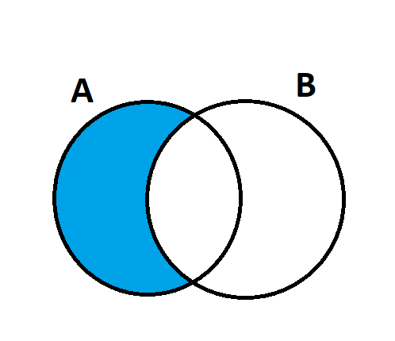

Yukarıdaki şemaya göre `A - B` işlemi "`A`'da olup `B`'de olmayan" anlamına gelmektedir. Örnek:
```py
print(frozenset({1,2,3,4,5}).difference(frozenset({1,2,3}))) # Output: frozenset({4, 5})
print(frozenset({1,2,3,4,5}).difference(frozenset({1,}),frozenset({2,}),frozenset({3,}))) # Output: frozenset({4, 5})
print(frozenset({1,2,3,4,5}).difference(frozenset({1,2,3}),frozenset({1,4}))) # Output: frozenset({5})
```

<h3 id="1.3.3"><code>intersection(*s)</code> Methodu</h3>

Uygulandığı frozenset ile `*s` parametresine girilen frozenset'lerin kesişimini alır ve sonucu döndürür. İki frozenset'i kesişimini almak için `&` operator'ı da kullanılabilir. `A` ve `B` iki frozenset type obje olmak üzere, `A & B` işleminin şematik gösterimi:

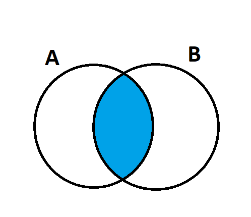

Yukarıdaki şemaya göre `A & B` işlemi "`A` ve `B`'de bulunan" anlamına gelmektedir. Örnekler:

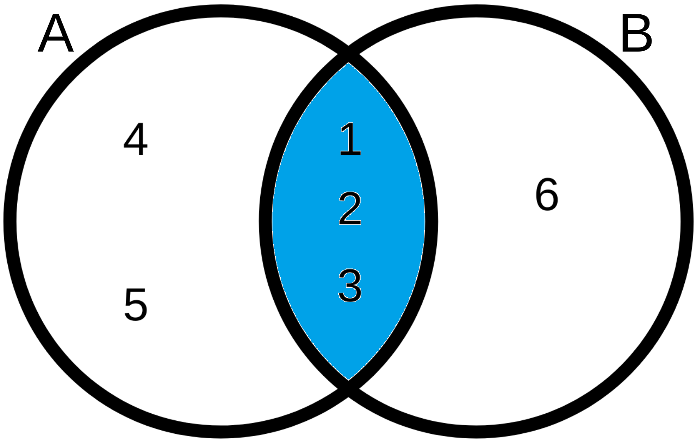

Yukarıdaki şemanın ifade ettiği kod:
```py
A = frozenset({1,2,3,4,5})
B = frozenset({1,2,3,6})
print(A.intersection(B)) # Output: frozenset({1, 2, 3})
print(A & B) # Output: frozenset({1, 2, 3})
```

<hr>

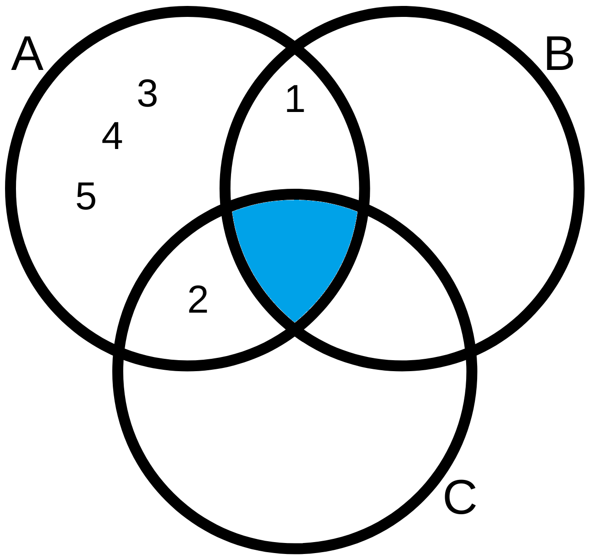

Yukarıdaki şemanın ifade ettiği kod:
```py
A = frozenset({1,2,3,4,5})
B = frozenset({1,})
C = frozenset({2,})
print(A.intersection(B,C)) # Output: frozenset() (boş frozenset)
print(A & B & C) # Output: frozenset() (boş frozenset)
```

<hr>

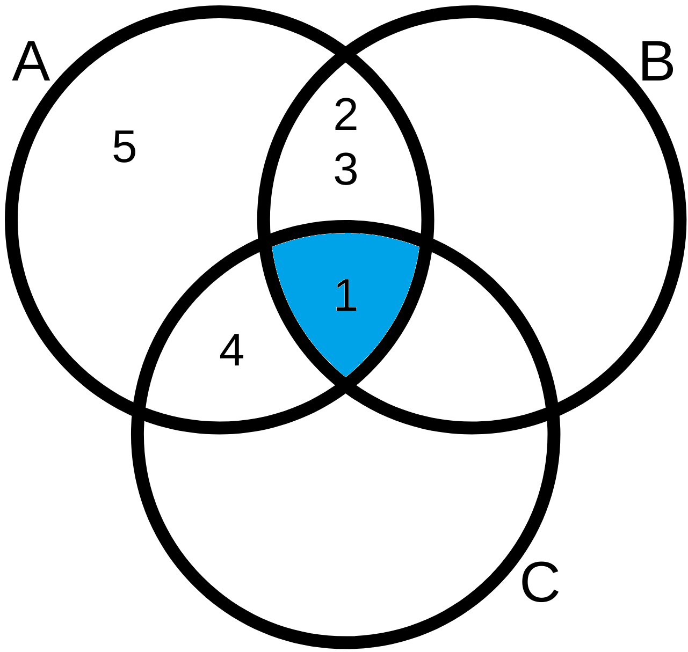

Yukarıdaki şemanın ifade ettiği kod:
```py
A = frozenset({1,2,3,4,5})
B = frozenset({1,2,3})
C = frozenset({1,4})
print(A.intersection(B,C)) # Output: frozenset({1})
print(A & B & C) # Output: frozenset({1})
```

<h3 id="1.3.4"><code>union(*s)</code> Methodu</h3>

Uygulandığı frozenset ile `*s` parametresine girilen frozenset'lerin birleşimini alır ve sonucu döndürür. İki frozenset'i birleşimini almak için `|` operator'ı da kullanılabilir. `A` ve `B` iki frozenset type obje olmak üzere, `A | B` işleminin şematik gösterimi:

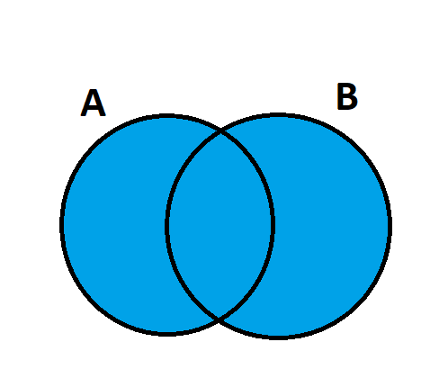

Yukarıdaki şemaya göre `A | B` işlemi "`A` veya `B`'de bulunan" anlamına gelmektedir. Örnekler:

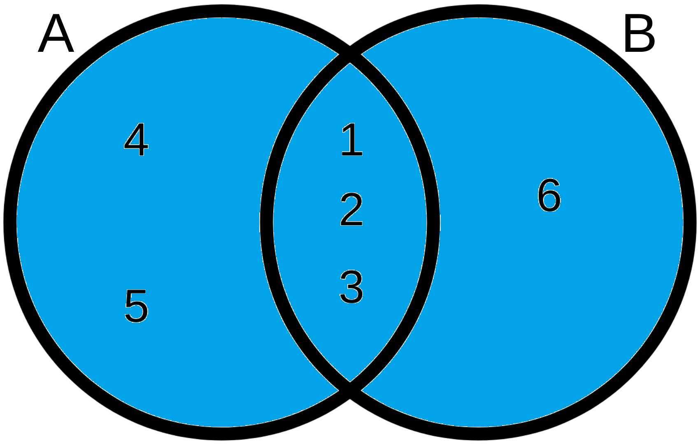

Yukarıdaki şemanın ifade ettiği kod:
```py
A = frozenset({1,2,3,4,5})
B = frozenset({1,2,3,6})
print(A.union(B)) # Output: frozenset({1, 2, 3, 4, 5, 6})
print(A | B) # Output: frozenset({1, 2, 3, 4, 5, 6})
```

<hr>

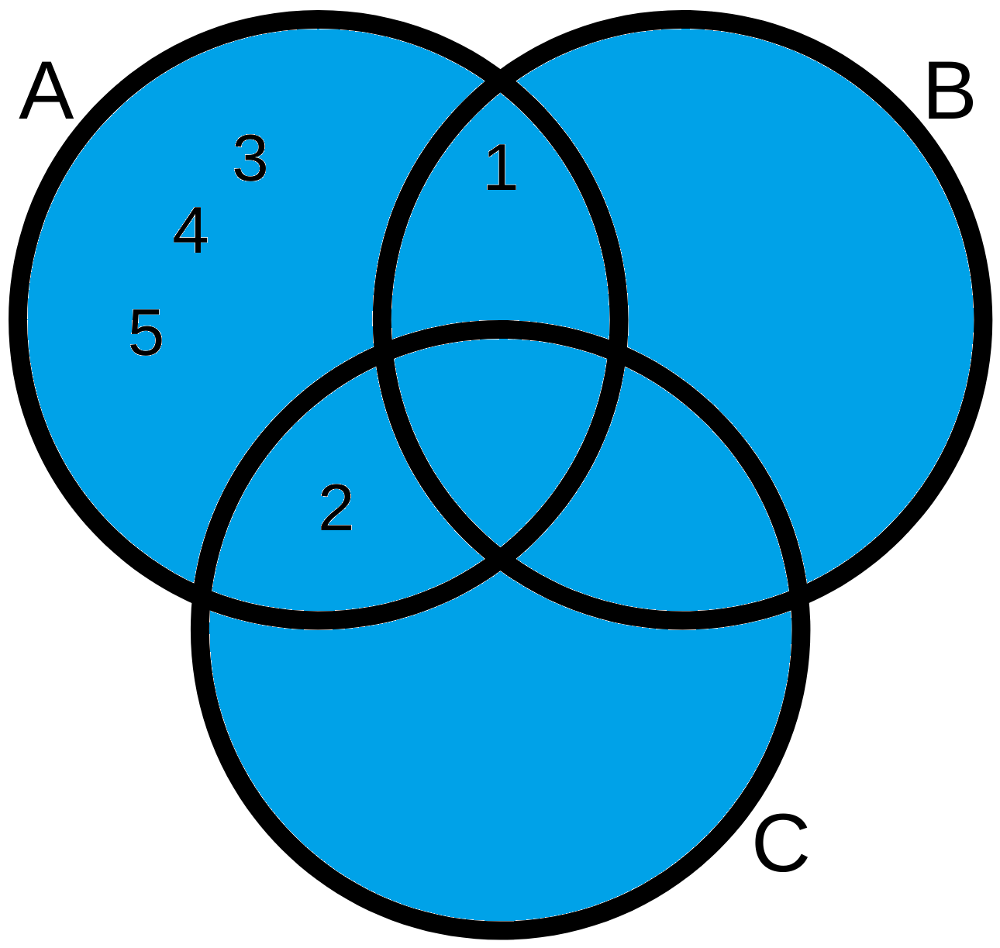

Yukarıdaki şemanın ifade ettiği kod:
```py
A = frozenset({1,2,3,4,5})
B = frozenset({1,})
C = frozenset({2,})
print(A.union(B,C)) # Output: frozenset({1, 2, 3, 4, 5})
print(A | B | C) # Output: frozenset({1, 2, 3, 4, 5})
```

<hr>

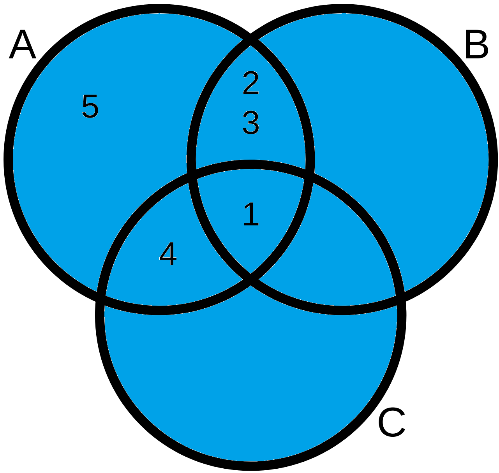

Yukarıdaki şemanın ifade ettiği kod:
```py
A = frozenset({1,2,3,4,5})
B = frozenset({1,2,3})
C = frozenset({1,4})
print(A.union(B,C)) # Output: frozenset({1, 2, 3, 4, 5})
print(A | B | C) # Output: frozenset({1, 2, 3, 4, 5})
```

<h3 id="1.3.5"><code>isdisjoint(s)</code> Methodu</h3>

Uygulandığı frozenset objesi ile `s` parametresine argüman olarak girilen frozenset objesinin kesişiminin boş olup olmadığını sorglar. Boşsa `True`, diğer durumlarda `False` döndürür. Örnek:
```py
A = frozenset({1,2,3,4,5})
B = frozenset({1,2,3})
C = frozenset({6,7})
print(A.isdisjoint(B)) # Output: False (Boş değil)
print(A.isdisjoint(C)) # Output: True (Boş)
```

<h3 id="1.3.6"><code>issubset(s)</code> Methodu</h3>

Uygulandığı frozenset objesinin, `s` parametresine argüman olarak girilen frozenset objesinin alt kümesi olup olmadığını sorgular. Alt kümesi ise `True`, diğer durumlarda `False` döndürür.

**Alt Küme:** `A` ve `B` iki küme olmak üzere, `B` kümesinin bütün elemanları `A` kümesinde de varsa (başka bir deyişle, `B` kümesinin bütün elemanları `A` kümesine ait ise), `B` kümesi `A` kümesinin alt kümesidir.

Örnek:
```py
A = frozenset({1,2,3,4,5})
B = frozenset({1,2,3,4})
C = frozenset({1,2,3})
D = frozenset({1,2})
E = frozenset({1})
F = frozenset()
print(A.issubset(A)) # Output: True (Her küme kendisinin alt kümesidir)
print(B.issubset(A)) # Output: True
print(C.issubset(A)) # Output: True
print(D.issubset(A)) # Output: True
print(E.issubset(A)) # Output: True
print(F.issubset(A)) # Output: True (Boş küme, bütün kümelerin alt kümesidir)
```
`A` kümesi diğer kümeleri kapsadığı için diğer kümeler `A` kümesinin alt kümesidir. Aykırı bir örnek:
```py
A = frozenset({1,2,3,4,5})
B = frozenset({1,2,3,4,5,6})
print(B.issubset(A)) # Output: False (A kümesi B kümesini kapsamaz)
```

<h3 id="1.3.7"><code>issuperset(s)</code> Methodu</h3>

Uygulandığı frozenset objesinin, `s` parametresine argüman olarak girilen frozenset objesinin üst kümesi olup olmadığını sorgular. Üst kümesi ise `True`, diğer durumlarda `False` döndürür.

**Üst Küme:** `A` ve `B` iki küme olmak üzere, `A` kümesi `B` kümesini kapsıyorsa (başka bir deyişle `B` kümesinin bütün elemanları `A` kümesinde de varsa), `A` kümesi `B` kümesinin üst kümesidir.

Örnek:
```py
A = frozenset({1,2,3,4,5})
B = frozenset({1,2,3,4})
C = frozenset({1,2,3})
D = frozenset({1,2})
E = frozenset({1})
F = frozenset()
print(A.issuperset(A)) # Output: True (Her küme kendisinin üst kümesidir)
print(A.issuperset(B)) # Output: True
print(A.issuperset(C)) # Output: True
print(A.issuperset(D)) # Output: True
print(A.issuperset(E)) # Output: True
print(A.issuperset(F)) # Output: True (Bütün kümeler, boş kümenin üst kümesidir)
```
Aykırı bir örnek:
```py
A = frozenset({1,2,3,4,5})
B = frozenset({1,2,3,4,5,6})
print(A.issuperset(B)) # Output: False (B kümesi A kümesini kapsamaz)
```

<h3 id="1.3.8"><code>symmetric_difference(s)</code> Methodu</h3>

`A` ve `B` iki frozenset objesi olmak üzere, `A.difference(B) | B.difference(A)` (yani `(A - B) | (B - A)`) işleminin sonucunu döndürür. Bu işlemin şematik gösterimi:

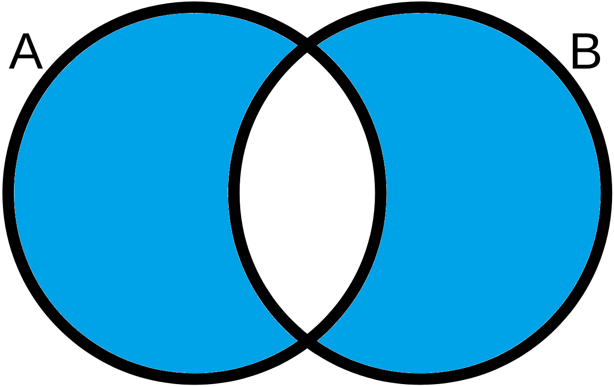

Örnek:

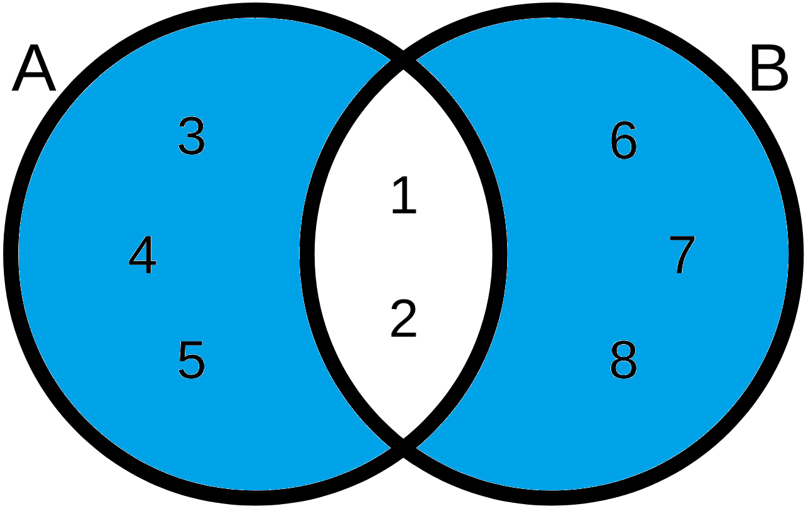

Yukarıdaki şemanın ifade ettiği kod:
```py
A = frozenset({1,2,3,4,5})
B = frozenset({1,2,6,7,8})
print(A.symmetric_difference(B)) # Output: frozenset({3, 4, 5, 6, 7, 8})
```