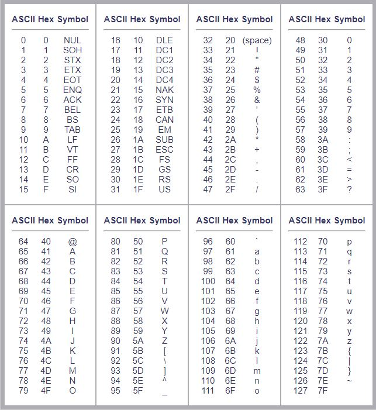

# İçindekiler

- [Kaçış Dizisileri](#1)
    - [`\` Geçersiz Kılma (Backslash)](#1.1)
    - [`\n` Satır Atlama](#1.2)
    - [`\t` TAB](#1.3)
    - [`\a` Alert](#1.4)
    - [`\r` Aynı Satırın Başı](#1.5)
    - [`\v` Düşey Sekme](#1.6)
    - [`\b` İmleç Kaydırma](#1.7)
    - [`\u` Küçük UNICODE](#1.8)
    - [`\U` Büyük UNICODE](#1.9)
    - [`\N` Uzun Ad](#1.10)
    - [`\x` Hexadecimal Karakter](#1.11)
    - [`\f` Sayfa Başı](#1.12)
    - [`r` Etkisizleştirme](#1.13)

<h1 id="1">Kaçış Dizisileri</h1>

Özel anlamları ve işlevleri olan karakterlerdir. ASCII'de tanımlanmıştır. ASCII tablosu:



<h2 id="1.1">`\` Geçersiz Kılma (Backslash)</h2>

Backslash, string kapsamında kendinden sonra gelen işaretin işlevini geçersiz kılar. Örnek:
```py
print("Bu \" ve bu \' tırnak işaretidir.") # Output: Bu " ve bu ' tırnak işaretidir.
print('İstanbul\'un insanları...') # Output: İstanbul'un insanları... 
print("Bu \\ backslash işaretidir.") # Output: Bu \ backslash işaretidir.
```
Bir string'i parçalamak için kullanılabilir. Örnek:
```py
print("Python 1990 yılında Guido Van Rossum tarafından geliştirilmeye başlanmış, oldukça güçlü ve yetenekli bir programlama dilidir.") # Output: Python 1990 yılında Guido Van Rossum tarafından geliştirilmeye başlanmış, oldukça güçlü ve yetenekli bir programlama dilidir.

print("Python 1990 yılında Guido Van Rossum \
tarafından geliştirilmeye başlanmış, oldukça \
güçlü ve yetenekli bir programlama dilidir.") # Output: Python 1990 yılında Guido Van Rossum tarafından geliştirilmeye başlanmış, oldukça güçlü ve yetenekli bir programlama dilidir.
```

<h2 id="1.2">`\n` Satır Atlama</h2>

Bir alt satıra geçmek için kullanılır. Örnek:
```py
print("Selam\nBen\n\nPython")
```
**Output:**
```
Selam
Ben

Python
```

<h2 id="1.3">`\t` TAB</h2>

Kendinden sonra bir `TAB` boşluk bırakır. Bu boşluğun boyutu IDE'den IDE'ye farklılık gösterebilir. En genel kullanılan `TAB` boyutları 2 ya da 4 space (boşluk).
```py
print("Selam\tBen\t\tPython") # Output: Selam   Ben             Python
```

<h2 id="1.4">`\a` Alert</h2>

Bir adet '*bip*' sesi ya da alert mesajı üretir. Her işletim sisteminde çalışmadığı için tercih edilmeyen bir komuttur.

<h2 id="1.5">`\r` Aynı Satırın Başı</h2>

Kendinden sonra gelen ifadeyi kesip, satır başındaki kelimenin üstüne yazar. Örneğin `"Selamlar\rNaber"` karakter dizisindeki `Naber` karakter dizisi `Selamlar`'ın üstüne yazılıp `Naberlar` olur.
```py
print("garip Keloğlan.\rBir ") # Output: Bir p Keloğlan.
```

<h2 id="1.6">`\v` Düşey Sekme</h2>

```
düşey
	 sekme
```
şeklinde bir görüntü elde edilir ama her işletim sisteminde çalışmadığı için tercih edilmez. Mesela ben win10 kullanıyorum ve `Selam♂Ben♂Python` şeklinde bir output aldım.

<h2 id="1.7">`\b` İmleç Kaydırma</h2>

Kendinden önceki harfi silip cümleye devam eder.
```py
print("google.com\b.tr") # Output: google.co.tr
print('google' , '\b.' , '\bcom') # google.com
```
Gördüğünüz gibi `print()` fonksiyonunun `sep` parametresinde belirtilen boşluk karakterlerini sildi ve bu sayede `google . com` tarzı bir output yerine `google.com` tarzı bir output aldık.

<h2 id="1.8">`\u` Küçük UNICODE</h2>

Karakterlerin UNICODE decimal karşılıklarını yazdırmamızı sağlar. 4 karakterden oluşur.
```py
print("\u0130") # Output: İ
print("\u0070") # Output: P
```

<h2 id="1.9">`\U` Büyük UNICODE</h2>

Karakterlerin UNICODE decimal karşılıklarını yazdırmamızı sağlar. 8 karakterden oluşur.
```py
print("\U00000130") # Output: İ
print("\U00000070") # Output: P
```
<h2 id="1.10">`\N` Uzun Ad</h2>

UNICODE sisteminde her karakterin tek ve benzersiz bir kod konumu olduğu gibi, tek ve benzersiz bir de uzun adı vardır. `\N` kaçış dizisi de bu uzun adları kullanarak, karşılık gelen değeri bize verir.
```py
print("\N{LATIN SMALL LETTER A}") # Output: a
print("\N{LATIN CAPITAL LETTER S WITH CEDILLA}") # Output: Ş
```
Bu uzun adlara ulaşmak için `unicodedata` modülünden yararlanabilirsiniz.
```py
import unicodedata
print(unicodedata.name('a'))
print(unicodedata.name('Ş'))
```

<h2 id="1.11">`\x` Hexadecimal Karakter</h2>

Onaltılı (hexadecimal) sayma sistemindeki bir sayının karakter karşılığını gösterebilirsiniz. ASCII tablosundaki Hex kısmındaki ifadeler kullanılır.
```py
print("\x41") # Output: A
print("\x4E") # Output: N
```

<h2 id="1.12">`\f` Sayfa Başı</h2>

Kendinden önceki ve sonraki ifadeleri farklı sayfalara yazdırır.
```py
f = open("deneme.txt", "w")
print("deneme\fdeneme", file=f)
f.close()
```
programını çalıştırdıktan sonra *deneme.txt* dosyasını *.docx* formatında çalıştırırsanız, deneme yazılarının farklı sayfalara yazdırıldığını görürsünüz. Günümüzde pek kullanılmaz.

<h2 id="1.13">`r` Etkisizleştirme</h2>

`r` kaçış dizisi, karakter dizisi içinde geçen kaçış dizilerini geçersiz kılar.
```py
print("Kaçış dizisi: '\'")  # Output: Kaçış dizisi: ''
print(r"Kaçış dizisi: '\'") # Output: Kaçış dizisi: '\'
```
Aynı şeyi backslash (`\`) kullanarak da yapabiliriz. Backslash'ı geçersiz kılmak için bazı yöntemler:
```py
# Kaçış dizisinden sonra bir adet boşluk karakteri yerleştirmek:
print("Kaçış dizisi: \ ") # Output: Kaçış dizisi: \ 

# Çift kaçış dizisi kullanmak:
print("Kaçış dizisi: \\") # Output: Kaçış dizisi: \ 

# Karakter dizilerini birbiri ile toplayıp, çift kaçış dizisi kullanmak:
print("Kaçış dizisi: " + "\\") # Output: Kaçış dizisi: \ 

# Karakter dizilerini farklı argüman olarak girip, çift kaçış dizisi kullanmak:
print("Kaçış dizisi:", "\\") # Output: Kaçış dizisi: \ 

# Karakter dizilerini birbirine ekleyip, çift kaçış dizisi kullanmak:
print("Kaçış dizisi: " "\\") # Output: Kaçış dizisi: \ 
```