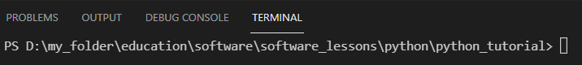
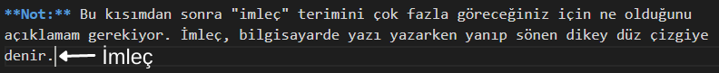
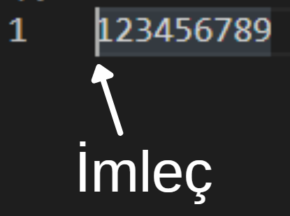
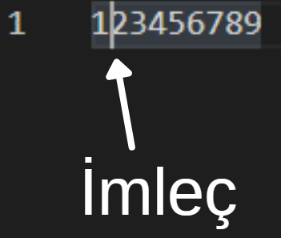
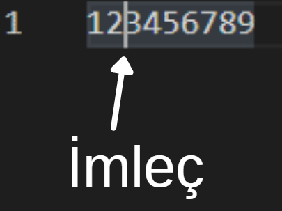
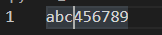

# İçindekiler

- [Dosya İşlemleri](#1)
    - [`open()` Fonksiyonu](#1.1)
    - [Dosyaya Erişim Kipleri](#1.2)
        - [`r` kipi](#1.2.1)
        - [`w` kipi](#1.2.2)
        - [`a` kipi](#1.2.3)
        - [`x` kipi](#1.2.4)
        - [`r+` kipi](#1.2.5)
        - [`w+` kipi](#1.2.6)
        - [`a+` kipi](#1.2.7)
        - [`x+` kipi](#1.2.8)
        - [`rb` kipi](#1.2.9)
        - [`wb` kipi](#1.2.10)
        - [`ab` kipi](#1.2.11)
        - [`xb` kipi](#1.2.12)
        - [`rb+` kipi](#1.2.13)
        - [`wb+` kipi](#1.2.14)
        - [`ab+` kipi](#1.2.15)
        - [`xb+` kipi](#1.2.16)
    - [Dosyadaki İmleç Konumu](#1.3)
        - [`tell()` Methodu](#1.3.1)
        - [`seek(offset, whence = SEEK_SET)` Methodu](#1.3.2)
        - [`seekable()` Methodu](#1.3.3)
    - [Dosyaya Yazmak](#1.4)
        - [`write(s)` Methodu](#1.4.1)
        - [`writelines(lines)` Methodu](#1.4.2)
        - [`writable()` Methodu](#1.4.3)
    - [Dosyayı Okumak](#1.5)
        - [`read(size = -1)` Methodu](#1.5.1)
        - [`readline(size = -1)` Methodu](#1.5.2)
        - [`readlines(hint = -1)` Methodu](#1.5.3)
        - [`readable()` Methodu](#1.5.4)
    - [Dosyaları Otomatik Kapatmak](#1.6)
        - [`try` - `except (ErrorCode)` - `finally` Yapısı](#1.6.1)
        - [`with` Statement](#1.6.2)
    - [Dosyaya Ekleme Yapma](#1.7)
        - [Dosyanın Sonunda ekleme yapmak](#1.7.1)
        - [Dosyanın Başında Değişiklik yapmak](#1.7.2)
        - [Dosyanın Ortasında Değişiklik yapmak](#1.7.3)
    - [Dosya Methodları](#1.8)
        - [`closed` Methodu](#1.8.1)
        - [`mode` Methodu](#1.8.2)
        - [`name` Methodu](#1.8.3)
        - [`encoding` Methodu](#1.8.4)
        - [`close()` Methodu](#1.8.5)
        - [`detach()` Methodu](#1.8.6)
        - [`fileno()` Methodu](#1.8.7)
        - [`flush()` Methodu](#1.8.8)
        - [`isatty()` Methodu](#1.8.9)
        - [`truncate(size = None)` Methodu](#1.8.10)
    - [İkili (Binary) Dosyalar](#1.9)
        - [PDF Dosyaları](#1.9.1)
        - [JPEG Dosyaları](#1.9.2)
        - [PNG Dosyaları](#1.9.3)
        - [GIF Dosyaları](#1.9.4)
        - [TIFF Dosyaları](#1.9.5)
        - [BMP Dosyaları](#1.9.6)

<h1 id="1">Dosya İşlemleri</h1>

Python, dış kaynaklar (external sources) üzerinde I/O (input/output) işlemleri yapmamıza izin verir. Bu olay sırasıyla:
1. Programın içine dış kaynağı (external source) dahil etmek (include).
2. Programın içine dahil edilmiş dış kaynak (external source) üzerinde istediğiniz işlemleri yapmak
3. Bu işlemleri asıl dış kaynağa (external source) yazmak.

şeklinde gerçekleşir. Bu işlemleri file I/O operation'ları ile yapabiliriz. Yukarıda sıralanan üç adımdan ilkini `open()` fonksiyonu ile yapıyoruz.

<h2 id="1.1"><code>open()</code> Fonksiyonu</h2>

Open fonksiyonu `open(file, mode='r', buffering=-1, encoding=None, errors=None, newline=None, closefd=True, opener=None)` syntax'ına sahiptir. `open()` fonksiyonu, `file` parametresinde belirtilen PATH'da (dizinde) bulunan dosyayı `mode` parametresinde belirtilen modda ve diğer parametrelerde belirtilen kurallara göre açar/programa dahil eder (include). Parametrelerini teker teker açıklamak gerekirse:

- `file`: Bu parametreye, açmak istediğiniz dosyanın ismini (uzantısı ile birlikte) veya direkt PATH'ını argüman olarak giriyorsunuz. Bu argüman string type olmalıdır. PATH tanımlarken bir üst dizin (PATH) için iki nokta `..\falan_filan`, o an bulunduğun dizin (PATH) için tek nokta `.\falan_filan` kullanılır. Argüman olarak dosya adı yerine PATH girecekseniz Python backslash (`\`) karakterini, bu karakterden sonra gelen harflerle beraber düşünerek escape characters tanımladığınızı sanabilir. Bu da size sıkıntı çıkarır. Bu yüzden PATH tanımlarken etkisizleştime harfi olarak kullanılan `r` harfini kullanmalısınız (örnek: `r"D:\falan_filan..."`). `file` parametresine PATH tanımlamak yerine sadece dosya ismini (uzantısı ile beraber) argüman olarak girerseniz, Python o dosyasının bulunduğu PATH'ı değil terminalin o an işaret ettiği PATH'ı dikkate alacaktır. Örnek:

    **Terminalin işaret ettiği PATH:**

    

    ```
    D:\my_folder\education\software\software_lessons\python\python_tutorial
    ```

    **Python dosyasının bulunduğu PATH:**

    ```py
    print(__file__) # Output: d:\my_folder\education\software\software_lessons\python\python_tutorial\main\.md\TP1.py

    dosya = open("deneme.txt", "r") # FileNotFoundError: [Errno 2] No such file or directory: 'deneme.txt'
    dosya.close()
    ```
    `__file__`'ı bulunduğu dosyanın path'ını içeren bir variable olarak düşünebilirsiniz. `open()` fonksiyonu ile açmaya çalıştığımız `deneme.txt` dosyası terminalin açık olduğu PATH'da bulunamadığı için `FileNotFoundError` hatası yükseltildi. Alternatif çözüm:
    ```py
    dosya = open(r"{}deneme.txt".format(__file__[:-6]), "r")
    print(dosya.read()) #Output: Selam
    dosya.close()
    ```
    Bu kod `TP1.py` adlı Python dosyasında çalıştırıldı ve `deneme.txt` dosyası `TP1.py` dosyasıyla aynı klasörün içinde olduğu için yukarıdaki gibi bir kod yazdık. Farklı klasörlerde olsaydı ona göre  kodda değişiklikler yapılması gerekirdi.

- `mode`: Bu parametreye argüman olarak string formatında dosya açma kipi girilir. `mode` parametresine argüman olarak girilen dosya açma kiplerinin (mode) ne anlamlar ifade ettiklerini öğrenmek için [tıklayınız](https://github.com/e-k-eyupoglu/python_tutorial/blob/main/python_tutorial/external_resources_operations/file_operations.md#1.2 "https://github.com/e-k-eyupoglu/python_tutorial/blob/main/python_tutorial/external_resources_operations/file_operations.md#1.2"). `mode` parametresinin default değeri `"r"`'dir.

- `buffering`: Bir dosyayı açıp veri girdiğimizde bu veriler tamponda (buffer) bekletilir. Buffer'da bekletilen veriler ancak dosya kapatıldığında dosyaya işlenir. `buffering` parametresine girilen integer argüman ile buffer'a alma işleminin nasıl yürüyeceğini belirleyebiliriz.
    - `buffering = 0`: Veriler buffer'a alınmadan doğrudan dosyaya işlenir ama bu sadece `'b'` (binary) mode ile açılan dosyalarda mümkündür.
    - `buffering = 1`: Veriler satır satır dosyaya işlenir. Yani `f.write('Falan filan\n')` komutu çalıştıktan sonra veri dosyaya işlenir ama `f.write('Falan filan')` komutunda işlenmez çünkü işlenmesi için Python `'\n'` kaçış dizisi görmeyi bekler. Açılan dosyalar `buffering = 1` iken çalışması için metin dosyaları (bu arada dosyalar metin ve ikili (binary) dosyalar olarak ikiye ayrılır) için olan kipler ile açılmalıdır.
    - `buffering = -1`: Bu değer default değerdir. `buffering` parametresine argüman olarak `-1` girilirse, dosya üzerinde yapılan işlemler buffer'da bekletilir.
    
        **Not:** Kendi sisteminizde default buffer boyutunun ne olduğunu merak ediyorsanız:
        ```py
        import io
        print(io.DEFAULT_BUFFER_SIZE) # Output: 8192 (win 10 pro için)
        ```

- `encoding`: Dosyayı hangi kod çözücüyle açacağını belirlediğiniz parametredir.

- `errors`: `encoding` parametresinde belirtilen kod çözücünün başarısız olması durumunda Python'ın nasıl davranacağını belirlediğimiz parametredir. Bu parametrenin alabileceği argümanlara ulaşmak için [tıklayınız](https://github.com/e-k-eyupoglu/python_tutorial/blob/main/python_tutorial/data_types/text_types/strings.md#1.3 "https://github.com/e-k-eyupoglu/python_tutorial/blob/main/python_tutorial/data_types/text_types/strings.md#1.3").

- `newline`: Farklı işletim sistemlerinde dosyaların satır sonlarının ifade edilme şekli birbirinden farklılık gösterebilir. Örneğin GNU/Linux'ta `\n` şeklindeyken, Windows'da `\r\n` şeklinde olabilir. `newline` parametresine girilen argüman ile dosyadaki her satırın sonundaki kaçış dizisi üzerinde işlem yapabilirsiniz. Default değeri `None`'dır.
    - `newline` parametresine argüman girilmezse, son satır hariç her satırın sonunda `\n` kaçış dizisi olur.
    - `newline` parametresine argüman olarak boş string `""` girilirse, son satır hariç her satırın sonunda `\r\n` kaçış dizileri olur.
    - `newline` parametresine argüman olarak `"\n"` girilirse, son satır hariç her satırın sonunda `\r\n` kaçış dizileri olur.
    - `newline` parametresine argüman olarak `"\r"` girilirse, son satır hariç her satırın sonunda `\r` kaçış dizisi olur.
    - `newline` parametresine argüman olarak `\r\n` girilirse, son satır hariç her satırın sonunda `\r\n` kaçış dizileri olur.

    `newline` parametresi `None`, `""`, `\n`, `\r`, `\r\n` bunlardan başka argüman kabul etmez.
    
    **Dikkat:** `newline` parametresi ile ilgili yukarıda anlattığım sonuçlar `Windows 10 Pro` işletim sisteminde deneme yanılma yolu ile elde edilmiştir. Her bilgisayarda ve işletim sisteminde aynı sonucu vermeyebileceğinden bu bilgileri mutlak doğru olarak kabul etmeyin, kendiniz de deneyin be araştırın. Ben bu parametreye dokunmama taraftarıyım.


- `closefd`: Bu parametreye argüman olarak `False` girilirse ve `file` parametresine dosya ismi (file name) yerine dosya descriptor'ı ([file descriptor](https://www.computerhope.com/jargon/f/file-descriptor.htm "https://www.computerhope.com/jargon/f/file-descriptor.htm")) girilmişse, dosya kapatıldığında (close) temeldeki (underlying) dosya descriptor'ı ([file descriptor](https://www.computerhope.com/jargon/f/file-descriptor.htm "https://www.computerhope.com/jargon/f/file-descriptor.htm")) açık tutulacaktır. file parametresine dosya ismi (file name) verilmişse, `closefd`' default değeri olan `True` olmalıdır. Aksi halde hata yükseltilir.

    **Not:** Python'da her nesnenin her özelliğini kafanıza göre değiştirebilirsiniz. Bu durumu bazı yerlerde sıkıntılara sebep olabileceğinden bu yetkiyi kısıtlamak isteyebilirsiniz. Descriptor denen şey, kafanıza göre herhangi bir özelliğini değiştiremeyeceğiniz nesnelere verilen isimdir. Kısaca `	__get__(self, instance, owner)`, `__set__(self, instance, value)`, `__delete__(self, instance)` methodlarından herhangi biri tanımlanmış objelere descriptor denir. Daha fazla bilgi için [tıklayınız](https://yasar11732.github.io/python/descriptor.html).

- `opener`: Python'un kendi opener'ı vardır. Custom opener tanımlamak için bu parametreyi kullanabilirsiniz.

**Not:** `open()` fonksiyonu ile açtığınız dosyayı programınızda kullanmanın en sağlıklı yöntemi `open()` fonksiyonunun döndürdüğü dosya objesini bir variable'a atamaktır. Örnek:
```py
my_path = r"{}deneme.txt".format(__file__[:-6])
dosya = open(my_path, "w+")
dosya.write("Selam ben Python")
dosya.read() # Output: Selam ben Python
print(dosya) # Output: <_io.TextIOWrapper name='D:\\my_folder\\education\\software\\software_lessons\\python\\python_tutorial\\main\\.md\\deneme.txt' mode='r' encoding='cp1254'>
dosya.close()
```

**DİKKAT:** Bir dosyayı açtıktan sonra kapatmayı kesinlikle unutmayın. Aksi taktirde geri döndürülemez hatalarla karşılaşabilirsiniz.

<h2 id="1.2">Dosyaya Erişim Kipleri</h2>

<h3 id="1.2.1"><code>r</code> kipi</h3>

Default dosya açma kipidir. Bu kip, bir metin dosyasını **read** (okuma) yetkisiyle açar. Bu kipi kullanabilmeniz için ilgili metin dosyasının belirttiğiniz path'da halihazırda var olması gerekir. Belirttiğiniz metin dosyası belirttiğiniz path'da yoksa `FileNotFoundError` hatası yükseltir.

<h3 id="1.2.2"><code>w</code> kipi</h3>

Bu kip, bir metin dosyasını **write** (yazma) yetkisiyle açar. Eğer belirttiğiniz adda bir metin dosyası belirttiğiniz path'da zaten varsa, Python hiçbir şey sormadan metin dosyasının içeriğini silecektir (metin dosyasını silip baştan oluşturmuyor, içeriğini siliyor). Eğer belirttiğiniz adda bir metin dosyası belirttiğiniz path'da yoksa, Python o adda bir metin dosyasını otomatik olarak oluşturur (create).

<h3 id="1.2.3"><code>a</code> kipi</h3>

Bu kip, bir metin dosyasını **append** (ekleme) yetkisiyle açar. Eğer belirttiğiniz adda bir metin dosyası belirttiğiniz path'da zaten varsa, metin dosyasının içeriğinde herhangi bir değişiklik yapılmaz (yani `w` kipi gibi metin dosyası içeriğini silmez). Eğer belirttiğiniz adda bir metin dosyası belirttiğiniz path'da yoksa, Python otomatik olarak o adda bir metin dosyası oluşturur (create). Bu kiple açtığınız bir metin dosyasına yazdıklarınız metin dosyasının sonuna eklenir çünkü imleç dosyanın sonundadır. Bu yüzden `seek(0)` gibi yöntemlerle metin dosyasının başına gitmek, metin dosyasının başına **append** (ekleme) işlemi yapmanızı sağlamaz.

<h3 id="1.2.4"><code>x</code> kipi</h3>

Bu kip, bir metin dosyasını **write** (yazma) yetkisiyle açar. Eğer belirttiğiniz adda bir metin dosyası belirttiğiniz path'da zaten varsa, Python varolan metin dosyasını silmek yerine `FileExistsError` hatası yükseltir. Belirttiğiniz adda bir metin dosyası belirttiğiniz path'da yoksa, Python belirttiğiniz isimde bir metin dosyası oluşturur (create).

<h3 id="1.2.5"><code>r+</code> kipi</h3>

Bu kip, bir metin dosyasını hem **write** (yazma) hem de **read** (okuma) yetkisiyle açar. Bu kipi kullanabilmeniz için ilgili metin dosyasının belirttiğiniz path'da halihazırda var olması gerekir. Belirttiğiniz metin dosyası belirttiğiniz path'da yoksa `FileNotFoundError` hatası yükseltilir.

<h3 id="1.2.6"><code>w+</code> kipi</h3>

Bu kip, bir metin dosyasını hem **write** (yazma) hem de **read** (okuma) yetkisiyle açar. Eğer belirttiğiniz adda bir metin dosyası belirttiğiniz path'da zaten varsa, Python hiçbir şey sormadan metin dosyasının içeriğini silecektir (metin dosyasını silip baştan oluşturmuyor, içeriğini siliyor). Eğer belirttiğiniz adda bir metin dosyası belirttiğiniz path'da yoksa, Python o adda bir metin dosyasını otomatik olarak oluşturur (create).  

<h3 id="1.2.7"><code>a+</code> kipi</h3>

Bu kip, bir metin dosyasını hem **append** (ekleme) hem de **read** (okuma) yetkisiyle açar. Eğer belirttiğiniz adda bir metin dosyası belirttiğiniz path'da zaten varsa, metin dosyasının içeriğinde herhangi bir değişiklik yapılmaz (yani `w` kipi gibi metin dosyası içeriğini silmez). Eğer belirttiğiniz adda bir metin dosyası belirttiğiniz path'da yoksa, Python otomatik olarak o adda bir metin dosyası oluşturur (create). Bu kiple açtığınız bir metin dosyasına yazdıklarınız metin dosyasının sonuna eklenir çünkü imleç dosyanın sonundadır. Bu yüzden `seek(0)` gibi yöntemlerle metin dosyasının başına gitmek, metin dosyasının başına **append** (ekleme) işlemi yapmanızı sağlamaz.

<h3 id="1.2.8"><code>x+</code> kipi</h3>

Bu kip, bir metin dosyasını hem **write** (yazma) hem de **read** (okuma) yetkisiyle açar. Eğer belirttiğiniz adda bir metin dosyası belirttiğiniz path'da zaten varsa, Python varolan metin dosyasını silmek yerine `FileExistsError` hatası yükseltir. Belirttiğiniz adda bir metin dosyası belirttiğiniz path'da yoksa, Python belirttiğiniz isimde bir metin dosyası oluşturur (create).

<h3 id="1.2.9"><code>rb</code> kipi</h3>

Bu kip, bir binary dosyayı **read** (okuma) yetkisiyle açar. Bu kipi kullanabilmeniz için ilgili binary dosyanın belirttiğiniz path'da halihazırda var olması gerekir. Belirttiğiniz binary dosya belirttiğiniz path'da yoksa `FileNotFoundError` hatası yükseltir.

<h3 id="1.2.10"><code>wb</code> kipi</h3>

Bu kip, bir binary dosyayı **write** (yazma) yetkisiyle açar. Eğer belirttiğiniz adda bir binary dosya belirttiğiniz path'da zaten varsa, Python hiçbir şey sormadan binary dosyanın içeriğini silecektir (binary dosyayı silip baştan oluşturmuyor, içeriğini siliyor). Eğer belirttiğiniz adda bir binary dosya belirttiğiniz path'da yoksa, Python o adda bir binary dosya otomatik olarak oluşturur (create).

<h3 id="1.2.11"><code>ab</code> kipi</h3>

Bu kip, bir binary dosyayı **append** (ekleme) yetkisiyle açar. Eğer belirttiğiniz adda bir binary dosya belirttiğiniz path'da zaten varsa, binary dosyanın içeriğinde herhangi bir değişiklik yapılmaz (yani `w` kipi gibi binary dosyanın içeriğini silmez). Eğer belirttiğiniz adda bir binary dosya belirttiğiniz path'da yoksa, Python otomatik olarak o adda bir binary dosya oluşturur (create). Bu kiple açtığınız bir binary dosyaya yazdıklarınız binary dosyanın sonuna eklenir çünkü imleç dosyanın sonundadır. Bu yüzden `seek(0)` gibi yöntemlerle binary dosyanın başına gitmek, metin dosyasının başına **append** (ekleme) işlemi yapmanızı sağlamaz.

<h3 id="1.2.12"><code>xb</code> kipi</h3>

Bu kip, bir binary dosyayı **write** (yazma) yetkisiyle açar. Eğer belirttiğiniz adda bir binary dosya belirttiğiniz path'da zaten varsa, Python varolan binary dosyayı silmek yerine `FileExistsError` hatası yükseltir. Belirttiğiniz adda bir binary dosya belirttiğiniz path'da yoksa, Python belirttiğiniz isimde bir binary dosya oluşturur (create).

<h3 id="1.2.13"><code>rb+</code> kipi</h3>

Bu kip, bir binary dosyayı hem **write** (yazma) hem de **read** (okuma) yetkisiyle açar. Bu kipi kullanabilmeniz için ilgili binary dosyanın belirttiğiniz path'da halihazırda var olması gerekir. Belirttiğiniz binary dosya belirttiğiniz path'da yoksa `FileNotFoundError` hatası yükseltir.

<h3 id="1.2.14"><code>wb+</code> kipi</h3>

Bu kip, bir binary dosyayı hem **write** (yazma) hem de **read** (okuma) yetkisiyle açar. Eğer belirttiğiniz adda bir binary dosya belirttiğiniz path'da zaten varsa, Python hiçbir şey sormadan binary dosyanın içeriğini silecektir (binary dosyayı silip baştan oluşturmuyor, içeriğini siliyor). Eğer belirttiğiniz adda bir binary dosya belirttiğiniz path'da yoksa, Python o adda bir binary dosya otomatik olarak oluşturur (create).

<h3 id="1.2.15"><code>ab+</code> kipi</h3>

Bu kip, bir binary dosyayı hem **append** (ekleme) hem de **read** (okuma) yetkisiyle açar. Eğer belirttiğiniz adda bir binary dosya belirttiğiniz path'da zaten varsa, binary dosyanın içeriğinde herhangi bir değişiklik yapılmaz (yani `w` kipi gibi binary dosyanın içeriğini silmez). Eğer belirttiğiniz adda bir binary dosya belirttiğiniz path'da yoksa, Python otomatik olarak o adda bir binary dosya oluşturur (create). Bu kiple açtığınız bir binary dosyaya yazdıklarınız binary dosyanın sonuna eklenir çünkü imleç dosyanın sonundadır. Bu yüzden `seek(0)` gibi yöntemlerle binary dosyanın başına gitmek, metin dosyasının başına **append** (ekleme) işlemi yapmanızı sağlamaz.

<h3 id="1.2.16"><code>xb+</code> kipi</h3>

Bu kip, bir binary dosyayı hem **write** (yazma) hem de **read** (okuma) yetkisiyle açar. Eğer belirttiğiniz adda bir binary dosya belirttiğiniz path'da zaten varsa, Python varolan binary dosyayı silmek yerine `FileExistsError` hatası yükseltir. Belirttiğiniz adda bir binary dosya belirttiğiniz path'da yoksa, Python belirttiğiniz isimde bir binary dosya oluşturur (create).

<h2 id="1.3">Dosyadaki İmleç Konumu</h2>

Bu kısımdan sonra "imleç" terimini çok fazla göreceğiniz için ne olduğunu açıklamam gerekiyor.

**Not:** bu kısımda `write` ve `read` methodlarını kullanacağımız için bunları basitçe anlatayım (daha sonra detaylı anlatacağım). `write` methodu, kendisine verilen argümanı dosyaya yazar. `read` methodu, argümansız kullanılırsa dosyanın tamamını, argümanlı kullanılırsa argüman olarak girilen integer kadar byte'ı okur ve döndürür. 

İmleç, dijital bir ortamda yazı yazarken yanıp sönen dikey düz çizgiye denir.



Dosya işlemlerinde karakterler, byte'larla ifade edilir. İmleç kavramı index mantığına benzer çalışır. Örnek:

Birinci byte'dan hemen önceki konumda:



İkinci byte'dan hemen önceki konumda:



Üçüncü byte'dan hemen önceki konumda:



**Dosya:**
```
123456789
```
**Kod:**
```py
dosya = open(r"{}deneme.txt".format(__file__[:-6]), mode="r", encoding="utf-8")

dosya.seek(0)
print(repr(dosya.read(1))) # Output: '1'
dosya.seek(1)
print(repr(dosya.read(1))) # Output: '2'
dosya.seek(2)
print(repr(dosya.read(1))) # Output: '3'

dosya.close()
```
İmleç, ilgili byte'dan hemen önceki konumdan (yukarıda örnekleri var) itibaren write (yazma) veya read (okuma) işlemlerini yapar. Örneğin imleç, 2. byte'dan hemen önceki konumda (`seek(1)`) bulunuyorsa, write (yazma) veya read (okuma) işlemleri, 2. byte'da bulunan `"2"` string'ini de kapsar/etkiler. Kısaca "sıfırıncı byte" dediğimde siz "birinci byte'dan hemen önceki konumda bulunan imleci" kasttettiğimi anlayın çünkü bundan sonraki kısımlarda böyle anlatacağım.

Write (yazma) ve read (okuma) işlemlerinde kullanılan methodların hepsi tek bir imleci dikkate alır. Örnek:

**Dosya:**
```
123456789
```
**Kod:**
```py
dosya = open(r"{}deneme.txt".format(__file__[:-6]), "r+")
dosya.write("abc")
print(dosya.read()) # Output: 456789
dosya.close()
```
**Dosya:**
```
abc456789
```
Gördüğünüz gibi `write` methodu sıfırıncı, birinci ve ikinci byte'larında işlem yaptıktan sonra imleç üçüncü byte'a (yani dördüncü byte'dan hemen önceki konuma) konumlandı ve `read` işlemi de üçüncü byte'dan itibaren (üçüncü byte dahil) işlem yaptı (üçüncü byte'da `"4"` string'i var). Write işleminden sonra imlecin konumu:



Bu basit örnekle write (yazma) ve read (okuma) işlemlerinde kullanılan methodların hepsinin tek bir imleci dikkate aldığını kanıtlamış oluyoruz.

**Not:** İmleç sıfırıncı byte'da değil de dosyanın sonunda olsaydı Write işleminde sonucunda elde edeceğimiz output `abc456789` şeklinde değil `123456789abc` şeklinde olurdu. Nedenini daha sonra daha iyi anlayacaksınız.

<h3 id="1.3.1"><code>tell()</code> Methodu</h3>

`tell` methodu, imlecin o anda hangi konumda olduğunu döndürür. Örnek:

**Dosya:**
```
abcdefgh
```
**Kod:**
```py
dosya = open(r"{}deneme.txt".format(__file__[:-6]), mode="r", encoding="utf-8")

print(dosya.read(2)) # Output: ab
print(dosya.tell()) # Output: 2
print(dosya.read(1)) # Output: c
print(dosya.tell()) # Output: 3

dosya.close()
```
`tell` methodunun `2` output'unu vermesi, imlecin o an 2. byte'da (3. byte'dan hemen önceki konumda) olduğu anlamına gelmektedir (2. byte'da (yani 3. byte'da) `c` karakteri var).

`UTF-8` kod çözücüde bazı karakterler bir, bazı karakterler iki byte ile ifade edilmektedir. Python'da imlecin konumunu byte'lara göre belirlediği için 2 byte ile ifade edilen karakterlerde imlecin konumu, tek byte ile ifade edilen karakterlere göre farklılık göstermektedir. Örnek:

**Dosya:**
```
abcçdefg
```
**Kod:**
```py
dosya = open(r"{}deneme.txt".format(__file__[:-6]), mode="r", encoding="utf-8")

print("ç".encode("utf-8")) # Output: b'\xc3\xa7'

print(dosya.read(3)) # Output: abc
print(dosya.tell()) # Output: 3
print(dosya.read(1)) # Output: ç
print(dosya.tell()) # Output: 5

dosya.close()
```
`"ç"` karakteri `UTF-8` kod çözücüde 2 byte (`b'\xc3\xa7'`) ile ifade edildiği için Python bu karakteri okuduktan sonra imleç 5. byte'a (5. byte'da (yani 6. byte'da) `"d"` karakteri var) geçiyor çünkü 3. ve 4. byte'lar (yani 4. ve 5. byte'lar) `ç` karakterini ifade etmek için kullanılıyor. Bu yüzden `read` methodu ile üçüncü byte'dan itibaren okumaya başlarsanız `"ç"` karakteri döndürülür ve imleç 5. byte konumuna geçer.

Her satırın sonunda kaçış dizileri (escape character) vardır ve bu escape character'ler de byte'larla ifade edilir. Örnek:

**Dosya:**
```
abc
def
```
**Kod:**
```py
dosya = open(r"{}deneme.txt".format(__file__[:-6]), mode="r", encoding="utf-8")

print(dosya.read(3)) # Output: abc
print(dosya.tell()) # Output: 3
print(repr(dosya.read(1))) # Output: '\n'
print(dosya.tell()) # Output: 5
print(dosya.read(3)) # Output: def

dosya.close()
```
gördüğünüz gibi sıfırıncı, birinci ve ikinci byte'lar `"a"`, `"b"` ve `"c"` karakterlerini ifade etmek için kullanılırken, üçüncü ve dördüncü byte'lar `"\n"` escape character'ini ifade etmek için kullanılır.

<h3 id="1.3.2"><code>seek(offset, whence = SEEK_SET)</code> Methodu</h3>

`seek` methodu, imlecin istenilen konuma konumlandırmak için kullanılır. `seek` methodu, `offset` parametresine argüman olarak girilen integer'ın ifade ettiği byte'a imleci konumlandırır. Örnek:

**Dosya:**
```
abcdefg
```
**Kod:**
```py
dosya = open(r"{}deneme.txt".format(__file__[:-6]), mode="r", encoding="utf-8")

dosya.seek(2)
print(dosya.read()) # Output: cdefg

dosya.close()
```
Yukarıdaki kodda sıfırıncı ve birinci byte'lar `"a"`, `"b"` karakterlerini, ikinci byte `"c"` karakterini ifade etmektedir. `seek` methodu imleci ikinci byte'a, yani `"c"` karakterine (`"c"` karakterinden hemen önceki konuma) konumlandırır. Bu yüzden output'da `"c"` karakteri de bulunmaktadır.

İki byte ile ifade edilen karakterleri ilk byte'ından itibaren okumalısınız. İkinci byte'ından itibaren okumaya çalışırsanız `UnicodeDecodeError` hatası ile karşılaşırsınız. Örnek:

**Dosya:**
```
abcçdefg
```
**Kod:**
```py
dosya = open(r"{}deneme.txt".format(__file__[:-6]), mode="r", encoding="utf-8")

print("ç".encode("utf-8")) # Output: b'\xc3\xa7'

dosya.seek(4)
print(dosya.read(1)) # Output: UnicodeDecodeError: 'utf-8' codec can't decode byte 0xa7 in position 0: invalid start byte

dosya.close()
```
Hata mesajındada dediği gibi "`UTF-8` kod çözücü `0xa7` (Yani `b'\xa7'`) kodunu çözemiyor.

Escape character'i imleç kendinden önce de olsa sonra da olsa okunabilir. Örnek:

**Dosya:**
```
abc
def
```
**Kod:**
```py
dosya = open(r"{}deneme.txt".format(__file__[:-6]), mode="r", encoding="utf-8")

print(dosya.read(3)) # Output: abc
print(dosya.tell()) # Output: 3
print(repr(dosya.read(1))) # Output: '\n'
print(dosya.tell()) # Output: 5
print(dosya.read(3)) # Output: def

dosya.close()
```
gördüğünüz gibi üçüncü ve dördüncü byte'lar `"\n"` escape character'ini ifade etmek için kullanılır. Bu yüzden `read` methodu ile ister üçüncü ister dördüncü byte'dan itibaren okumaya başlayın, ikisinde de `"\n"` escape character'i döndürülür. Kanıt:
```py
dosya = open(r"{}deneme.txt".format(__file__[:-6]), mode="r", encoding="utf-8")

print("\n".encode("utf-8")) # Output: b'\n'
dosya.seek(3)
print(repr(dosya.read(1))) # Output: '\n'
dosya.seek(4)
print(repr(dosya.read(1))) # Output: '\n'

dosya.close()
```

**Not:** `"ş"`, `"İ"`, `"ç"` gibi Türkçe karakterlerde yukarıdaki durum geçerli değilkeb `"\n"` karakteri `ç` harfi gibi byte olarak `b'\xc5\x9f'` gibi değil `b'\n'` şeklinde ifade edildiği için istisnadır.

`whence` parametresine argüman olarak, imleç konumlandırma işlemi yapılırken hangi ölçüte/kurala göre konumlandırma yapılacağını belirleyebilediğimiz özel anlamlara gelen string'ler giriyoruz. Bunlar:

- `whence` parametresine argüman olarak `"SEEK_SET"` ya da `0` girilirse, dosyanın başına atıfta bulunulur (refers to). Bu durumda `offset` parametresine sadece sıfır ya da positif integer'lar argüman olarak girilebilir çünkü sıfırıncı byte'dan öncesi olamayacağı için mantıken negatif yönde ilerlenemez.

- `whence` parametresine argüman olarak `"SEEK_CUR"` ya da `1` girilirse, dosyanın mevcut (current) konumuna atıfta bulunulur (refers to). Bu durumda `offset` parametresine herhangi bir integer argüman olarak girilebilir. Mevcut (current) konum, reading veya writing işlemlerinde değişen veya `seek()` methoduyla değiştirebildiğimiz imlecin o an bulunduğu konumdur. Kısaca o an ki konumdur.

- `whence` parametresine argüman olarak `"SEEK_END"` ya da `2` girilirse, dosyanın sonuna atıfta bulunulur (refers to). Bu durumda `offset` parametresine sadece sıfır ya da negatif integer'lar argüman olarak girilebilir çünkü en sonuncu byte'dan sonrası olamayacağı için mantıken pozitif yönde ilerlenemez.

**Not:** `whence` parametresine argüman olarak `"SEEK_CUR"` (`1`) veya `"SEEK_END"` (`2`) girecekseniz, ilgili dosya binary (`"rb"`, `"wb"`, `"ab"`, `"xb"`, `"rb+"`, `"wb+"`, `"ab+"`, `"xb+"`) modda açılmalıdır. Aksi halde `io.UnsupportedOperation: can't do nonzero end-relative seeks` hatası yükseltilir.

<h3 id="1.3.3"><code>seekable()</code> Methodu</h3>

Bu method bir dosya seekable (aranabilir) ise `True`; değilse (yani `seek()`, `tell()` ve `truncate()` methodları `OSError` yükseltiyorsa), `False` döndürür.

<h2 id="1.4">Dosyaya Yazmak</h2>

Bir dosyaya yazabilmek için o dosyayı **write** (yazma) yetkisi ile açmanız gerekmektedir. Bir dosyaya bir şeyler yazarken dikkat edilmesi gereken en öncemli şeylerden birisi de `encoding` parametresine argüman olarak girdiğiniz kod çüzücüdür. Örneğin `UTF-8` ile encoding yapılmış (kodlanmış) bir dosyayı `ASCII` ile decoding yapamazsınız (kodunu çözemezsiniz). Bir dosyaya yazabilmek için belli methodlar vardır.

<h3 id="1.4.1"><code>write(s)</code> Methodu</h3>

`s` parametresine girdiğiniz string'i uygulandığı dosyaya yazdırır. Örnek:

**Dosya:**
```
abcdefg
```
**Kod:**
```py
dosya = open(r"{}deneme.txt".format(__file__[:-6]), mode="r+", encoding="utf-8")

dosya.write("123")

dosya.close()
```
**Dosya:**
```
123defg
```
Gördüğünüz gibi `write` methodu, imlecin bulunduğu byte'dan başlayarak `s` parametresine argüman olarak girilen string'i dosyaya yazdı. Eğer imlecin bulunduğu byte'da halihazırda bir yazı varsa, `write` methodu ile o dosyaya yazılanlar yukarıdaki örnekteki gibi halihazırda bulunan yazının üzerine yazılır (overwrite). İmleç dosyanın sonundaysa, o dosyaya yazılanlar dosyanın sonundan itibaren yazılır. Örnek:

**Dosya:**
```
abcdefg
```
**Kod:**
```py
dosya = open(r"{}deneme.txt".format(__file__[:-6]), mode="r+", encoding="utf-8")

dosya.read()
dosya.write("123")

dosya.close()
```
**Dosya:**
```
abcdefg123
```
`read` methodu çalışınca imleç dosyanın en sonuna gitti. Bu sayede `write` methodu dosyanın en sonundan itibaren yazmaya başladı.

<h3 id="1.4.2"><code>writelines(lines)</code> Methodu</h3>

`lines` parametresine argüman olarak girilen iterable objenin öğelerini uygulandığı dosyaya yazdırır. Bu iterable objenin öğeleri string type olmalıdır. `writelines` methodu da yazdırma işlemini imlecin konumuna göre yapar. `write` methodunda bahsedilen overwrite durumu bunda da geçerlidir. Örnek:

**Dosya:**
```
abcdefg
```
**Kod:**
```py
dosya = open(r"{}deneme.txt".format(__file__[:-6]), mode="r+", encoding="utf-8")

dosya.writelines(["12", "34"])

dosya.close()
```
**Dosya:**
```
1234efg
```

**Not:** `write` ve `writelines` methodlarının `s` ve `lines` parametrelerine girilen string'lerin uzunluğu en fazla etki ettikleri satırın uzunluğu kadar olabilir. Aksi halde istenmeyen durumlar oluşur. Örnek:

**Dosya:**
```
ab
cd
ef
```
**Kod:**
```py
dosya = open(r"{}deneme.txt".format(__file__[:-6]), mode="r+", encoding="utf-8")

dosya.writelines("1234")

dosya.close()
```
**Dosya:**
```
1234cd
ef
```
Gördüğünüz gibi escape karakterler de overwrite edildi ve dosyanın satır düzeni bozuldu.

<hr>

Benzer bir örnek:

**Dosya:**
```
ab
cd
ef
```
**Kod:**
```py
dosya = open(r"{}deneme.txt".format(__file__[:-6]), mode="r+", encoding="utf-8")

dosya.writelines(["12", "34"])

dosya.close()
```
**Dosya:**
```
1234cd
ef
```

<h3 id="1.4.3"><code>writable()</code> Methodu</h3>

Uygulandığı dosyanın write (yazma) yetkisi ile açılıp açılmadığını (bu yetkiye sahip olup olmadığını) sorgular. Sahipse (yazdırılabilirse) `True`, aksi durumda `False` döndürür. Örnek:
```py
dosya = open(r"{}deneme.txt".format(__file__[:-6]), mode="w", encoding="utf-8")
print(dosya.writable()) # Output: True
dosya.close()

dosya = open(r"{}deneme.txt".format(__file__[:-6]), mode="w+", encoding="utf-8")
print(dosya.writable()) # Output: True
dosya.close()

dosya = open(r"{}deneme.txt".format(__file__[:-6]), mode="r", encoding="utf-8")
print(dosya.writable()) # Output: False
dosya.close()

dosya = open(r"{}deneme.txt".format(__file__[:-6]), mode="r+", encoding="utf-8")
print(dosya.writable()) # Output: True
dosya.close()

dosya = open(r"{}deneme.txt".format(__file__[:-6]), mode="a", encoding="utf-8")
print(dosya.writable()) # Output: True
dosya.close()

dosya = open(r"{}deneme.txt".format(__file__[:-6]), mode="a+", encoding="utf-8")
print(dosya.writable()) # Output: True
dosya.close()
```

<h2 id="1.5">Dosyayı Okumak</h2>

Bir dosyayı okuyabilmek için o dosyayı **read** (okuma) yetkisi ile açmanız gerekmektedir. Bir dosyayı okurken dikkat edilmesi gereken en öncemli şeylerden birisi de `encoding` parametresine argüman olarak girdiğiniz kod çüzücüdür. Örneğin `UTF-8` ile encoding işlemi yapılmış (kodlanmış) bir dosyayı `ASCII` ile decoding işlemi yapamazsınız (kodunu çözemezsiniz). Bir dosyayı okuyabilmek için belli methodlar vardır.

<h3 id="1.5.1"><code>read(size = -1)</code> Methodu</h3>

Uygulandığı dosya objesini, `size` parametresine argüman olarak girilen integer'ın belirttiği byte kadar (dikkat, "byte'a kadar" değil, "byte kadar") okur ve string type olarak döndürür. Örneğin `size` parametresine argüman olarak `5` girilirse, `read` methodu imlecin bulunduğu konumdan 5 byte kadar okur. `size` parametresine argüman girilmezse, imlecin bulunduğu konumdan (byte'dan) dosyanın sonuna kadar okur ve okuduğu kısımları döndürür. Bu output'lar **kullanıcı gözünden**'dir (yani escape character'i döndürülen output'da göremeyiz). Örnek:

**Dosya:**
```
abcdefg
```
**Kod:**
```py
dosya = open(r"{}deneme.txt".format(__file__[:-6]), mode="r", encoding="utf-8")

print(dosya.read(), end="\n\n") # Output: abcdefg

dosya.seek(0)
print(dosya.read(3), end="\n\n") # Output: abc

dosya.seek(4)
print(dosya.read(3), end="\n\n") # Output: efg

dosya.close()
```

`read` methodunun `size` parametresine argüman olarak negatif integer ya da `None` girmek ile argümansız kullanmak arasında bir fark yoktur. Kanıtı:

**Dosya:**
```
abcdefg
```
**Kod:**
```py
dosya = open(r"{}deneme.txt".format(__file__[:-6]), mode="r", encoding="utf-8")

dosya.seek(0)
print(dosya.read(None), end="\n\n") # Output: abcdefg

dosya.seek(0)
print(dosya.read(-1), end="\n\n") # Output: abcdefg

dosya.seek(0)
print(dosya.read(-565214), end="\n\n") # Output: abcdefg

dosya.seek(0)
print(dosya.read(), end="\n\n") # Output: abcdefg

dosya.close()
```

**Not:** Okuyacak satır kalmamışsa (yani dosyanın sonuna ulaşılmışsa, imleç dosyanın sonundaysa) `read` methodu boş string `""` döndürür.

<h3 id="1.5.2"><code>readline(size = -1)</code> Methodu</h3>

Uygulandığı dosya objesini, `size` parametresine argüman olarak girilen integer'ın belirttiği byte kadar (dikkat, "byte'a kadar" değil, "byte kadar") satır satır (line) okur ve string type bir output döndürür. `size` parametresine argüman girilmezse, imlecin bulunduğu konumdan (byte'dan) satırın (line) sonuna kadar okur ve okuduğu kısımları döndürür. Bu output'lar **kullanıcı gözünden**'dir(yani escape character'i döndürülen output'da göremeyiz). Örnek:

**Dosya:**
```
abc
def
ghi
```
**Kod:**
```py
dosya = open(r"{}deneme.txt".format(__file__[:-6]), mode="r", encoding="utf-8")

print(repr(dosya.readline())) # Output: 'abc\n'

print(repr(dosya.readline())) # Output: 'def\n'

print(repr(dosya.readline())) # Output: 'ghi'

dosya.close()
```

`readline` methodu, bir satırı okumayı bitirmeden diğer satırı okumaya geçmez. Yani `readline` methodu bir line'ı okumayı bitirmezse, kendisinden sonra gelen `readline` methodu o line'dan okumaya devame eder. Örnek:

**Dosya:**
```
abc
def
ghi
```
**Kod:**
```py
dosya = open(r"{}deneme.txt".format(__file__[:-6]), mode="r", encoding="utf-8")

print(repr(dosya.readline(2))) # Output: 'ab'

print(repr(dosya.readline())) # Output: 'c\n'

print(repr(dosya.readline())) # Output: 'def\n'

dosya.close()
```

`readline` methodunun `size` parametresine ne kadar büyük bir integer verirseniz verin, imlecin bulunduğu line'ın sonuna kadar okur, daha fazlasını okumaz.

**Dosya:**
```
abc
def
ghi
```
**Kod:**
```py
dosya = open(r"{}deneme.txt".format(__file__[:-6]), mode="r", encoding="utf-8")

print(repr(dosya.readline(99999))) # Output: 'abc\n'

dosya.close()
```

`read` methodunun `size` parametresine argüman olarak negatif integer girmek ile argümansız kullanmak arasında bir fark yoktur. Kanıtı:

**Dosya:**
```
abc
def
ghi
```
**Kod:**
```py
dosya = open(r"{}deneme.txt".format(__file__[:-6]), mode="r", encoding="utf-8")

print(repr(dosya.readline(-1))) # Output: 'abc\n'
dosya.seek(0)

print(repr(dosya.readline(-1354146))) # Output: 'abc\n'
dosya.seek(0)

print(repr(dosya.readline())) # Output: 'abc\n'

dosya.close()
```

**Not:** Okuyacak satır kalmamışsa (yani dosyanın sonuna ulaşılmışsa) `readline` methodu boş string `""` döndürür.

**Not:** `readline` methoduna `read` methodundaki gibi `None` argümanını veremezsiniz. Aksi halde `TypeError` hatası yükseltir.

<h3 id="1.5.3"><code>readlines(hint = -1)</code> Methodu</h3>

Uygulandığı dosya objesini, `hint` parametresine argüman olarak girilen integer'ın belirttiği byte'ların bulunduğu satırların (line) tamamını okur ve her satırın string olarak saklandığı bir liste objesi döndürür. `size` parametresine argüman girilmezse, imlecin bulunduğu konumdan (byte'dan) başlayarak bütün satırların her birinin string olarak saklandığı bir liste objesi döndürür. Bu liste objesinin her bir öğesi **Python'ın gözünden**'dir (`repr` fonksiyonu kullanılmış gibi). Örnek:

**Dosya:**
```
abc
def
ghi
```
**Kod:**
```py
dosya = open(r"{}deneme.txt".format(__file__[:-6]), mode="r", encoding="utf-8")

print(dosya.readlines()) # Output: ['abc\n', 'def\n', 'ghi']

dosya.close()
```

`readlines` methodu imlecin bulunduğu konumdan okumaya başlar. Örnek:

**Dosya:**
```
abc
def
ghi
```
**Kod:**
```py
dosya = open(r"{}deneme.txt".format(__file__[:-6]), mode="r", encoding="utf-8")

print(repr(dosya.read(6))) # Output: 'abc\nde'
print(dosya.readlines()) # Output: ['f\n', 'ghi']

dosya.close()
```
`read(6)` işleminden sonra imleç 7. byte'a konumlanmıştır (7. byte'da `"f"` string'i var). Bu yüzden `readlines` methodu 7. byte'dan (yani `"f"` string'inden) başlayarak her satırın bir string olarak saklandığı bir liste objesi döndürür.

`readlines` methodu, `hint` parametresine argüman olarak girilen integer'ın belirttiği byte'ların bulunduğu satırların (line) tamamını dikkate alır. Cümleyi anlamadıysanız örneğe bakın. Örnek:

**Dosya:**
```
abc
def
ghi
```
**Kod:**
```py
dosya = open(r"{}deneme.txt".format(__file__[:-6]), mode="r", encoding="utf-8")

dosya.read()
print(dosya.tell()) # Output: 13 (dosyanın bittiği byte)
dosya.seek(12)
print(repr(dosya.read())) # Output: 'i'
dosya.seek(13)
print(repr(dosya.read())) # Output: ''
dosya.seek(14)
print(repr(dosya.read()), end="\n\n") # Output: ''

dosya.seek(0)
print("0:", dosya.readlines(0))
dosya.seek(0)
print("1:", dosya.readlines(1))
dosya.seek(0)
print("2:", dosya.readlines(2))
dosya.seek(0)
print("3:", dosya.readlines(3))
dosya.seek(0)
print("4:", dosya.readlines(4))
dosya.seek(0)
print("5:", dosya.readlines(5))
dosya.seek(0)
print("6:", dosya.readlines(6))
dosya.seek(0)
print("7:", dosya.readlines(7))
dosya.seek(0)
print("8:", dosya.readlines(8))
dosya.seek(0)
print("9:", dosya.readlines(9))
dosya.seek(0)
print("10:", dosya.readlines(10))
dosya.seek(0)
print("11:", dosya.readlines(11))
dosya.seek(0)
print("12:", dosya.readlines(12))
dosya.seek(0)
print("13:", dosya.readlines(13))
dosya.seek(0)
print("14:", dosya.readlines(14))

dosya.close()
```
**Output:**
```
13
'i'
''
''

0: ['abc\n', 'def\n', 'ghi']
1: ['abc\n']
2: ['abc\n']
3: ['abc\n']
4: ['abc\n', 'def\n']
5: ['abc\n', 'def\n']
6: ['abc\n', 'def\n']
7: ['abc\n', 'def\n']
8: ['abc\n', 'def\n', 'ghi']
9: ['abc\n', 'def\n', 'ghi']
10: ['abc\n', 'def\n', 'ghi']
11: ['abc\n', 'def\n', 'ghi']
12: ['abc\n', 'def\n', 'ghi']
13: ['abc\n', 'def\n', 'ghi']
14: ['abc\n', 'def\n', 'ghi']
```
Gördiğiniz gibi 4, 5, 6 ve 7 numaralı byte'lar `'def\n'` kısmına ait olduğu için `hint` parametresine hangisinin girildiği farketmeksizin aynı sonuca neden oldu. Çünkü `readlines` methodu bu mantıkla çalışıyor.

`readlines` methodunun `hint` parametresine argüman olarak negatif integer ya da `None` ya da sıfır sayısı girmek ile argümansız kullanmak arasında bir fark yoktur. Kanıtı:

**Dosya:**
```
abc
def
ghi
```
**Kod:**
```py
dosya = open(r"{}deneme.txt".format(__file__[:-6]), mode="r", encoding="utf-8")

print(repr(dosya.readlines(None))) # Output: ['abc\n', 'def\n', 'ghi']
dosya.seek(0)
print(repr(dosya.readlines(-1))) # Output: ['abc\n', 'def\n', 'ghi']
dosya.seek(0)
print(repr(dosya.readlines(-1354146))) # Output: ['abc\n', 'def\n', 'ghi']
dosya.seek(0)
print(repr(dosya.readlines())) # Output: ['abc\n', 'def\n', 'ghi']

dosya.close()
```

<h3 id="1.5.4"><code>readable()</code> Methodu</h3>

Uygulandığı dosyanın read (okuma) yetkisi ile açılıp açılmadığını (bu yetkiye sahip olup olmadığını) sorgular. Sahipse (okunabilirse) `True`, aksi durumda `False` döndürür. Örnek:
```py
dosya = open(r"{}deneme.txt".format(__file__[:-6]), mode="w", encoding="utf-8")
print(dosya.readable()) # Output: False
dosya.close()

dosya = open(r"{}deneme.txt".format(__file__[:-6]), mode="w+", encoding="utf-8")
print(dosya.readable()) # Output: True
dosya.close()

dosya = open(r"{}deneme.txt".format(__file__[:-6]), mode="r", encoding="utf-8")
print(dosya.readable()) # Output: True
dosya.close()

dosya = open(r"{}deneme.txt".format(__file__[:-6]), mode="r+", encoding="utf-8")
print(dosya.readable()) # Output: True
dosya.close()

dosya = open(r"{}deneme.txt".format(__file__[:-6]), mode="a", encoding="utf-8")
print(dosya.readable()) # Output: False
dosya.close()

dosya = open(r"{}deneme.txt".format(__file__[:-6]), mode="a+", encoding="utf-8")
print(dosya.readable()) # Output: True
dosya.close()
```

<h2 id="1.6">Dosyaları Otomatik Kapatmak</h2>

Dosyaları kapatmayı unutursanız fatal error (ölümcül hata) sorunları ile uğraşmak zorunda kalırsınız. Bu sorunlardan birisi de memory overflow error'dür. Örneğin, `open` fonksiyonu ile sürekli dosya açarsanız ve açtığınız dosyaları kapatmazsanız bir süre sonra makinenizin belleği dolacak ve daha fazla dosya açmak istediğinizde memory overflow error ile karşılaşacaksınız. Donanımsal ve insan kaynaklı (unutkanlık gibi) çeşitli sorunlara karşı önlem almak için çeşitli garanti yöntemler mevcuttur.

<h3 id="1.6.1"><code>try</code> - <code>except (ErrorCode)</code> - <code>finally</code> Yapısı</h3>

`try` - `except (ErrorCode)` - `finally` yapısının `finally` kısmında dosya kapatma işlemini yaparsanız, dosya işlemleri sırasında hata olsa da olmasa da dosya anında kapatılacağı için dosyanızın bozulma olasılığı azalır. Örnek:
```py
try:
	dosya = open(r"{}deneme.txt".format(__file__[:-6]), mode="w", encoding="utf-8")
    # .
    # .
    # .
	# Burada dosyayla bazı işlemler yapıyoruz ve ansızın bir hata oluşuyor.
except:
	print("Bir hata oluştu!")
finally:
	dosya.close()
```

<h3 id="1.6.2"><code>with</code> Statement</h3>

`with` statement sayesinde, açtığınız dosyada hata oluşsa bile Python dosyayı güvenli bir şekilde kapatacaktır. Örnek:
```py
with open(r"{}deneme.txt".format(__file__[:-6]), mode="w", encoding="utf-8") as dosya:
	# Dosya işlemleri
```
`with` statement'ı daha sonra detaylıca anlatacağım. Şimdilik `with` statement'in kod bloğundaki işlemler yapıldıktan (kod bloğunda çalıştırılacak bir kod kalmadığı için kod bloğundan çıkıldıktan) sonra dosyayı otomatik kapattığını ve `as` keyword'ünden sonra yazığınız identifier'ın da dosya objesinin `with` statement'ın kod bloğunda kullanılmak üzere atandığı bir variable olduğunu bilseniz yeterli.

<h2 id="1.7">Dosyaya Ekleme Yapma</h2>

Zaten halihazırda bulunan bir dosyanın içeriğinin çeşitli yerlerinde (başı, ortası, sonu vb.) değişiklik yapmak için o dosyayı ihtiyacınıza göre bir kip ile açmakla başlayın.

<h3 id="1.7.1">Dosyanın Sonunda ekleme yapmak</h3>

**Dosya:**
```
First Line
Second Line
Third Line
```
**Kod:**
```py
dosya = open(r"{}deneme.txt".format(__file__[:-6]), mode="a+", encoding="utf-8")
dosya.write("\nFourth Line")
dosya.close()
```
**Dosya:**
```
First Line
Second Line
Third Line
Fourth Line
```

<hr>

**Dosya:**
```
First Line
Second Line
Third Line
```
**Kod:**
```py
dosya = open(r"{}deneme.txt".format(__file__[:-6]), mode="r+", encoding="utf-8")

dosya.read()
dosya.write("\nFourth Line")

dosya.close()
```
**Dosya:**
```
First Line
Second Line
Third Line
Fourth Line
```

<h3 id="1.7.2">Dosyanın Başında Değişiklik yapmak</h3>

**Dosya:**
```
First Line
Second Line
Third Line
```
**Kod:**
```py
dosya = open(r"{}deneme.txt".format(__file__[:-6]), mode="r+", encoding="utf-8")

temp = dosya.read()
dosya.seek(0)
dosya.write("Start\n" + temp)
del temp # tek kullanımlık verilerin ram'de yer işgal etmesini önlemek için böyle yaptım.

dosya.close()
```
**Dosya:**
```
Start
First Line
Second Line
Third Line
```
Tek kullanımlık verilerin ram'de yer işgal etmesini önlemek için yaptığım şey böyle kısa kodlarda bir anlam ifade etmiyor çünkü program sonlandıktan sonra (yani Python'un okuyacağı satır kalmadıktan sonra) ram'deki bütün veriler zaten silinecekti. Sürekli çalışacak büyük programlarda gereksiz ve otomarik temizlenmeyen (global scope'da bulunanlar mesela) verileri silecek kodu programın gerekli yerlerine eklemek önem arz ediyor.

<h3 id="1.7.3">Dosyanın Ortasında Değişiklik yapmak</h3>

**Dosya:**
```
This is the first paragraph 
This is the second paragraph 
This is the third paragraph 
```
**Kod:**
```py
dosya = open(r"{}deneme.txt".format(__file__[:-6]), mode="r+", encoding="utf-8")

temp = (dosya.readlines())
dosya.seek(0)
temp.insert(1, "Now this is the second paragraph .\n")
dosya.writelines(temp)

dosya.close()
```
**Dosya:**
```
This is the first paragraph 
Now this is the second paragraph
This is the second paragraph 
This is the third paragraph 
```

<hr>

**Dosya:**
```
This is the first paragraph 
This is the second paragraph 
This is the third paragraph 
```
**Kod:**
```py
dosya = open(r"{}deneme.txt".format(__file__[:-6]), mode="r+", encoding="utf-8")


temp1 = dosya.readlines()
dosya.seek(0)
temp2 = list(temp1[0].partition("first"))
temp2.insert(1, "very ")

result = str()
for i in temp2:
    result += i

temp1[0] = result
dosya.writelines(temp1)

dosya.close()
```
**Dosya:**
```
This is the very first paragraph 
This is the second paragraph 
This is the third paragraph 
```

<h2 id="1.8">Dosya Methodları</h2>

<h3 id="1.8.1"><code>closed</code> Methodu</h3>

Uygulandığı dosya objesinin kapalı olup olmadığını denetleyen bir property'dir (ne olduğu class'lar konusunda anlatılacak. şimdilik bir değeri tutan variable olarak düşünün). Uygulandığı dosya objesi kapalıysa `True`, değilse `False` döndürür. Örnek:
```py
dosya = open(r"{}deneme.txt".format(__file__[:-6]), mode="r+", encoding="utf-8")

print(dosya.closed) # Output: False

dosya.close()

print(dosya.closed) # Output: True
```

<h3 id="1.8.2"><code>mode</code> Methodu</h3>

Uygulandığı dosya objesinin hangi kiple (mode) açıldığını denetleyen bir property'dir (ne olduğu class'lar konusunda anlatılacak. şimdilik bir değeri tutan variable olarak düşünün). Uygulandığı dosya objesinin açıldığı kipi (mode) döndürür. Örnek:
```py
dosya = open(r"{}deneme.txt".format(__file__[:-6]), mode="r+", encoding="utf-8")

print(dosya.mode) # Output: r+

dosya.close()
```

<h3 id="1.8.3"><code>name</code> Methodu</h3>

Uygulandığı dosya objesinin adını (uzantısı ile birlikte) veren bir property'dir (ne olduğu class'lar konusunda anlatılacak. şimdilik bir değeri tutan variable olarak düşünün). Uygulandığı dosya objesini `open` fonksiyonu ile açarken `file` parametresine girilen string'i döndürür. döndürür. Örnek:
```py
dosya = open(r"{}deneme.txt".format(__file__[:-6]), mode="r+", encoding="utf-8")

print(dosya.mode) # Output: d:\my_folder\education\software\software_lessons\python\python_tutorial\main\.md\deneme.txt

dosya.close()
```

<h3 id="1.8.4"><code>encoding</code> Methodu</h3>

Uygulandığı dosya objesinin encoding değerini veren bir property'dir (ne olduğu class'lar konusunda anlatılacak. şimdilik bir değeri tutan variable olarak düşünün). Uygulandığı dosya objesini `open` fonksiyonu ile açarken `encoding` parametresine girilen string'i döndürür. döndürür. Örnek:
```py
dosya = open(r"{}deneme.txt".format(__file__[:-6]), mode="r+", encoding="utf-8")

print(dosya.encoding) # Output: utf-8

dosya.close()
```

<h3 id="1.8.5"><code>close()</code> Methodu</h3>

Uygulandığı dosya objesini kapatır. Halihazırda zaten kapalı bir dosya objesine uygulanırsa bir şey değişmez (yani hata falan yükseltmez). Örnek:
```py
dosya = open(r"{}deneme.txt".format(__file__[:-6]), mode="r+", encoding="utf-8")

print(dosya.closed) # Output: False

dosya.close()

print(dosya.closed) # Output: True
```

<h3 id="1.8.6"><code>detach()</code> Methodu</h3>

Python'da bir dosyayı açtığında açma moduna göre oluşturulan I/O objesine (yani, `open` fonksiyonu ile bir dosyayı açtığında, `open` fonksiyonunun döndürdüğü objeye (`io.TextIOWrapper`)) **Stream** ya da **file object** ya da **file-like object** denir (ben stream diyeceğim). `detach()` methodu, TextIOBase'i underlying binary buffer'dan ayırır ve döndürür. Yani bir stream'in **raw-stream** objesini dönüştürülür. Bu işlem sonrasındaki bütün işlemler raw-stream objesinde gerçekleşir. Yani stream objesini artık kullanamazsınız, kullanmaya çalışırsanız `ValueError: underlying buffer has been detached` hatası yükseltilir. Örnek:
```py
dosya = open(r"{}deneme.txt".format(__file__[:-6]), mode="r+", encoding="utf-8")

dosya.detach()

dosya.close() # ValueError: underlying buffer has been detached
```
`detach` methodunun döndürdüğü raw-stream objesini `dosya` variable'ına atamadığımız için `dosya` variable'ında hala stream objesi bulunmaktadır. Bu yüzden `close` methodu stream objesine uygulanır. Raw-stream yerine stream objesi kullanıldığı için `ValueError: underlying buffer has been detached` hatası yükseltildi. Doğrusu:
```py
dosya = open(r"{}deneme.txt".format(__file__[:-6]), mode="r+", encoding="utf-8")

dosya = dosya.detach()

dosya.close()
```
`detach` methodunun döndürdüğü raw-stream objesini `dosya` variable'ına atadığımız için `dosya` variable'ında artık raw-stream objesi bulunmaktadır. Bu yüzden `close` methodu raw-stream objesine uygulanır. `close` methodu stream yerine raw-stream objesine uygulandığı için `ValueError: underlying buffer has been detached` hatası yükseltilmez.

Stream dosyasını açtığınız mode'lara göre oluşturulan raw-stream objesi değişiklik gösterir:
- Stream sadece read (okuma) yetkisine sahip bir kip (mode) ile açılmışsa, raw-stream objesi `io.BufferedReader` şeklindedir.
- Stream sadece write (okuma) yetkisine sahip bir kip (mode) ile açılmışsa, raw-stream objesi `io.BufferedWriter` şeklindedir.
- Stream hem read (okuma) hem write (yazma) yetkisine sahip bir kip (mode) ile açılmışsa, raw-stream objesi `io.BufferedRandom` şeklindedir.

`detach()` methodu ile oluşturulan **raw-stream** objesi üzerinde daha detaylı dosya işlemleri yapabilirsiniz. Yani bildiğimiz dosya işlemlerini daha çok ayrıntıya girerek yapabiliriz ama daha çok uğraştırır. `detach()` methodu `io.IOBase` class'ından miras alındığı için Python gibi high level programlama dilleri ile uğraşanların bilmesi zorunlu değildir ve çok kullanılmaz (memory ile uğraşmak isteyenler C gibi low level programlama dillerine yönelsinler). İlla bilmek istiyorum diyorsanız [**`io` modülüne**](https://docs.python.org/3/library/io.html "https://docs.python.org/3/library/io.html") bakabilirsiniz.

<h3 id="1.8.7"><code>fileno()</code> Methodu</h3>

`fileno()` methodu, uygulandığı dosya objesinin **file descriptor** numarasını döndürür. Bu output integer type'dır. File descriptor numarası, underlying implementation (temel uygulama) tarafından, işletim sisteminden (OS) I/O işlemlerini talep etmek için kullanılır. Bu, `fcntl` modülü veya `os.read()` veya bunlar gibi file descriptor kullanan diğer daha düşük seviyeli interface'ler için daha kullanışlı olabilir. Her dosya objesi kendi file descriptor numarasına sahiptir. Örnek:
```py
dosya1 = open(r"{}deneme.txt".format(__file__[:-6]), mode="r+", encoding="utf-8")
dosya2 = open(r"{}deneme.txt".format(__file__[:-6]), mode="r+", encoding="utf-8")
dosya3 = open(r"{}deneme.txt".format(__file__[:-6]), mode="r+", encoding="utf-8")
dosya4 = open(r"{}deneme.txt".format(__file__[:-6]), mode="r+", encoding="utf-8")

print(dosya1.fileno()) # Output: 3
print(dosya2.fileno()) # Output: 4
print(dosya3.fileno()) # Output: 5
print(dosya4.fileno()) # Output: 6

dosya1.close()
dosya2.close()
dosya3.close()
dosya4.close()
```

**Not:** Açma izninizin olmadığı bir dosyayı `open` fonksiyonu ile açmaya çalıştıktan sonra ilgili dosya objesine `fileno` methodu uygularsanız (`open` fonksiyonu ile `dosya.close()` kodu arasından bahsediyorum), `fileno` methodu `-1` integer'ını döndürür.

<h3 id="1.8.8"><code>flush()</code> Methodu</h3>

`open()` fonksiyonu ile bir dosyayı açtıktan sonra o dosyada yaptığınız değişiklikler **buffer** (tampon) adı verilen bir bölgede bekletilir ve dosya `close()` methodu ile kapatıldığında, bu değişiklikler dosyaya işlenir. `flush()` methodu, buffer'daki değişikliklerin dosyaya işlenmesini sağlar. Bu sayede, dosyada yapılan değişiklikleri dosyayı `close()` methodu ile kapatmak zorunda kalmadan dosyaya işleyebilirsiniz.

<h3 id="1.8.9"><code>isatty()</code> Methodu</h3>

Stream'in interactive olup olmadığını (yani bir terminale veya tty cihazına bağlı olup olmadığını) sorgular. `isatty()` methodu, stream eğer interactive ise (yani bir terminale veya tty cihazına bağlıysa) `True`, değilse `False` döndürür. `isatty()` methodu örneğin, consol stream'ında `True` döndürürken, normal bir dosya açıp kullanıldığında `False` döndürür.

**Not:** **Consol Stream**'i ve [**Terminal Stream**](https://docs.python.org/3/library/sys.html#sys.stdin "https://docs.python.org/3/library/sys.html#sys.stdin")'i aynı şeylerdir. Terminale girilen `stdin` ve `stdout` verileri, consol stream'i (diğer bir ismiyle terminal stream'i) oluşturuyor. Terminal stream'e yazı yazmak için `print()`, terminal stream'i okumak için `input()` kullanıyoruz gibi düşünebilirsiniz.

<h3 id="1.8.10"><code>truncate(size = None)</code> Methodu</h3>

`truncate` methodu, uygulandığı dosyayı byte cinsinden yeniden boyutlandırmak için kullanılır. `size` parametresine argüman girilmezse veya default değeri olan `None` girilirse, dosyanın başından (`seek(0)`) imlecin bulunduğu byte'a kadar (`tell()`) (imlecin bulunduğu byte'ı dahil etmeden) dosyayı yeniden boyutlandırır. Örnek:

**Dosya:**
```
abcdefg
```
**Kod:**
```py
dosya = open(r"{}deneme.txt".format(__file__[:-6]), mode="r+", encoding="utf-8")

dosya.seek(4)
dosya.truncate()

dosya.close()
```
**Dosya:**
```
abcd
```
Gördüğünüz gibi `seek(4)` methodu ile imleci 4. byte'a (5. byte'dan hemen önceki konum) konumlandırdık ve `truncate` methodu, uygulandığı dosyanın başından (`seek(0)`) imlecin bulunduğu 4. byte'a kadar dosyayı yeniden boyutlandırdı.

`size` parametresine argüman olarak pozitif integer girilirse (negatif integer girilemez), dosyanın başından (`seek(0)`) o integer'ın belirttiği byte kadar dosyayı yeniden boyutlandırır. Örnek:

**Dosya:**
```
abcdefg
```
**Kod:**
```py
dosya = open(r"{}deneme.txt".format(__file__[:-6]), mode="r+", encoding="utf-8")

dosya.truncate(4)

dosya.close()
```
**Dosya:**
```
abcd
```
Gördüğünüz gibi `truncate` methodu uygulandığı dosyanın başından (`seek(0)`) başlayarak 4 byte boyutunda dosyayı yeniden boyutlandırdı.

`size` parametresine argüman olarak girilen integer'ın belirttiği boyut `truncate` methodunun uygulandığı dosyanın boyutundan büyükse, boşluklar genellikle elmas içindeki soru işareti işareti ile doldurulur. Örnek:

**Dosya:**
```
abc
```
**Kod:**
```py
dosya = open(r"{}deneme.txt".format(__file__[:-6]), mode="r+", encoding="utf-8")

dosya.truncate(6)

dosya.close()
```
**Dosya:**


<h2 id="1.9">İkili (Binary) Dosyalar</h2>

Dosyalar, metin ve ikili (binary) dosyalar olarak ikiye ayrılır. Metin dosyalarının satır sonu işlemleri GNU/Linux dağıtımlarında `\n`, Windows işletim sisteminde `\r\n` karakterleriyle gösterir. Python herhangi bir dosyayı açarken eğer o dosya bir metin dosyası ise, satır sonlarını gösteren karakterleri dosyanın açıldığı işletim sistemine göre ayarlar. Yani satır sonlarını standart bir hale getirerek `\n` karakterine dönüştürür. Bir binary dosyayı metin dosyası gibi (`r`, `w`, `a`, `x`, `r+`, `w+`, `a+`, `x+`) açarsanız, metin ve binary dosyalardaki satır sonu işlemleri farklı olduğu için binary dosya bozulabilir. Binary dosyaları binary kipiyle (`rb`, `wb`, `ab`, `xb`, `rb+`, `wb+`, `ab+`, `xb+`) açarsanız Python, satır sonlarına herhangi bir değiştirme-dönüştürme işlemi uygulamaz ve dolayısıyla dosya bozulma riskine girmez.

<h3 id="1.9.1">PDF Dosyaları</h3>

PDF belgelerinde, o belge hakkında bazı önemli bilgiler veren birtakım özel etiketler bulunur. Bu etiketler şunlardır:
| Etiket | Anlamı |
| :--------: |--------|
| `/Creator` | Belgeyi oluşturan yazılım |
| `/Producer` | Belgeyi PDF'e dönüştüren yazılım |
| `/Title` | Belgenin başlığı |
| `/Author` | Belgenin yazarı |
| `/Subject` | Belgenin konusu |
| `/Keywords` | Belgenin anahtar kelimeleri |
| `/CreationDate` | Belgenin oluşturulma zamanı |
| `/ModDate` | Belgenin değiştirilme zamanı |

Bu etiketlerin tamamı bütün PDF dosyalarında tanımlı değildir. Ama özellikle `/Producer` etiketi her PDF dosyasında bulunur. `/Producer` etiketinin devamı `b'/Producer (Acrobat Distiller 2.0 for Macintosh)\r/T` şeklinde olabilir. `/Producer` ifadesinin dosya içinde geçtiği noktanın sıra numarasını bulmak için:
```py
with open("xxx.pdf", "rb") as dosya:
	okunan = dosya.read()
	producer_index = okunan.index(b"/Producer")
	print(producer_index) # Output Örneği: 4077883
```
**Not:** Buradaki `producer_index` variable'ı, `b"/Producer"` byte dizisinin ilk bayt'ının dosya içindeki konumunu tutuyor. Yani `/` karakterinin ifade edildiği byte'ın konumunu belirten integer'ı tutuyor. Sağlamasını yapmak için `print(chr(okunan[producer_index]))` kodunu çalıştırırsanız, `/` outputunu alırsınız.

<h3 id="1.9.2">JPEG Dosyaları</h3>

JPEG dosyalarının en başında aşağıdaki veriler bulunur:
```
FF D8 FF E0 ? ? 4A 46 49 46 00 (Heksadesimal)
255 216 255 224 ? ? 74 70 73 70 0 (Decimal)
```
JPEG dosyası bir CANON fotograf makinesi ile oluşturulmuşsa bu veriler aşağıdaki gibidir:
```
FF D8 FF E0 ? ? 45 78 69 66 00 (Heksadesimal)
255 216 255 224 ? ? 45 78 69 66 0 (Decimal)
```
Bir JPEG dosyasını diğer resim dosyalarından ayırt etmek için JPEG dosyasının ilk 4 byte'tan sonra gelen 2 byte'ı atlayıp, sonraki 5 byte'ı kontrol etmemiz yeterlidir. Bu ilk 11 byte'ın 7-10 byte'ları araında (7 ve 10 dahil) `"JFIF"` ya da `"Exif"` ifadelerine karşılık gelen byte'lar varsa bu dosya bir JPEG dosyasıdır. Bunu kontrol etmek için şöyle bir kod yazılabilir:
```py
with  open("xxx.jpeg", "rb") as dosya:
	data = dosya.read()
	if data[6:11] in [b"JFIF", b"Exif"]:
		print("Bu bir JPEG dosyasıdır.")
	else:
		print("Bu bir JPEG dosyası değildir.")
```
**Not:** Bir JPEG dosyasının ilk 10 byte'ını okuttuğunuzda karşınıza aşağıdaki gibi output'lar gelebilir:
```
b'\xff\xd8\xff\xe0\x00\x10JFIF'
b'\xff\xd8\xff\xe1T\xaaExif'
```
Buradaki `/x` kısımlarını temizlersek `'ff d8 ff e0 00 10 J F I F'` tarzı bir format elde ederiz.

**Not:** JPEG dosya biçimi ile ilgili bilgi edinmek için [bu siteyi](https://jpeg.org/ "https://jpeg.org/") ve yardımcı kaynak için [bu siteyi](http://www.faqs.org/faqs/jpeg-faq/part1/section-15.html "http://www.faqs.org/faqs/jpeg-faq/part1/section-15.html) kullanabilirsiniz.

<h3 id="1.9.3">PNG Dosyaları</h3>

PNG dosyasının ilk 8 byte'ı mutlaka aşağıdaki değerleri içerir:
```
"137 80 78 71 13 10 26 10" (decimal)
"89 50 4e 47 0d 0a 1a 0a" (hexadecimal) (b"\x89\x50\x4e\x47\x0d\x0a\x1a\x0a")
"\211 P N G \r \n \032 \n" (string)(b"\211PNG\r\n\032\n")
```
Bir dosyanın PNG dosyası olup olmadığını sorgulamak için aşağıdaki kodu kullanabilirsiniz:
```py
with  open("xxx.png", "rb") as dosya:
	okunan = dosya.read(8)
	if okunan == b"\211PNG\r\n\032\n":
		print("Bu bir PNG dosyasıdır.")
	else:
		print("Bu bir PNG dosyası değildir.")
```
**Not:** PNG dosya biçiminin teknik şartnamesine ulaşmak için [bu siteyi](http://www.libpng.org/pub/png/spec/ "http://www.libpng.org/pub/png/spec/") ve yardımcı kaynak için [bu siteyi](https://www.fileformat.info/format/png/egff.htm "https://www.fileformat.info/format/png/egff.htm") kullanabilirsiniz.

<h3 id="1.9.4">GIF Dosyaları</h3>

Bir GIF dosyasının ilk üç byte'ı `GIF` karakterlerinden oluşur. Dolayısıyla bir dosyanın GIF dosyası olup olmadığını anlamak için ilk üç byte'ını okumak yeterlidir:
```py
with  open("xxx.gif", "rb") as dosya:
	okunan = dosya.read(3)
	if okunan == b'GIF':
		print("Bu bir GIF dosyasıdır.")
	else:
		print("Bu bir GIF dosyası değildir.")
```
**Not:** GIF standartlarının Mayıs 1987 sürümünde, bir GIF dosyasının ilk altı baytı `GIF87a`; Temmuz 1989 sürümünde, bir GIF dosyasının ilk altı baytı `GIF89a` karakterlerinden oluşur. GIF şartnamesine ulaşmak için [bu siteyi](https://www.w3.org/Graphics/GIF/spec-gif89a.txt "https://www.w3.org/Graphics/GIF/spec-gif89a.txt") kullanabilirsiniz.

<h3 id="1.9.5">TIFF Dosyaları</h3>

Bir TIFF dosyasının ilk iki byte'ı `II` ya da `MM` karakterlerinden oluşur:
```py
with  open("xxx.tiff", "rb") as dosya:
	okunan = dosya.read(2)
	if okunan in [b'II', b'MM']:
		print("Bu bir TIFF dosyasıdır.")
	else:
		print("Bu bir TIFF dosyası değildir.")
```
**Not:** TIFF şartnamesine  ulaşmak için [bu siteyi](https://partners.adobe.com/public/developer/en/tiff/TIFF6.pdf "(https://partners.adobe.com/public/developer/en/tiff/TIFF6.pdf") kullanabilirsiniz.

<h3 id="1.9.6">BMP Dosyaları</h3>

Bir BMP dosyasının ilk iki byte'ı `BM` karakterlerinden oluşur:
```py
with  open("xxx.bmp", "rb") as dosya:
	okunan = dosya.read(2)
	if okunan == b'BM':
		print("Bu bir BMP dosyasıdır.")
	else:
		print("Bu bir BMP dosyası değildir.")
```
**Not:** BMP türündeki resim dosyalarına ilişkin bilgi için [bu siteyi](https://www.loc.gov/preservation/digital/formats/fdd/fdd000189.shtml "https://www.loc.gov/preservation/digital/formats/fdd/fdd000189.shtml") kullanabilirsiniz.