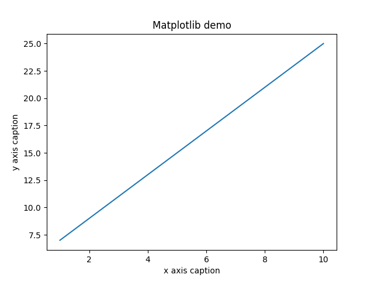
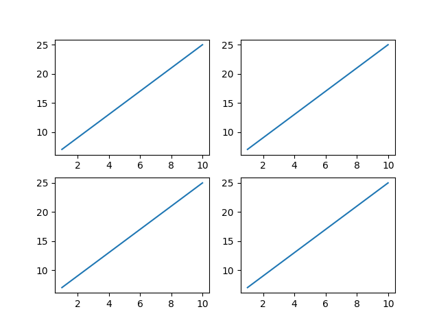
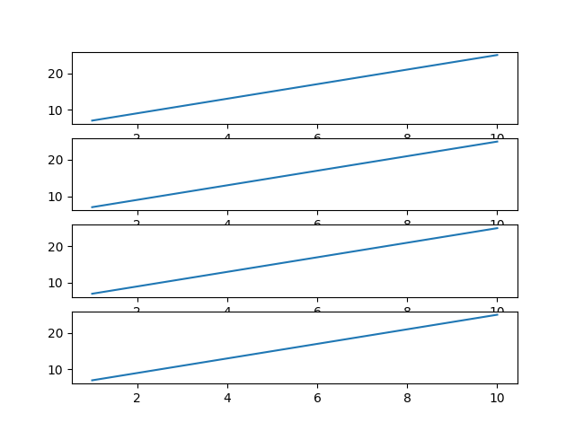

# İçindekiler

- [Matplotlib](#1)
  - [`plot` Methodu](#1.1)
  - [`subplot` Methodu](#1.2)
  - [`bar` Methodu](#1.3)

<h1 id="1">Matplotlib</h1>

Matplotlib, Python dilinde veri görselleştirme için kullanılan bir kütüphanedir. Matplotlib, verileri çizgi, nokta, bar, histogram, contour, 3D gibi çeşitli grafiklerle görselleştirmemizi sağlar. MatLab programında kullanılan grafik çizme fonksiyonlarının çoğu Matplotlib kütüphanesinde bulunur. Matplotlib hakkında daha fazla bilgi için [Matplotlib](https://matplotlib.org/) sitesini ziyaret edebilirsiniz.

Matplotlib kütüphanesini kullanabilmek için `import matplotlib.pyplot as plt` ya da `from matplotlib import pyplot as plt` kodunu kullanabiliriz.

<h2 id="1.1"><code>plot(x, y)</code> Methodu</h2>

`x` ve `y` parametrelerine girilen verileri çizgi grafiği olarak çizer. Örnek:
  ```py
  import numpy as np 
  from matplotlib import pyplot as plt 

  x = np.arange(1,11) 
  y = 2 * x + 5 
  plt.title("Matplotlib demo") 
  plt.xlabel("x axis caption") 
  plt.ylabel("y axis caption") 
  plt.plot(x,y) 
  plt.show()
  ```
  **Output:**

  

  `plot()` fonksiyonuna format string parametresi de verilebilir. Format string parametresi, çizgi grafiğinin rengini, kalınlığını, şeklini ve benzeri özelliklerini belirler.
  | Format String | Açıklama |
  | --- | --- |
  | `color` | Çizgi rengi |
  | `linewidth` | Çizgi kalınlığı |
  | `linestyle` | Çizgi şekli |
  | `marker` | Nokta şekli |
  | `markersize` | Nokta boyutu |
  | `markeredgecolor` | Nokta kenar rengi |
  | `markeredgewidth` | Nokta kenar kalınlığı |
  | `markerfacecolor` | Nokta iç rengi |
  | `alpha` | Saydamlık |
  | `label` | Etiket |
  Örnek:
  ```py
  import numpy as np
  from matplotlib import pyplot as plt

  x = np.arange(1,11)
  y = 2 * x + 5
  plt.title("Matplotlib demo")
  plt.xlabel("x axis caption")
  plt.ylabel("y axis caption")
  plt.plot(x,y, color='red', linewidth=2.5, linestyle=':', marker='o', markersize=10, markeredgecolor='blue', markeredgewidth=3, markerfacecolor='green', alpha=0.5, label='line')
  plt.legend()
  plt.show()
  ```
  **Output:**

  

  Daha fazla format string parametresi için [buraya](https://matplotlib.org/stable/api/_as_gen/matplotlib.pyplot.plot.html) bakabilirsiniz.

<h2 id="1.2"><code>subplot(nrows, ncols, index, *args, **kwargs)</code> Methodu</h2>

Çizgi grafiğini `nrows` satır ve `ncols` sütun olacak şekilde `index` numarasına göre parçalara böler. Örnek:
  ```py
  import numpy as np
  from matplotlib import pyplot as plt

  x = np.arange(1,11)
  y = 2 * x + 5
  plt.subplot(2, 2, 1)
  plt.plot(x, y)
  plt.subplot(2, 2, 2)
  plt.plot(x, y)
  plt.subplot(2, 2, 3)
  plt.plot(x, y)
  plt.subplot(2, 2, 4)
  plt.plot(x, y)
  plt.show()
  ```
  **Output:**

  
  
  ```py
  import numpy as np
  from matplotlib import pyplot as plt

  x = np.arange(1,11)
  y = 2 * x + 5
  plt.subplot(4, 1, 1)
  plt.plot(x, y)
  plt.subplot(4, 1, 2)
  plt.plot(x, y)
  plt.subplot(4, 1, 3)
  plt.plot(x, y)
  plt.subplot(4, 1, 4)
  plt.plot(x, y)
  plt.show()
  ```
  **Output:**

  

<h2 id="1.3"><code>bar(x, height, width=0.8, bottom=None, *, align='center', data=None, **kwargs)</code> Methodu</h2>

`x` ve `height` parametrelerine girilen verileri bar grafiği olarak çizer. `width` parametresi bar grafiğinin genişliğini, `bottom` parametresi ise bar grafiğinin başlangıç noktasını belirler. Örnek:
  ```py
  import numpy as np
  from matplotlib import pyplot as plt

  x = np.arange(1,11)
  y = 2 * x + 5
  plt.bar(x, y)
  plt.show()
  ```
  **Output:**

  

  ```py
  import numpy as np
  from matplotlib import pyplot as plt

  x = np.arange(1,11)
  y = 2 * x + 5
  plt.bar(x, y, width=0.5, bottom=10)
  plt.show()
  ```
  **Output:**

  

<h2 id="1.4"><code>hist(a, bins=10, range=None, normed=None, weights=None, density=None)</code> Methodu</h2>

Histogram, verilerin sıklık dağılımını gösteren bir grafiktir. Histogramı çizmek için NumPy'ın `hist()` fonksiyonu kullanılır. `hist()` fonksiyonu, verileri sınıflara ayırır ve her sınıfın kaç veri içerdiğini hesaplar, sınıfların sıklık değerlerini ve sınıf sınırlarını döndürür. `histogram()` fonksiyonunun syntax'ı `hist(a, bins=10, range=None, normed=None, weights=None, density=None)` şeklindedir.
- `a`: Histogramın çizileceği veriler
- `bins`: Histogramın sınıf sayısı
- `range`: Histogramın sınıf sınırları
- `normed`: Histogramın sıklık değerlerinin toplamının 1 olup olmadığını belirler
- `weights`: Histogramın sıklık değerlerinin ağırlıklarını belirler
- `density`: Histogramın sıklık değerlerinin toplamının 1 olup olmadığını belirler
Örnek:
```py
import numpy as np

a = np.array([22, 87, 5, 43, 56, 73, 55, 54, 11, 20, 51, 5, 79, 31, 27])
hist, bins = np.hist(a, bins=[0, 20, 40, 60, 80, 100])
print(hist)
print(bins)
```
**Output:**
```
[3 4 5 2 1]
[  0  20  40  60  80 100]
```