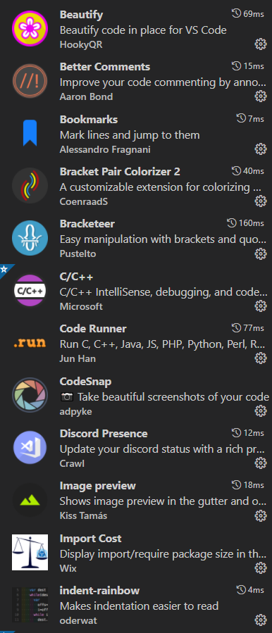
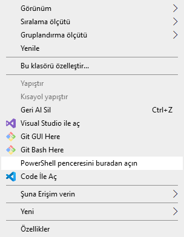

# İçindekiler
- [Python Yazmak İçin Ne Kullanmalıyım?](#0)
- [Python Sözlüğü (Python Glossary)](#1)
- [Python'un Çalışma Mantığı](#2)
- [Block Mantığı](#3)
- [Variable'lar (Değişkenler)](#4)
- [İsimlendirme (Identifier) Kuralları](#5)
- [Yorum (Comment) Satırları](#6)
- [Hata Mesajlarının Önem](#7)
- [Implementation Nedir?](#8)
- [CMD ile çalışmak](#9)
- [Python sürümleri](#10)
- [Heap ve Stack Yöntemleri](#11)
- [Garbage Collector](#12)


<h1 id="0">Python Yazmak İçin Ne Kullanmalıyım?</h1>

Ben VSCode kullanıyorum. Bu yüzden bu tutorial boyunca göreceğiniz bütün kodlar, output'lar, debugger işlemleri vs. her şey VSCode kullanılarak elde edilmiştir. Başka bir IDE veya text editör kullanıp aynı şeyleri elde edemediyseniz yapabileceğim bir şey yok. Python'u öğrenene kadar VSCode kullanın.

VSCode'da VSCode bir text editor'dür. Burada IDE ile text editor'ün farkını anlatmakta fayda var:
- **IDE (Integrated Development Environment):** Program geliştirmek için gerekli her şeyi size sunan bir geliştirme ortamıdır. Bir programdır. VS (Microsoft Visual Studio) IDE'lere bir örnektir. IDE'ler text editor'lerine göre daha ağır çalışır ve daha çok kaynak kullanırlar. Daha fazla bilgi için [tıklayınız](https://www.vargonen.com/blog/ide-nedir-en-iyi-6-ide-editoru/ "https://www.vargonen.com/blog/ide-nedir-en-iyi-6-ide-editoru/").
- **Text editor:** Not defterinin gelişmiş versiyonudur diyebiliriz. Çeşitli extension'larla modifiye edilerek harika program geliştirme ortamlarına da dönüştürülebilir. IDE'lere göre daha hızlıdır ama bu hız kurduğunuz extension'lara göre değişebilir. Benim gibi 20 tane extension kullanıyorsanız, kullandığınız text editor, bir IDE kadar yavaş açılabilir. Kullandığım extension listesi:
	
	
	
	

<h1 id="1">Python Sözlüğü (Python Glossary)</h1>

Python'da kullanılan terimlerin tamamına [bu sözlükten ulaşabilirsiniz](https://docs.python.org/3/glossary.html "https://docs.python.org/3/glossary.html").

<h1 id="2">Python'un Çalışma Mantığı</h1>

Python, kodları yukarıdan aşağıya okur. İç içe yazılmış fonksiyonları da aşağıdaki örnekteki gibi okur:
```py
print(complex(float(int(str(10))))) #Output: (10+0j)
```
1. `print` var, aha parantez, `print`'i geç ve parantezin içine bak,
2. `complex` var, aha bir parantez daha, `complex`'i geç ve parantezin içine bak,
3. `float` var, aha bir parantez daha, `float`'ı geç ve parantezin içine bak,
4. `int` var, aha bir parantez daha, `int`'i geç ve parantezin içine bak,
5. `str` var, aha bir parantez daha, str'yi geç ve parantezin içine bak,
6. 10 var, tamam,
7. `str(10) == "10"`,
8. `int("10") == 10`,
9. `float(10) == 10.0`,
10. `complex(10.0) == 10+0j`,
11. `print(10+0j)` var, o zaman `10+0j`'yi `sys.stdout`'a yazdır.

<h1 id="3">Block Mantığı</h1>

Python'da `if`, `elif`, `else`, `while`, `for`, `def`, `class` vb. gibi statement'lara yazılacak kodlar, bu statement'ların kod blocklarına yazılır. Bu kod blockları oluşturmak için **Indentation** dediğimiz girintileme işlemi yapılır. Bu girintilere **Indent** denir. Bu indent'ler genelde 2 ya da 4 space'den oluşur. Örnek:
```py
var = int(input("Bir sayı girin: "))
if var % 2 == 0:
	print(f"{var} çift sayıdır.") # 4 space boyunda bir indent
else:
	print(f"{var} tek sayıdır.") # 4 space boyunda bir indent
```
Bu kodları anlamanıza şimdilik gerek yok. Bu, sadece indent'in ne olduğunu anlamanız için bir örnek.

Indent'ler hatalı kullanıldığında `IndentationError` ya da `TabError` hataları yükseltilebilir. Programınızı yazarken kullandığınız indent sayısı her yerde aynı olmalıdır. Örneğin bir block'u belirlerken 2 indent kullanırken başka birinde 4 kullanırsanız hata alırsınız. 

<h1 id="4">Variable'lar (Değişkenler)</h1>

Variable'lar, en küçük depolama birimleridir. Variable, bir value'ya atıfta bulunan (refers to) bir addır. Variable'a atanan data'ya **value** (değer) denir. Assignment statement ile variable'lar yaratılabilir (create). Örnek:
```py
i = 15 # i'nin değeri 15
i = 30 # i'nin değeri 30
```

Değişkenleri kağıt üzerinde göstermek için **state diagram** kullanmak yaygın bir yöntemdir. Örnek:
```py
massage = "What's up, Doc?"
n = 17
pi = 3.14159
```


Variable'ları kullanarak işlem yapabilirsiniz. Örneğin:
```py
i = 15
j = 30
k = i + j
print(k) # Output: 45
```
İki variable'ın değerlerini birbiriyle değiştirebilirsiniz. Örnek:
```py
a = 5
b = 10
a,b = b,a
```
Bir variable'yi silmek istiyorsanız:
```py
a = 1
del a
```
Bütün bunların ne oldukları ve nasıl kullanıldıkları zamanla daha iyi oturacak. Şu an bunları anlamadıysanız çok takılmayın.

<h1 id="5">İsimlendirme (Identifier) Kuralları</h1>

- Bir objeyi temsil eden isme **identifier** denir. Bu identifier'ı kullanarak ilgili objeye atıfta bulunmak (refers to) suretiyle kullanabiliriz.
- Identifier, variable'lara (daha genel tanımıyla objelere) verdiğimiz isimdir.
- Identifier'lar rakam (digit) ile başlayamaz ve sadece rakamlardan oluşamaz. Örnek: `1vrb`, `1234`
- Identifier'larda boşluk karakteri kullanılamaz. Örnek: `var exp`
- Identifier'larda `:`, `'`, `”`, `,`, `<`, `>`, `/`, `?`, `|`, `\`, `(`, `)`, `!`, `@`, `#`, `$`, `%`, `^`, `&`, `*`, `~`, `-`, `+` sembolleri kullanılamaz. Sadece `_` (alt çizgi) kullanılabilir. Aksi durumda `SyntaxError: invalid syntax` hatası yükseltilir (raised).
- [Keyword'ler](./python_tutorial/blob/main/python_tutorial/temel_bilgiler/statements_expressions_keywords.md#1) identifier olarak kullanılamaz. Örnek: `global = 1`. Build-in namespace'de tanımlanmış `str`, `int`, `float`... vb. build-in class ve fonksiyonları da identifier olarak kullanmamalısınız. Python'un keyword'lerin identifier olarak kullanılmaması için bir savunma mekanizması vardır ama bu mekanizma build-in namespace'deki class'ları ve fonksiyonları kapsamamaktadır. Bu yüzden bunları identifier olarak kullanmayın, işlevselliklerini yokedersiniz ve dolayısıyla programınızı bozarsınız.

<h1 id="6">Yorum (Comment) Satırları</h1>

Python'da kodlarınızın ne işe yaradığını, kullanıcıların neler yapması gerektiğini veya canınız ne istiyorsa yazabileceğiniz yorum satırları (comment) bulunmaktadır. 

**Tek satır yorum satırı:**
```py
# Tekli Yorum Satırı
'Tekli Yorum Satırı'
"Tekli Yorum Satırı"
```

**Çoklu Yorum satırı:**
```py
"""
Çoklu
Yorum
Satırı
"""
```
**Dikkat:** Kod blocklarında (Örneğin bir `if` statement'ın kod bloğu) aralara tırnak işareti kullanarak yorum satırı eklememeye çalış. Mümkün oldukça `#` kullan. Aksi halde istenmeyen hatalarla karşılaşırsınız.

<h1 id="7">Hata Mesajlarının Önemi</h1>

Python geliştirildikçe, hata mesajlarının çeşidi ve içeriğinin zenginliği de artmaktadır. Hata mesajlarını okumayı bilen ve bilmeyen kişiler arasındaki fark çok fazladır. Hata mesajlarını okumayı ve anlamayı becerebilmenin kişiye en büyük artısı zamandır. Çünkü Python bir hata yükseltince, hatanın hangi satırda ve kodun tam olarak neresinde olduğunu, hatanın neden oluştuğunu, hatta bazen hatanın çözümünü bile içeren bir hata mesajı gösterir kullanıcılara.

<h1 id="8">Implementation Nedir?</h1>

"Uygulamak" anlamına gelir. Örneğin kurduğunuz bir algoritmayı koda döktüğünde algoritmayı implemente etmiş olursun. En basit tanımıyla bu. Ayrıntılı bilgi için kendiniz araştırabilirsiniz.

<h1 id="9">CMD ile çalışmak</h1>

CMD ve PowerShell'in ne olduğunu bilmiyorsanız araştırın.

- Herhangi bir klasör içinde ya da desktop'ta PowerShell'i açmak için klavyedeki `shift` tuşuna basılı tutarken ekrana sağ tıklarsanız, karşınıza çıkan arayüzde PowerShell'i açabilirsiniz.

	

- Herhangi bir klasör açıkken arama çubuğuna cmd yazarsanız, o konuma (path) ayarlı bir cmd penceresi açılır. O konumdaki bir Python dosyasını çalıştırmak için `python dosya_ismi.py` komutunu kullanabilirsiniz.

	

- cmd'yi çalıştırdıktan sonra herhangi bir adrese gitmek istiyorsanız `cd adres` komutunu kullanabilirsiniz. Örnek: `cd desktop/Files`

<h1 id="10">Python sürümleri</h1>

Python'ın `2.x` serisi ile çalışan bir program Python'ın `3.x` serisi ile çalışmayabilir. Aynı şekilde bunun tersi de geçerli olabilir. Bu gibi durumlarda kullanıcıya bir uyarı mesajı göstermek gerekebilir. Python dosyanızın en başına `#!/usr/bin/env pythonX.X` veya `#! pythonX.X` gibi bir uyarı eklemek bir çözüm olabilir ama yeterli değildir. Bu satırlar programınızın `PythonX.X` sürümünde çalışmadığını belirtmiş oluyorsunuz ama eğer çalıştırılırsa ne olacağını belirtmiyorsunuz. Python sürümünüzü öğrenmek için `sys` modülündeki `versiyon_info` methodundan yararlanabilirsiniz.
```py
print(sys.version_info) # Output: sys.version_info(major=3, minor=9, micro=2, releaselevel='final', serial=0)
```
Buradaki:
- `major`, kullanılan Python serisinin ana sürüm numarasını;
- `minor`, alt sürüm numarasını;
- `micro`, kullanılan Python serisinin en alt sürüm numarasını verir.

Bu değerlere `sys.version_info.major`, `sys.version_info.minor` ve `sys.version_info.micro` şeklinde de elde edebiliriz. Örnek:
```py
import sys
_2x_metni = u" Python'ın 2.x sürümlerinden birini kullanıyorsunuz. Programı çalıştırabilmek için sisteminizde Python'ın 3.x sürümlerinden biri kurulu olmalı."

_3x_metni = "Programa hoşgeldiniz."

if (sys.version_info.major < 3):
	print(_2x_metni)
	exit() # Programı sonlandırır.
else:
	print(_3x_metni)

# Programınızdaki diğer kodlar...
```
Eğer Python sürümünüz 3'den büyük ve 3'e eşitse `else` statement çalışır ve programınız çalışmaya devam eder. Python sürümünüz 3'den küçükse `if` statement çalışır ve ilgili metin yazdırıldıktan sonra `exit()` build-in fonksiyonu ile program sonlandırılır.

**Not:** `_2x_metni` variable'ındaki metinin başındaki `u` harfi, bu metinin UNICODE ile kodlanmış (encoded) olduğunu söylemektedir. Bu sayede aşağıdaki gibi istenmeyen sonuçlarla karşılaşmayız:
```py
_2x_metni = u" Python'ın 2.x sürümlerinden birini kullanıyorsunuz. Programı çalıştırabilmek için sisteminizde Python'ın 3.x sürümlerinden biri kurulu olmalı."
print(_2x_metni.encode(encoding='ascii', errors='replace'), end="\n\n") # Output: b" Python'?n 2.x s?r?mlerinden birini kullan?yorsunuz. Program? ?al??t?rabilmek i?in sisteminizde Python'?n 3.x s?r?mlerinden biri kurulu olmal?."
print(_2x_metni.encode(encoding='ascii', errors='xmlcharrefreplace')) # Output: b" Python'&#305;n 2.x s&#252;r&#252;mlerinden birini kullan&#305;yorsunuz. Program&#305; &#231;al&#305;&#351;t&#305;rabilmek i&#231;in sisteminizde Python'&#305;n 3.x s&#252;r&#252;mlerinden biri kurulu olmal&#305;."
```

**Önemli Not:** Python'ın 2.7 sürümünden önceki sürümlerinde `sys` modülünün `version_info()` methodu farklı output'lar verir. Mesela Python'ın 2.7 sürümünden önceki sürümlerinde `version_info()` metodunun `major`, `minor` veya `micro` gibi methodları bulunmaz. Bu methodlar Python'ın 2.7 sürümüyle birlikte geldi. Dolayısıyla yukarıdaki programı Python'ın 2.7 öncesi sürümlerinden biriyle çalıştırırsanız, büyük ihtimal `AttributeError` hatası yükseltilecek (raised). Alternatif çözümler:
```py
# Python X.x < 2.7
import sys
  
_2x_metni = """ Python'ın 2.x sürümlerinden birini kullanıyorsunuz. Programı çalıştırabilmek için sisteminizde Python'ın 3.x sürümlerinden biri kurulu olmalı.""" 
_3x_metni = "Programa hoşgeldiniz."
  
try:
	if (sys.version_info.major < 3):
		print(_2x_metni)
	else:
		print(_3x_metni) # Output: Programa hoşgeldiniz.
except  AttributeError:
	print(_2x_metni)
```
Veya kesin çözüm olarak, Python'ın bütün sürümlerinde çalışan aşağıdaki yöntemi kullanabilirsiniz:
```py
import sys

major = sys.version_info[0]
minor = sys.version_info[1]
micro = sys.version_info[2]  

print(major, minor, micro, sep=".") # Output: 3.9.2
```

<h1 id="11">Heap ve Stack Yöntemleri</h1>

Python programları sırasında kullanılan her obje bellekte yer kaplar. Bu yerin boyutu kimi zaman belliyken (yani değişmezken), kimi zaman ise kullanıcının program esnasında gireceği verilere göre değişebilecek durumdadır. Bu farkları sağlayan **Stack** ve **Heap** adında iki yöntem vardır. **Stack** ve **Heap**'in her ikisi de RAM bölgesinde bulunur. **Stack**, bellekten statik olarak yer tahsisi için kullanılırken, **Heap**, dinamik olarak yer tahsisi içindir. Bu yüzden program esnasında derleyici (compiler), boyutları bildirilmiş, değişmez bir değer kullanacaksak ve bu değer çok büyük bir veri değilse **stack** (Stack alanı sınırlı olduğundan çok büyük sayıda ve büyük tiplerde veri atanması belleğin dolmasına sebep olabilir); boyutu belli olmayan bir değer kullanıyorsak **Heap**'ten yer tahsisi yapar. **Stack**'da yer alan veriler direk bellek içine yerleştirildiği için erişimi çok hızlıdır. **Heap** ise runtime (çalışma zamanı) anında kullanılırlar ve dağınık bir bellek göz yapısı olduğu için erişimi **stack** kadar kolay olmaz, dolayısıyla yavaş çalışır. Daha fazla bilgi ve örnek için [tıklayınız](http://blog.bilgiyazan.com.tr/stack-ve-heap-kavrami/ "http://blog.bilgiyazan.com.tr/stack-ve-heap-kavrami/"). Stack bellekteki veri hemen silinirken Heap bellekteki verinin silinmesi **Garbage Collector**'a (Çöp toplama mekanizmasına) bağlıdır. Swift, Objective-C gibi **Automatic Reference Counting**'e sahip mimarilerde bu konu compiler tarafından otomatik olarak yapılır. **Stack** ve **Heap** bilgisi, dünyanın en vasat bellek yönetimine sahip scripting dillerinden birisi olan Python için çok gerekli bir şey değil. Python, bellekle uğraşmanızı gerektirecek bir dil değildir. Bellekle uğraşmanızı gerektirecek bir dil olan `C` dil ailesiyle işiniz olursa **Stack** ve **Heap** kavramlarına kafa yorunuz.

**Stack:**
- Kullanımı kolaydır.
- Tıpkı Heap gibi bilgisayarın RAM bölgesinde bulunur.
- Objeler, stack kapsamından çıkınca otomatik olarak yok edilir.
- Ulaşılması Heap'e göre oldukça hızlıdır.
- 20 boyutlu bir diziye 21 eleman atamak gibi, Stack üzerinde kullanım fazla olduğunda alan yeterli olmayabilir.
- Objeler, pointer (`C` dil ailesini alakadar eden bir şey. Merak ediyorsanız araştırın. Büyük ihtimal ileriki derslerden birinde de ne olduğundan bahsetmişimdir) olmadan kullanılabilir.
- Derleme (compile) zamanında oluşturulur.
- Kullanacağınız yerin boyutunu tam olarak biliyorsanız Stack'i kullanmak sizin için uygun olacaktır.
  
**Heap:**
- Kullanımı Stack'dan daha zordur.
- Tıpkı Stack gibi bilgisayarın RAM bölgesinde bulunur.
- Bir block içerisinde oluşturulan heap objeler, block'un dışına çıktığında otomatik olarak yok edilemez, bunun manuel olarak yapılması gerekir (ya da Garbage Collector ile).
- Stack ile karşılaştırıldığında oldukça yavaştır.
- Doğru kullanılmaması durumunda bellek sorunları yaratır.
- Objeler pointer ile kullanılır.
- Çalışma zamanında (runtime) oluşturulur.
- İhtiyacınız olan boyutu tam olarak bilmiyorsanız Heap kullanımı sizin için biçilmiş kaftandır.

<h1 id="12">Garbage Collector</h1>

Bilgisayar programları, runtime sırasında bellek ihtiyacı duyarlar. Bellek sınırsız bir şey olmadığı için artık kullanılmayan bellek alanlarının, işletim sistemine (OS) geri iade edilmesi gerekir. Müsait bellek alanı bulma ve kullanılmayan bellek alanlarını işletim sistemine geri iade etme işlemlerinin programcılar tarafından manuel (el ile) yapılması gerekiyordu. Örneğin bu işlem, `C` dilinde `malloc()` ve `free()` fonksiyonları ile yapılmaktadır. İşletim sistemine iade edilmiş bir alanın program tarafından tekrar kullanılması güvenlik açıklarını beraberinde getirmekteydi. Elle yapılan bu işlemin takibi bir yerden sonra zorlaştığı için bu işi otomatik yapan bir sisteme ihtiyaç vardı. **Garbage Collector**, bu işlemi otomatik yapan bir sistemdir. Bu sistem sayesinde bir programcı, program yazarken hafıza alanını Garbage Collection mekanizmasından talep edip, iade işlemine karışılmamaktadır çünkü kalan tüm işlemler Garbage Collection mekanizması tarafından yapılmaktadır. Garbage Collector, kullanılan hafıza alanlarının izini sürerek, ihtiyaç duyulmayan alanları işletim sistemine iade etmektedir ve yeni bir talep geldiği zamanda bellekte yer bulup programa göndermektedir. Garbage Collection mekanizmasının işlemci kullanımı ile alakalı iki farklı yönetim yaklaşımı bulunmaktadır:
- **stop-the-world** yaklaşımı herhangi bir t zamanında, Garbage Collection mekanizması devreye girdiği zaman sırasıyla ilgili programdaki tüm işlemler durdurulur, hafıza yönetimi yapılır ve durdurulan işlemeler başlatılır. Bu çalışma yöntemi, kritik uygulamalar için bir dezavantaj oluşturmaktadır. Bu nedenle daha sonra **concurrent** algoritmalar geliştirilmiştir. 
- **Concurrent** yaklaşımı, programın çalışması durdurulmadan programla eşzamanlı olarak Garbage Collection işlemleri yapılır. Bu sayede **stop-the-world** yaklaşımının oluşturduğu dezavantaj ortadan kalkar.

Daha fazla bilgi için [tıklayınız](https://www.tutorialspoint.com/How-does-garbage-collection-work-in-Python "https://www.tutorialspoint.com/How-does-garbage-collection-work-in-Python").
